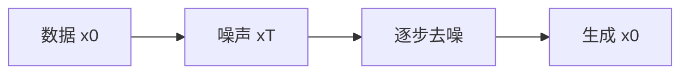

# DDPM

把图像逐步加噪到近高斯，再学每一步把噪声减回去。采样就是沿同一条马尔可夫链倒着走。

<footer>—— Ho, Jain, Abbeel, Denoising Diffusion Probabilistic Models</footer>

[上一课](/llm/multimodal-reasoning)收束理解。本单元问像素如何生成。理解侧走连续 [ViT](/llm/vit-as-encoder) 前缀；生成常从噪声出发。缺口是去噪扩散这条链。后课流匹配默认：离散时间、预测噪声，不是唯一的连续生成几何。

## 问题

直接在像素上回归整图会模糊；GAN 锐但不给似然、训练脆。Sohl-Dickstein 等的扩散把数据破坏与恢复写成马尔可夫链。Ho 等人的 DDPM 把它训成可扩展的图像生成器：前向

$$
q(x_t\mid x_{t-1})=\mathcal{N}(\sqrt{1-\beta_t}x_{t-1},\beta_t I)
$$

$t=1\ldots T$ 后 $x_T$ 近标准正态。反向用网络 $\epsilon_\theta(x_t,t)$ 预测所加噪声，等价于学高斯反向步。缺口不是再讲卷积骨干，而是这条目标比对抗稳、比逐像素似然可扩展。

训练目标是对 $t$ 与噪声的期望 MSE，不必每步算完整 ELBO。采样仍要走许多步，$T$ 常数百到千，这是后课蒸馏要砍的税。

## 方法

训练：抽 $x_0$、时间 $t$、噪声 $\epsilon$，构造 $x_t$，回归 $\epsilon$。采样：从 $x_T\sim\mathcal{N}(0,I)$ 逐步更新到 $x_0$。条件生成把类或文本嵌入送进 $\epsilon_\theta$（后课 CFG 再加压）。验收用 FID / 人评，不要用 [CLIP](/llm/clip) 检索分代替生成质量。

## 机制

每步只去掉一点噪声，网络学的是向量场在不同噪声水平上的值。高频先毁、后恢复，这与 VQ 像素损失抹掉高频不同：扩散在采样末端仍可写细节，但步数换质量。与离散 [VQGAN](/llm/vqgan) 码上的 AR 相比，这里没有词表，似然在连续空间上以变分形式出现。

## 边界

像素空间 DDPM 分辨率贵、步数多。下一课把离散链换成连续时间的流，路径可以更直。

## 小结

- DDPM 用加噪链与预测噪声训练可采样的生成器。
- 目标是 MSE，采样步数是质量税。
- 无离散视觉词表，与理解用的 patch 前缀不是同一接口。
- 出处：Ho, Jain, Abbeel, DDPM。
