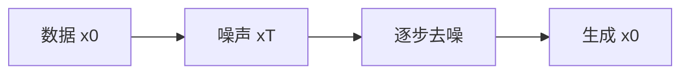

# DDPM

把图像逐步加噪到近高斯，再学每一步把噪声减回去。采样就是沿同一条马尔可夫链倒着走。

<footer>—— Ho, Jain, Abbeel, Denoising Diffusion Probabilistic Models</footer>

[上一课](/llm/multimodal-reasoning)收束理解。本单元问像素如何生成。理解侧走连续 [ViT](/llm/vit-as-encoder) 前缀；生成常从噪声出发。缺口是去噪扩散这条链的完整机制：前向怎么加噪、日程怎么选、反向一步的均值与方差从哪来，以及这条目标为何比对抗稳、比逐像素似然可扩展。后课流匹配默认：离散时间、预测噪声，不是唯一的连续生成几何。

## 问题

直接在像素上回归整图会模糊；GAN 锐但不给似然、训练脆。Sohl-Dickstein 等的扩散把数据破坏与恢复写成马尔可夫链：前向对图像反复注入少量高斯噪声，

$$
q(x_t\mid x_{t-1})=\mathcal{N}(\sqrt{1-\beta_t}\,x_{t-1},\beta_t I)
$$

系数 $\sqrt{1-\beta_t}$ 与方差 $\beta_t$ 配好，每步的信号能量按固定比例收缩、噪声按固定份额补入。$t=1\ldots T$ 步后 $x_T$ 近标准正态。利用高斯的可加性，记 $\bar\alpha_t=\prod_{s\le t}(1-\beta_s)$，任意一步可重参数化为闭式

$$
x_t=\sqrt{\bar\alpha_t}\,x_0+\sqrt{1-\bar\alpha_t}\,\epsilon,\qquad \epsilon\sim\mathcal N(0,I)
$$

训练于是不必走链：抽一个 $t$ 直接构造 $x_t$。反向是同一条链的贝叶斯逆步，仍是高斯，但均值要靠无法观测的 $x_0$ 信息，只能用网络预测。Ho 等人的 DDPM 让网络 $\epsilon_\theta(x_t,t)$ 直接预测当初加进去的噪声，等价于学高斯反向步。缺口不是再讲卷积骨干，而是这条目标比对抗稳、比逐像素似然可扩展，代价与日程的账都钉在哪。

日程 $\beta_t$ 决定训练与采样覆盖的噪声水平分布。Ho 等人用线性日程：$\beta_t$ 从 $10^{-4}$ 线性升到 $0.02$。Nichol 与 Dhariwal 指出它的浪费：$\bar\alpha_t$ 在链条走完之前就已降到近 $0$，后半段在给几乎纯噪声再加噪声——这些步不携带信息，训练在无信息的水平上花梯度，采样在无信息的水平上花步数。余弦日程把 $\bar\alpha_t$ 写成 $\cos^2$ 的缓降，让对数信噪比近似随 $t$ 线性下降，末端保留一条信噪比下限。信息毁完仍分配步数，是线性日程要修的账。

训练目标是对 $t$ 与噪声的期望 MSE，不必每步算完整 ELBO。采样仍要走许多步，$T$ 常数百到千，这是后课蒸馏要砍的税。

## 方法

训练：抽 $x_0$、时间 $t$、噪声 $\epsilon$，按闭式构造 $x_t$，回归 $\epsilon$。回归目标选 $\epsilon$ 而不是直接选均值：把变分下界按高斯逆步展开并固定方差，剩下对均值的项恰好化成噪声上的加权 MSE，权重偏向低信噪比一端——正是细纹理所在的水平；方差由日程钉死，网络少学一路，避免小 $\beta$ 端的方差估计失稳。预测 $\epsilon$ 与预测得分只差一个日程系数，两种写法可互换。采样：记 $\alpha_t=1-\beta_t$，从 $x_T\sim\mathcal N(0,I)$ 逐步更新到 $x_0$：

$$
x_{t-1}=\frac{1}{\sqrt{\alpha_t}}\Big(x_t-\frac{\beta_t}{\sqrt{1-\bar\alpha_t}}\,\epsilon_\theta(x_t,t)\Big)+\sigma_t z,\qquad z\sim\mathcal N(0,I)
$$

均值项把 $x_t$ 减去日程折算的一份预测噪声，再除以本步的收缩系数；$\sigma_t$ 取 $\beta_t$ 或 $\tilde\beta_t=\frac{1-\bar\alpha_{t-1}}{1-\bar\alpha_t}\beta_t$，最后一步置 $z=0$。条件生成把类或文本嵌入送进 $\epsilon_\theta$（后课 CFG 再加压）。质量验收是方法而不是一个分数：FID 这类分布距离管整体真实感，但对低频失败不敏感，文字与手这类高频结构要人评单独盯；用 [CLIP](/llm/clip) 检索分代替生成质量会把「对得上提示」混进「画得好」，两条线必须分开报。

```mermaid
flowchart LR
  X0["数据 x0"] --> XT["噪声 xT"]
  XT --> DEN["逐步去噪"]
  DEN --> XHAT["生成 x0"]
```

## 机制

每步只去掉一点噪声，网络学的是得分 $\nabla\log p_t$ 在不同噪声水平上的值：一次训练覆盖整条噪声水平轴上的得分族，且各水平可并行抽 $t$。这是它比对抗稳的第一层原因——目标是无歧义的回归，没有对抗目标的非驻点与震荡；比逐像素似然可扩展的第二层原因是联合生成被拆成 $T$ 个可并行的回归问题，而不是把一张图拆成数千次顺序预测，顺序只留在采样端。采样时低信噪比步先定布局与大色块，高信噪比步才填高频细节；日程配错会让某些水平欠训练，伪影钉在那一层。高频先毁、后恢复，这与 VQ 像素损失抹掉高频不同：扩散在采样末端仍可写细节，但步数换质量。与离散 [VQGAN](/llm/vqgan) 码上的 AR 相比，这里没有词表，似然在连续空间上以变分形式出现。

## 边界

像素空间 DDPM 分辨率贵、步数多：分辨率翻倍，每步注意力与卷积的账都翻倍，$T$ 并不随之减少。后课两条减税路线正交：蒸馏砍步数，潜空间砍分辨率。下一课把离散链换成连续时间的流，路径可以选得更直。

## 小结

- DDPM 用加噪链与预测噪声训练可采样的生成器；闭式 $x_t$ 让训练不必走链。
- 线性日程在末端信噪比归零后仍花步数；余弦日程保住末端下限。
- 反向一步的均值由 $\epsilon_\theta$ 与日程给出，方差固定，随机性来自每步的 $z$。
- 目标是 MSE，采样步数是质量税。
- 无离散视觉词表，与理解用的 patch 前缀不是同一接口。
- 出处：Ho, Jain, Abbeel, DDPM；Nichol 与 Dhariwal 的日程改进。
