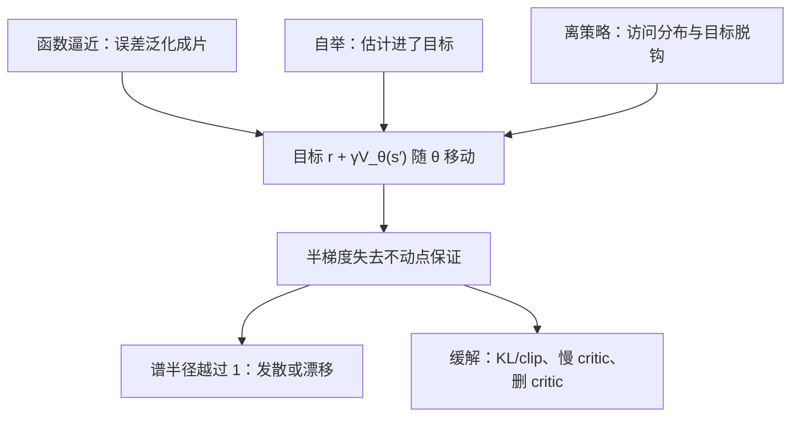

# 致命三要素

函数逼近、自举、离策略，两两相安；三者聚齐，就把不动点赶出系统，值函数沿自己编的方向走远。

<footer>—— 据 Sutton &amp; Barto, 2018, 第 11 章；Tsitsiklis &amp; Van Roy, 1997 整理</footer>

[上一课](/llm/off-policy-importance-rl)校正了外来数据的分布差，但一切仍在表格里：每个状态一个槽。[语言生成作为 MDP](/llm/llm-decision-view) 的维度灾难早已写明：LLM 的状态是前缀，槽写不下，值函数必须换成参数化的 $V_\theta$、$Q_\theta$，靠泛化活着。缺口：把函数逼近放进前几课的自举更新后，三个各自收敛保证完好的要素会互相点火。本课写致命三要素与 Tsitsiklis–Van Roy 的发散反例，以及深度 RLHF 为什么天天在线上走。

## 问题

表格账本先钉死：TD(0) 收敛（Sutton 1988），Q 学习收敛（Watkins &amp; Dayan 1992），三要素至多配齐两个。换成 $V_\theta$，目标是 $r_{t+1}+\gamma V_\theta(s_{t+1})$——目标自己随参数动，半梯度法一步挪两次地面，不再是压缩映射的迭代。拆开看三要素各自的无害：函数逼近不配自举时只是回归，回归不发散；自举在表格里收敛；离策略在表格里也只是方差与覆盖问题（Q 学习）。合起来的失效链：泛化把一个状态的误差搬进一整片邻域，自举把这片误差设为别的状态的目标，离策略把「数据怎么来」与「目标希望谁被访问」脱钩——唯一依赖同策略访问分布的收敛证明随之失效。

## 机制

## 方法

分析工具是把更新过程写成算子。表格 TD 的更新是贝尔曼算子 $T$ 与恒等的复合，$T$ 在 $\gamma\lt1$ 下是压缩映射，不动点存在且唯一；线性近似的半梯度 TD 是 $T$ 与投影 $\Pi$ 的复合 $\Pi T$，同策略数据下 $\Pi T$ 仍是平均压缩映射，Tsitsiklis–Van Roy 的收敛定理就是这一行。判据随之而来：检验一个配置是否安全，写出复合算子并看它的谱半径，越过 $1$ 即发散——与步长无关，步长只改发散速度。构造反例也用同一件工具：给两条转移、一个线性近似压不下的价值面，再让数据分布偏离同策略，Baird 的七状态星形就是这样搭出来的展品。

Tsitsiklis &amp; Van Roy 1997 给出这条链的精确形态：同策略、线性近似下，TD(0) 是投影算子与贝尔曼算子复合后的平均压缩映射，收敛；换成离策略数据，对应算子的谱半径可以越过 1，此时任何正步长都发散。反例小得省材料：论文中的两状态例子，线性近似、两条转移、数据来自另一个策略，参数在每步更新下振荡放大。Sutton &amp; Barto 第 11 章把 Baird 1995 的七状态反例记为标准展品：权重发散到无穷，与步长多小无关——收敛不是「慢」，是「没有」。

Baird 1995 的反例：7 个状态、星形转移、线性近似，TD(0) 的部分权重在任意小步长下发散到无穷；Sutton &amp; Barto 2018 §11.2 以此为标准展品。「步长调小」治不了它。

深度 RLHF 的位置：PPO 一类做法是 actor-critic，critic 是 Transformer 上的价值头，每步回归自举目标（自举）；数据过不止一个 epoch 或来自异步 rollout（离策略）；价值头是深度网络（函数逼近）。三要素全占——深度 RLHF 的 critic 抖动是结构性的，不是事故，LLM 栏的 [Actor-Critic 稳定性](/llm/ac-stability)从工程侧写过它。工程缓解都是拆掉或拉远某一要素：KL 正则与 clip 把策略拉住，让数据不离策略太远；价值头单独低学习率把自举放慢；[GRPO](/llm/grpo) 干脆删掉 critic，用组内基线替换自举价值——用方差换掉发散风险。

## 边界

三要素的准确读法是「保证消失」，不是「必发散」：实践中多数时间不崩，崩起来不可预测且与步长无关，工程以稳定手段换回定理没覆盖的场景。发散的表现是谱系：数值爆炸、价值缓慢漂移、critic 永远追不上 actor，是同一结构病的不同进展速度。只占两要素的配置各有成熟账本：表格加离策略收敛（Q 学习），同策略的线性 TD 有收敛结果。奖励模型的过优化是另一条病——那是代理本身坏掉，与这里的学习动力学正交，见 [RM 过优化与 Goodhart](/llm/rm-overoptimization)。下一课做实验：表格世界里三要素缺一，看不到发散，这份「安心」要带着条件收藏。

## 小结

- 函数逼近、自举、离策略两两无害，三者合取使半梯度 TD 失去收敛保证。
- Tsitsiklis & Van Roy 1997：同策略是平均压缩映射；离策略时算子谱半径可越过 1。
- 反例极小：两状态线性即可发散；Baird 七状态的发散与步长无关。
- RLHF 的 critic 三要素全占，抖动是结构性；KL、clip、慢 critic 与删 critic 都是在拆要素。
- 与奖励过优化正交：一个坏在学习动力学，一个坏在代理本身。
- 出处：Sutton & Barto 2018 第 11 章；Tsitsiklis & Van Roy 1997；Baird 1995。
