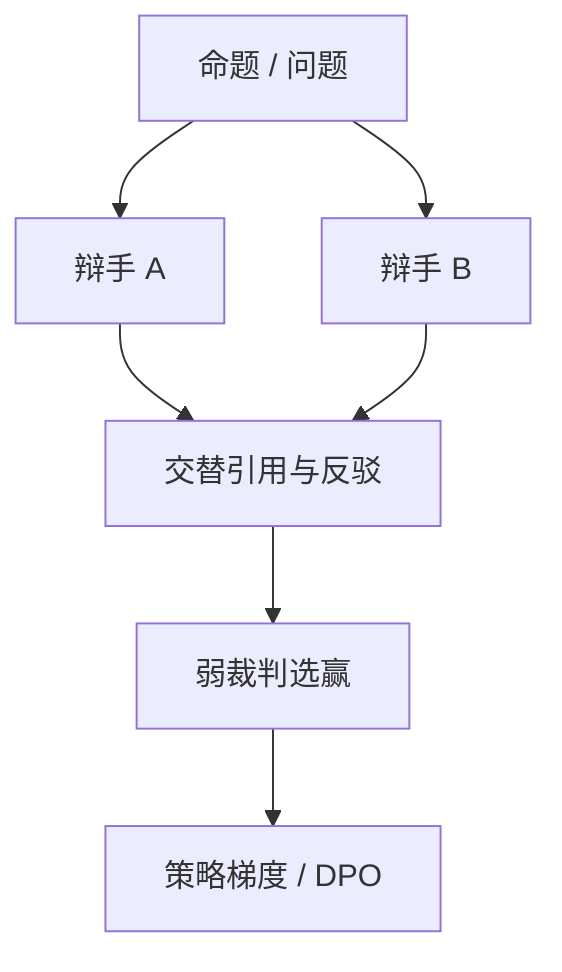

# 辩论

两个模型互相反驳，人类只判最后的交锋；希望真话比假话更容易辩护。

<footer>—— Irving, Christiano, Amodei, AI Safety via Debate</footer>

[上一课](/llm/self-play-lm)要求环境给输赢。开放事实与对齐没有编译器。缺口是：**弱监督者能否通过看辩论、而不是自己解整题，来监督更强的模型。** Irving、Christiano、Amodei 的 Debate 把可扩展监督写成双人博弈：双方引用上下文互攻，裁判看终局。本课写辩论作为监督协议，接到 [过程监督](/llm/process-supervision) 与后课弱到强。不提供越狱或欺骗教程。

## 问题

人类无法逐步检查超长证明或隐藏的有害意图。若让两个助手对同一命题辩论，攻击方有动机揭穿错误，裁判只比较双方给出的证据片段。假设是：诚实策略在均衡上胜出，因为谎言需要更多共谋。这个假设是经验性的，不是定理。Khan 等、Michael 等后来用 LLM 做辩论实验，结果依赖裁判强度、是否允许引用、轮数。

辩论的奖励是裁判的胜负，于是又变成 LLM 或人类裁判，带 [LLM 裁判](/llm/llm-judge-reward) 的全部偏差。它的独特处是**信息结构**：裁判不必事先会解题，只要会核对引用。

### 辩论不是两个聊天机器人互喷

协议必须规定：可引用的材料、是否能隐藏思维、轮次、裁判看到什么。允许隐藏 CoT 时，可监视性与诚实性分离，见后课忠实性。训练若优化「看起来赢」，会得到修辞而不是真理。

Irving 等的原型在棋盘游戏与简单任务上论证；语言模型上的「真话更容易辩护」仍是开放假设。

## 方法

采样：同一 $x$ 上两个角色（可同权不同提示）交替发言。裁判（人弱模型）选赢方。损失：对赢方轨迹做正优势，或构 DPO 对。也可只训练一方，另一方冻结为诚实基线。与宪法结合：裁判按原则看谁更少伤害，而不是谁更像对。

评测：用有金标的题看辩论是否提高裁判准确率（相对只看单方答案）。这是 Bowman 等可扩展监督的测量方式。提高失败则辩论只是更贵的自奖励。

## 机制

信息论上，辩论把「生成完整解答」换成「生成可核对的局部声明」。局部声明更接近过程标签。若双方共谋（同模型同目标骗过裁判），机制失效——这是自博弈同源模型的固有风险，需要不对称信息或独立初始化。弱裁判被冗长说服时，辩论强化的是篇幅，必须对发言长度设硬顶。

产品上的「让两个模型讨论再总结」多数不是训练协议，只是推理时集成，不要叫做 Debate 对齐。

## 边界与工程取舍

有校验器的域，辩论多余。无金标的域，辩论的评测本身循环。下一课弱到强：用弱监督者的标签训强模型，辩论是实现弱监督者的一种协议。可扩展监督课把它们收成同一研究纲领。

## 小结

- 辩论让弱裁判看交锋而非整题，是可扩展监督的一种博弈协议。
- 「真话更容易赢」是假设，须在有金标的任务上测裁判准确率。
- 同源双辩手可能共谋；长度与修辞会收买弱裁判。
- 推理时双模型讨论 ≠ 本课的训练协议。
- 出处：Irving, Christiano, Amodei, 2018；后续 LLM 辩论实验；对照 Bowman 等测量。
