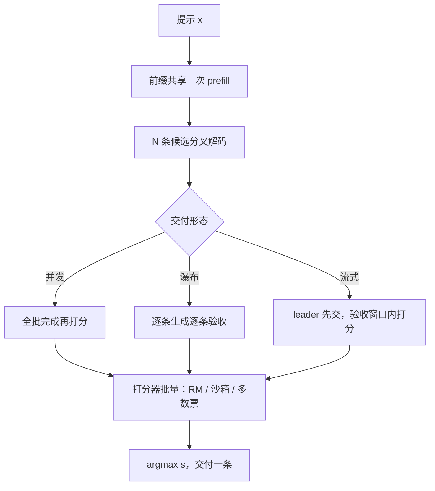
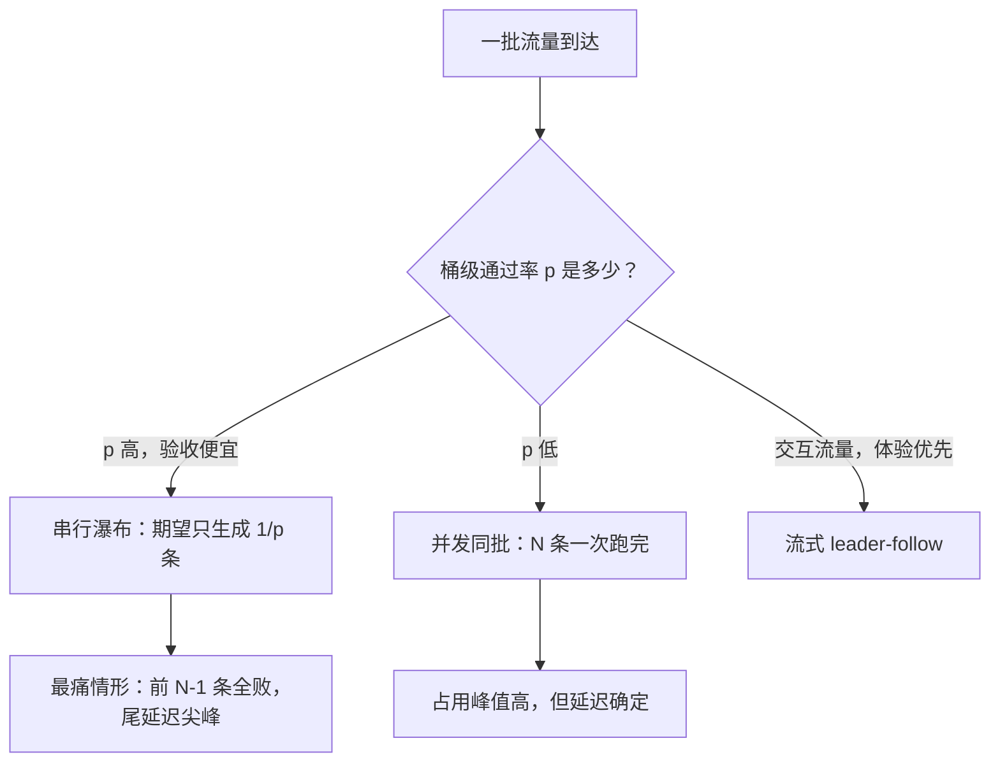

# best-of-n 的服务化

算法课只说「采 $N$ 条选一条」；服务化的全部麻烦在于，这 $N$ 条要同时住在显存里、挤进批里、再等一个打分器判生死。

<footer>—— 据 Cobbe et al., 2021 与 Snell et al., 2024 的测试时计算口径，按服务视角整理</footer>

[上一课](/llm/dec-postprocess-pipeline)把单条输出做成管线。本课把候选从 1 条放大到 $N$ 条。算法与打分器谱系基础课已备齐：[Best-of-N](/llm/best-of-n) 写了 $s(x,y)$ 的来源与 $(1-p)^N$ 的账，[self-consistency](/llm/self-consistency) 写了多数票特例，[过程奖励引导搜索](/llm/prm-guided-search)写了逐步打分。本课只写服务化：$N$ 条并发的显存与批位、打分器的调度、交付模式的选择。

## 问题

$N$ 条独立样本的账在服务上分两段。生成段：$N$ 条共享同一提示前缀，[前缀缓存](/llm/kv-prefix-cache)只省一次 prefill，分叉后 KV 与吞吐按 $N$ 涨，$N$ 条在[连续批](/llm/sch-continuous-batching-deep)里占 $N$ 个成员位——批里的其他请求跟着变慢。打分段：规则核对要沙箱执行，ORM / PRM 要一次推理服务，沙箱与 RM 都是第二段排队。术语翻译：ORM（结果奖励模型）只看最终答案好不好，像只批「最后一句结论」的老师；PRM（过程奖励模型）对每个推理步骤打分，像逐段批改。PRM 信号更细但每次验收要多看好几眼，这正是「打分段是第二段排队」的由来。串行化（先生成一条、不合格再抽）把占用降下来，却把尾延迟乘上去。缺口是交付模式的选择：什么流量并发、什么流量瀑布、什么流量流式先交。

## 方法

**三种交付形态**：

1. **并发同批**：$N$ 条一次提交，前缀共享，全批完成后打分取优。延迟最短，集群占用峰值最高。适合离线判题、竞赛、允许等待的思考模式。
2. **串行瀑布**：逐条生成逐条验收，合格即停。期望占用低（常常第一条就过），尾延迟方差大（前 $N-1$ 条全败时最痛）。适合验收便宜且通过率不低的流量。
3. **流式 leader-follow**：先生成的 leader 流式交付，验收窗口内打分；不过关再切换或补抽。体验最好，协议最复杂——切换前用户看到的与最终交付可能不同，要写进帧协议。

**打分器并行化**：$N$ 条打分一次批量提交（RM 的批处理吞吐远高于逐条）；执行沙箱池化，超时计入验收。打分与下一段生成重叠，别串在关键路径上。

## 机制

成本结构沿用[服务成本模型](/llm/serving-cost-model)：$N$ 条里只交付一条，用户可见 token 的有效产出除以 $N$，验收增益要拿 $N\times C_{\mathrm{tok}}$ 换。三形态在同一坐标系里各有工作区：通过概率 $p$ 高的流量，瀑布的期望生成条数 $1/p$ 小于 $N$，平均占用最低；$p$ 低的流量瀑布会滑到 $N$ 条全跑，比并发还贵——形态选择按桶级的 $p$ 估，而 $p$ 恰是 [Best-of-N 课](/llm/best-of-n)里难度分桶的量。打分器弱时 $N$ 是黑客放大器，RM 分数曲线与真值曲线要分开报；这条边界在服务上的落点是：验收指标用双曲线，报警挂在真值侧而不是 $s$ 侧。

用数字感受形态选择：$p=0.8$ 时瀑布平均只生成 $1/0.8=1.25$ 条，比并发 $N=8$ 省得多；$p=0.1$ 时瀑布平均要 10 条，若 $N=8$ 则几乎每次都全跑满还常常全败——比并发更贵、体验更差。所以「瀑布一定省」是错觉，关键看桶级的 $p$。

前缀共享省的是 prefill 不是 decode：64 条候选分叉后的 KV 是 64 份，[decode 显存墙](/llm/decode-memory-wall)照撞。先把 $N$ 上限钉在容量公式上，再谈并发形态。

## 边界

不要全局 $N$：按难度或自洽不确定性调节，是测试时计算的最优策略（[Best-of-N 课](/llm/best-of-n)引 Snell 的结论）。常见误区：初学者容易把 $N$ 设成全局常数（比如一律 64）。对一半都能答对的简单流量，这是把算力烧在 32 条多余候选上；把省下的预算挪给难题，同样的总成本能换到更高的整体准确率——这就是「按难度分配测试时算力」。验收便宜、可通过率稳定的流量先试瀑布，别直接上并发。流式切换的产品语义（用户是否可见「正在换答案」）是 UX 决策，但协议层必须能表达。打分器服务自身的 SLO 要单独钉：它慢了，$N$ 条白生成。与投机解码叠加时成员位与 KV 还要再乘，先单请求验证再上批。下一课把所有旋钮放进同一条成本-质量曲线。

## 小结

- 三种交付形态：并发同批、串行瀑布、流式 leader-follow；按桶级通过率 $p$ 选形态。
- 前缀共享只省 prefill；分叉后 KV 按成员位涨，$N$ 的上限钉在容量上。
- 打分器是第二段服务：RM 批打分、沙箱池化、与生成重叠，SLO 单独钉。
- 有效产出除以 $N$；验收增益按 $N\times C_{\mathrm{tok}}$ 记账。
- 验收看双曲线：真值准确率与打分器分数分开报，报警挂真值侧。
- 出处：Cobbe et al., *Training Verifiers to Solve Math Word Problems*, 2021；Snell et al., *Scaling LLM Test-Time Compute Optimally…*, 2024；服务账单见 Best-of-N 与服务成本模型课。
