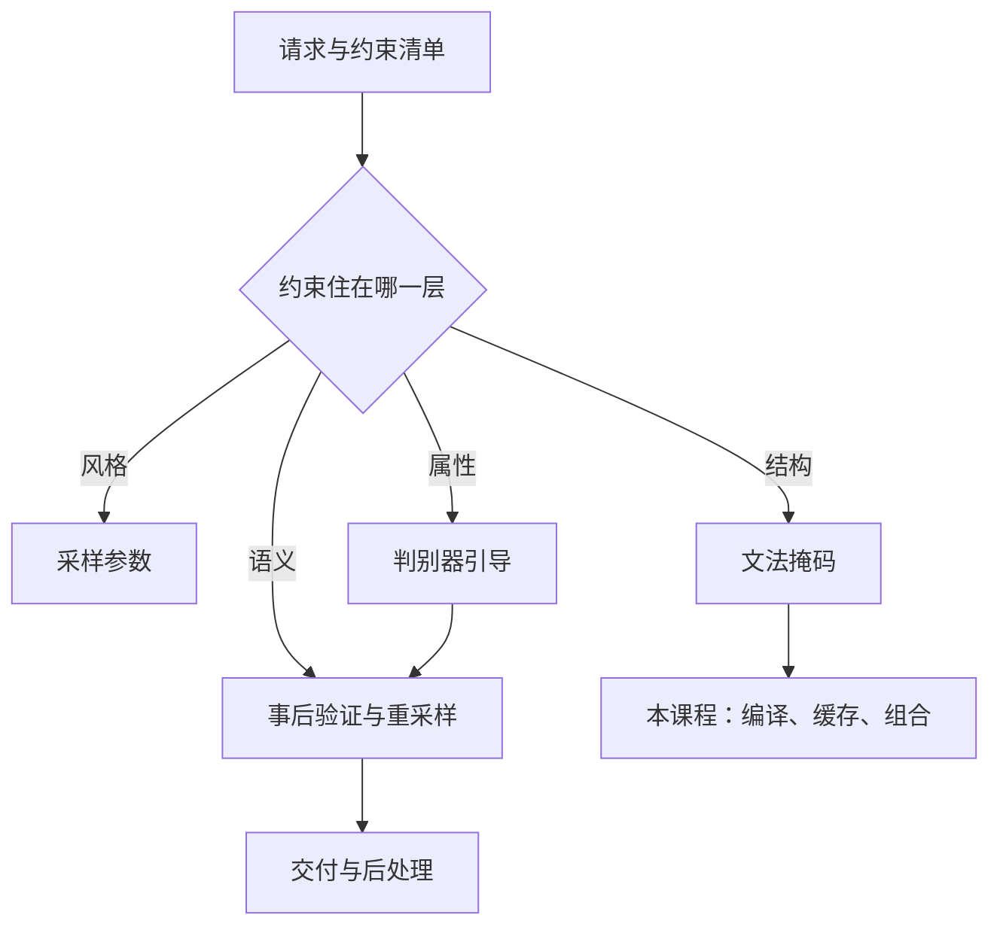
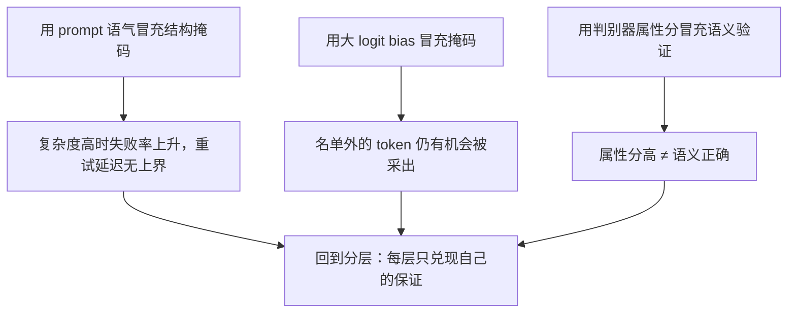

# 受控生成的进阶主题

属性控制有两条路：把判别器的梯度灌进每一步的隐状态，或把约束编成掩码挡在采样前；前者软而贵，后者硬而便宜。

<footer>—— Dathathri et al., Plug and Play Language Models, ICLR 2020；掩码一路见 Willard & Louf, arXiv:2307.09702</footer>

[上一课](/llm/spec-map)把投机解码收束成一张决策单，回答的是「快」。本课程回答「听话」：让输出服从结构、词法、属性与业务语义，并把它做成服务。基础课已经把 token 级掩码讲透：[约束解码](/llm/constrained-decoding)的自动机、[文法约束](/llm/grammar-decode)的下推机、[JSON Schema](/llm/json-schema-decode) 的产品契约、[正则约束](/llm/regex-constrained-decode)的活前缀，以及[结构化输出的开销](/llm/structured-output-overhead)。本课补一张总图：控制面按什么分层、各层付出什么代价，本课程后面各课在图上的位置。后课默认你已经知道：掩码改的是支撑集，不是权重。

## 问题

文法掩码保证「输出能过解析器」，但产品清单上的约束大多不在文法里：摘要不得整句照抄原文，文案必须提到品牌词，回复语气要正式，字段值要来自检索命中的实体。这些约束住在不同的层：有的采样参数就能碰，有的能编成逐步掩码，有的需要一个判别器在每步打分，有的只能靠生成后的执行验证。全塞进 prompt 是软的：模型可以听见但不服从；全编成文法是做不到的：「语气正式」没有上下文无关文法。缺口是分层——每层有明确的保证强度、每步成本与失败模式，工程上按需选层、按层组合。

## 方法

四层，硬度递减、语义深度递增：

1. **采样参数**：温度与核采样改变分布形状，不承诺任何结构，成本为零。它是所有上层控制都要穿过的底座，见 [Temperature / Top-k / Top-p](/llm/sampling-temperature-topp)。
2. **词法与结构约束**：正则、JSON Schema、CFG 编成掩码，硬保证输出属于编译后的语言。术语翻译：「掩码」就是每步生成前把「现在绝对不许出现的 token」的概率清零，模型只能从剩下的候选里挑；「支撑集」指概率不为零的候选集合。掩码不改模型权重，只在出口处拦截——所以它给的是硬保证，代价是分布被截断。基础课已讲语义；本课程后面三课写它的工程化。
3. **属性引导**：判别器或能量项在每步改写 logits。PPLM 对隐状态做梯度更新再重排分布；FUDGE 训练一个「未来判别器」，每步为若干候选方向各估一次属性概率，把加权后的 logits 混回主干。软保证：倾向属性，不禁止违规。
4. **语义验证**：生成后跑校验器、单测或检索比对，不合格重采样或重生成，等价于拒绝采样，见 [Best-of-N](/llm/best-of-n)。

### 硬度与代价是一对账

掩码每步近似查表，却把分布截断到合法集；判别器每步多一次到几次前向，却保留模型的分布形状。数字实例：掩码近似一次查表，开销几乎为零；而判别器每步加一次前向，decode 每步本来就要跑一遍主模型——等于把这一层的成本直接翻倍。若每个候选方向都判一次（FUDGE 式），还要再乘候选数。这就是「软而贵」的账单来源。选层规则：约束能写成字符串模式，就编掩码；只存在统计倾向（毒性、风格、主题），才请判别器；只有能执行的语义（代码能跑、答案能对），才走验证重采样。选反了，要么为软约束付出硬约束的分布代价，要么为硬保证支付判别器的账单。

## 机制

分层图解释了「不这么做会错在哪」：用 prompt 编排冒充第二层，失败率随结构复杂度上升，且重试延迟方差没有上界；用大正 bias 冒充掩码，名单外仍有概率质量（[logit bias](/llm/logit-bias) 的边界）；用判别器冒充验证器，属性分高不等于语义正确。

这张图把三种最常见的「拿软的冒充硬的」并排放在一起。共同病因是错把「倾向」当「保证」：prompt 是建议、bias 是倾斜、属性分是打分，三者都留有失败概率；只有掩码与可执行验证才给得出「绝不超过某集合」式的承诺。

反过来，「必须出现某关键词」丢给纯掩码也不对：关键词可以出现在未来任意位置，这不是有限状态的「当前该写什么」。NeuroLogic 一线的工作专门处理这种前瞻约束——允许先写、对违约的未来加启发式惩罚，属于第三层的能量思路。

引导的账单不小：PPLM 每步对候选做数次梯度更新，FUDGE 为每个未来假设各跑一次判别前向。把第三层当免费旋钮，是 decode 预算最常见的事故。

## 边界

第三层是另一个攻击面：判别器是被塞进解码环路的第二个模型，它自己的偏置与被绕过的方式都算进产品风险。软引导会偏离语言流形，[CFG 课](/llm/cfg-llm)对外推的警告同构。掩码层保证结构合法但不保证事实正确，这是基础课的老边界；常见误区：拿到一份 100% 能通过 JSON 解析的输出，就以为模型「听话了」。语法合法与内容正确是两回事——完全合格的 JSON 里照样可以装着编造的字段值。结构层管「格式不崩」，事实层要靠检索比对或事后验证另管。越往上层走，保证越弱、成本越贵，验收口径越要提前钉死。本课只钉分层地图；编译怎么做、约束怎么叠、栈怎么排，交给后面各课。

## 小结

- 受控生成四层：采样参数、文法掩码、判别器引导、事后验证；硬度递减、语义深度递增。
- 能写成字符串模式的用掩码，统计倾向用判别器，可执行的语义用验证重采样。
- 软引导保留分布形状但每步多付前向；硬掩码便宜但把分布截断在合法集。
- 「关键词必现」这类前瞻约束属于能量与惩罚思路，不是有限状态能表达的。
- 本课程后续：编译优化、缓存复用、多约束组合，再转服务侧的栈、停止、流式与账单。
- 出处：Dathathri et al., PPLM, ICLR 2020；Yang & Klein, FUDGE, NAACL 2021；词法前瞻见 Lu et al., NeuroLogic A*esque, 2021；掩码一路见 Willard & Louf, arXiv:2307.09702。
