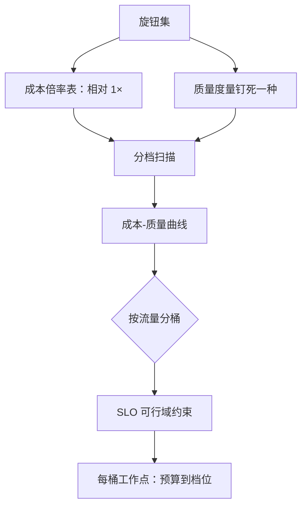
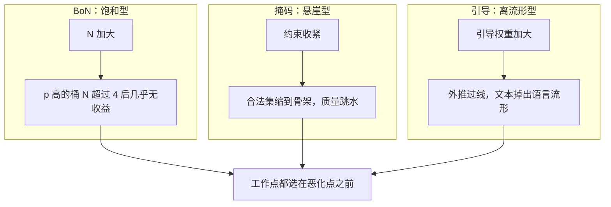

# 成本-质量曲线

每个旋钮都能讲一个「更好」的故事；把横轴换成每请求成本、纵轴钉死一种质量度量，故事才会互相可比。

<footer>—— 据 Snell et al., 2024 的测试时计算权衡与 Pope et al., 2022 的服务成本口径整理</footer>

[上一课](/llm/dec-bestofn-serving)把 $N$ 的账算清。本课程至此积累了一排旋钮：采样参数、logit bias、文法掩码、判别器引导、Best-of-N、投机、瀑布与并发。本课把它们放上同一条坐标：横轴每请求成本，纵轴质量。成本的分母基础课已给：[服务成本模型](/llm/serving-cost-model)的 $C_{\mathrm{tok}}$。本课给曲线本身。

## 问题

每个旋钮在自己的论文与课程里都「有效」，但度量互不可比：核采样报生成质量的人评，文法约束报可解析率，Best-of-N 报真值准确率，投机报加速比。没有统一坐标，团队会在错误的地方优化——为免费旋钮写三周代码，为昂贵旋钮拍脑袋定档。更隐蔽的是漏账：文法的编译与逐步掩码、CFG 的双倍前向、BoN 的打分器与重试、后处理的修复率，都不在「token 数」里。缺口是两张表：每个旋钮的成本倍率表，与一种钉死的质量度量。

## 方法

**成本写成相对倍率**（decode 步的每请求成本，以无约束采样为 $1\times$）：

- 温度与核采样：$1\times$，免费但改变分布形状（[温度课](/llm/sampling-temperature-topp)）。
- logit bias 与惩罚：$1\times$ 加稀疏操作的零头（[bias 课](/llm/logit-bias)）。
- 文法掩码：约 $1\times$ 加掩码开销，确定边跳过前向后可 $\lt 1\times$（[编译与缓存](/llm/dec-schema-compile)把开销压到查表）。
- 判别器引导：一到数倍（[进阶课](/llm/dec-controlled-advanced)的账单）。
- Best-of-N：约 $N\times$，前缀共享与瀑布打折（[服务化课](/llm/dec-bestofn-serving)）。
- 投机解码：$\lt 1\times$，折扣即接受率（[投机收束](/llm/spec-map)）。直觉类比：投机解码像实习生先起草、老编辑逐段抽查——草稿便宜（小模型），抽查通过就整段收货，不通过才重写。接受率越高，「折扣」越大，所以它能做到比 $1\times$ 还便宜——这是表里少有的能往左走的旋钮之一（文法掩码的确定边跳步是另一个）。

**质量度量钉死一种**：可执行验收（单测、答案比对）$\gt$ RM 分 $\gt$ 人工抽样。同一张图只用一种；换度量重画曲线，不拼接。

**扫档位、报边际**：每旋钮 3-5 档，报「边际质量 / 边际成本」，而不是只报最优点的绝对值。

## 机制

曲线形状由边际递减决定，且每个旋钮的递减点不同：BoN 在 $p$ 接近 1 的桶上 $N\gt 4$ 几乎无收益（[Best-of-N 课](/llm/best-of-n)的饱和）；过紧掩码存在质量悬崖——合法集缩到只剩骨架时质量跳水（[文法课](/llm/grammar-decode)）；CFG 外推过线后质量掉出流形（[CFG 课](/llm/cfg-llm)）。**曲线的工程用法是分桶选工作点**：工具调用流量上文法是必选项（不是质量旋钮而是可用性旋钮），它的曲线起点就不在 $0$；闲聊流量上文法无用，温度与 bias 是全部。SLO 把曲线切成可行域：TPOT 上界砍掉重引导这类慢旋钮，尾延迟预算砍掉深瀑布；可行域内再按边际选点（[SLO 分层](/llm/sch-slo-tiers)的成员边界归调度课程，这里只取它的约束面）。

这张图回答「为什么不能一路把旋钮拧到底」：三种旋钮的恶化形状不同——饱和是「加了白加」（浪费但不伤质量），悬崖与离流形是「加过头反而变差」（伤质量）。用数字感受悬崖：合法集从几万个候选 token 缩到几百个时，模型常常只能「在矮子里拔将军」，通顺度骤降。

曲线是会过期的资产：换模型、换分词器、换 schema 模板，曲线整体平移。每条曲线必须带版本戳与测量日期；没有版本戳的「文法 1.05× 成本、通过率 +18pt」不可复现。

## 边界

不同纵轴的曲线不能拼一张图；「人工偏好」做纵轴时样本量与评审协议必须先钉，否则曲线是噪声。成本只算 token 是漏账：打分器、沙箱、重试与修复率都要折进每请求成本，否则 BoN 与修复重的流量被系统性低估。常见误区：初学者容易拿「生成的 token 数」当全部成本。一个 BoN=8 的请求真正烧掉的是 8 份 decode 加 1 次 RM 打分加可能的沙箱执行；漏掉后两项，账面上 BoN 显得比文法引导便宜，实际恰好相反——这也是团队「在错误的地方优化」的常见起点。曲线回答「在给定模型上把推理算力花在哪」，不回答「要不要换更强的模型」——后者是另一条曲线的比较，前提是口径统一（Snell 等人的测试时计算权衡就是在这套坐标里比较宽度与深度的）。最后一课把课程收束成决策单。

## 小结

- 每旋钮一张成本倍率表：免费（采样、bias）、近免费（文法、投机）、线性（BoN、引导）。
- 质量度量一图一种：可执行验收优先于 RM、RM 优先于人工；换度量重画。
- 边际递减点各不同：BoN 饱和、掩码悬崖、引导离流形，工作点选在悬崖之前。
- 曲线按流量分桶使用，SLO 切可行域；工具调用的文法是可用性支出，不是质量支出。
- 成本入账含打分器、重试与修复；曲线带版本戳，换代重测。
- 出处：Snell et al., 2024；Pope et al., 2022；各旋钮口径见本课程与基础采样、服务成本各课。
