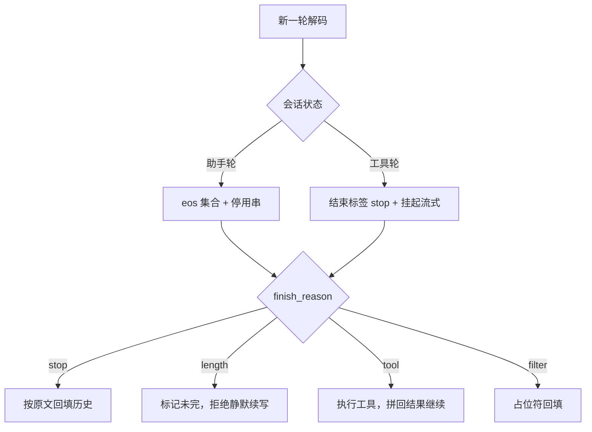
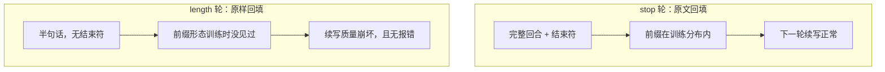

# 对话状态与停止语义

「为什么停了」至少有四种答案；把这四种答案都折叠成 finished，多轮对话就会在半句话上续写。

<footer>—— 据 OpenAI 兼容接口的 finish_reason 约定与 Hugging Face chat template 机制整理</footer>

[上一课](/llm/dec-logit-processor-stack)把每一步的 logits 改写钉成栈。本课问序列何时收口。单请求的零件基础课已备齐：[stop sequences](/llm/stop-sequences) 写了结束 token、停用串与长度预算三分，[chat template](/llm/chat-template) 写了角色渲染与结束符契约，[function calling](/llm/function-calling) 写了工具协议。本课把它们装进**多轮服务**：停止语义是会话状态的函数，不是解码器的常数。

## 问题

多轮服务里，「这一步之后停」的含义随状态变化。助手正常说完，结束符是模板规定的特殊 token；术语翻译：结束符通常叫 EOS（end of sequence），是词表里一个专门表示「我说完了」的特殊 token，不是普通文字。它由训练时的对话模板规定——模型生成出它，解码器才知道该收口；换一个模型，这个 token 的编号和写法可能完全不同。工具调用回合里，结束标签是协议边界，切掉之后还要执行工具、把结果拼回来继续生成；`max_tokens` 触发的截断在语言学上没有结束，若当正常输出回填历史，下一轮从半句话续写；安全过滤中断是另一种 finish。无状态服务每个请求只看到一次解码，天然不知道这些差别；把所有终止都叫 `finished`，会话层就失去了区分「说完了」「被截断」「触发协议边界」的信息。缺口是：服务侧要有一份随会话演进的停止状态机，决定每轮用哪些终止条件、结束之后历史怎么记。

## 方法

**每轮记录 finish_reason，全集至少四项**：`stop`（EOS 或停用串命中）、`length`（预算截断）、`tool`（协议边界命中、工具待执行）、`filter`（安全中断）。返回给客户端的是这份全集，不是布尔。

**历史回填按 finish 分支**：`stop` 轮按原文回填；`length` 轮要么补显式「未完待续」标记、要么拒绝静默续写；`tool` 轮回填的是「调用片段加工具结果」的完整回合；`filter` 轮回填占位符而非被滤内容。回填文本与交付文本的一致性归后处理管线，本课钉的是：**截断绝不当正常结束**。

**终止条件随状态装配**：助手轮把模板结束符放进 eos 集合（[stop 课](/llm/stop-sequences)的分工）；工具轮把结束标签放进 stop 列表并挂起增量交付；两者来源都是[模板与特殊 token 契约](/llm/special-tokens)，不靠运行时猜字符串。取消与超时也进状态机：它们是调用方中止，`finish` 标记要如实区分。

## 机制

为什么必须状态化：训练分布里结束符是渲染模板的一部分（[chat template 课](/llm/chat-template)的结论——模板与权重同为契约）。会话层若把截断历史原样回放，模型见到的条件前缀是训练时没见过的「半句话」形态，下一轮的续写质量崩坏却无报错——这是 OOD，不是能力问题。术语翻译：OOD 即 out of distribution（分布外）——输入长成了训练时没见过的形状。模型只学过「完整回合后面接新回合」，从没学过「半句话后面接什么」，于是只能瞎接；这种错不会抛异常，只有下游质量悄悄变差。工具轮同理：结束标签若既不进 stop 也不进 eos，模型会在标签后继续「替系统写结果」；若把工具结果误当用户输入拼错角色，模板层直接坏掉。

这张图回答「为什么截断绝不能当正常结束」：两种回填在日志里看起来一模一样，差别只在 finish_reason 字段。左边的模型见过这种前缀，右边的没见过——所谓「多轮对话越聊越胡说」，很多就是这么来的。

停止语义与投机解码的交互在基础课已钉过：草稿上的提前命中不能提交，以已接受文本为准。会话状态机加上一条：跨轮的终止条件配置（eos 集合、stop 列表）属于会话元数据，跟随会话路由迁移，换引擎不能丢。

最常见的多轮 bug 是把 finish_reason=length 的轮次按正常输出回填：日志里一切正常，只有 finish 字段知道模型从半句话续写。验收脚本要按 finish_reason 分桶统计续写质量。

## 边界

停止语义不提供安全：模型可以在命中终止条件前写完违规内容，内容安全是独立分类通道（[stop 课](/llm/stop-sequences)的老边界）。多结束符集合跨模型迁移要重测：同一逻辑结束在不同词表里有不同表面编码，只做字符串匹配会漏。常见误区：初学者以为结束符就是一段固定字符串（比如 `</s>`），写个字符串比对就完事。实际上很多结束符是特殊 token，可能在文本里没有对应的字面形式，或者同一段文字在不同 tokenizer 下切法不同——字符串匹配要么漏停、要么误停，必须走 token id 层的契约。会话粘性与路由归调度课程；本课钉的是状态机本身。下一课管收口之前的每一段怎么交付：流式与增量解析。

## 小结

- finish_reason 至少四项：stop、length、tool、filter；全部终止都进状态机，含取消与超时。
- 历史回填按 finish 分支；截断绝不当正常结束，宁可显式标记。
- 终止条件随会话状态装配：助手轮用 eos 集合，工具轮用结束标签 stop，来源是模板契约。
- 半句话回填是条件前缀 OOD，错误无报错、只有字段知道。
- 会话的终止配置是元数据，随会话迁移，换引擎不丢。
- 出处：据开放 API 的 finish_reason 约定与 Hugging Face chat template 机制整理；单请求语义见 stop sequences 课。
