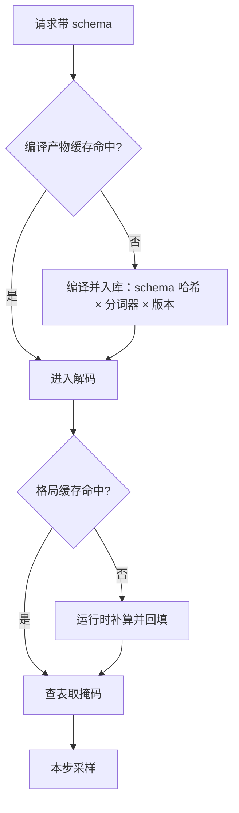
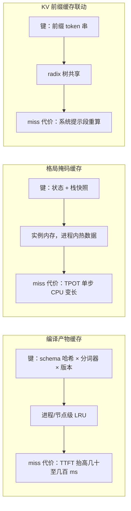

# 文法缓存与复用

编译一次是优化，编译千次是事故；缓存键里漏掉分词器，命中越多越危险。

<footer>—— 据 Dong et al., XGrammar, arXiv:2411.15100 的自适应掩码缓存与 SGLang 缓存工程整理</footer>

[上一课](/llm/dec-schema-compile)把单个 schema 的编译压到可承受：简化、token 级索引、预计算与运行时切分。服务一天见到的 schema 远不止一个：工具定义、表单、信封各有各的文法，还有长尾被反复请求。本课写缓存与复用：什么做键、存什么、怎么失效、怎么度量。后课的多约束组合把缓存键扩成元组。

## 问题

缓存的候选有三层。第一层是**编译产物**：FSM / PDA、离线掩码表——不缓存它，每个请求付一次完整编译，冷启动打在 TTFT。第二层是**运行时格局掩码**：PDA 格局到合法 token 集的映射，XGrammar 用自适应缓存记住见过的格局，命中率决定逐步开销接近查表还是回到线性。第三层是与 **KV 前缀缓存**的联动：系统提示加工具定义这段前缀在[前缀缓存](/llm/kv-prefix-cache)里照常命中，结构化请求的开销集中在正文分叉之后。三层各有键、容量与失效问题；缺一层，TTFT 或 TPOT 的尾部就会间歇性变差，而平均数看不出来。

术语翻译：「格局」就是自动机当前走到哪一步的快照——状态编号加上栈里压了什么。同一段 JSON 写到 `{"name":"` 和写到 `{"age":` 是两个不同格局，各自允许的下一批 token 不同；格局缓存就是把「见过的快照 → 允许 token 表」记下来，下次同快照直接查表。

## 方法

**键设计**：编译产物缓存键至少三个字段——归一化后的 schema 哈希、分词器指纹、编译器版本。归一化要消掉空白、转义与键序差（若产品已固定键序则按序哈希）；分词器指纹防「换模型旧表照用」；编译器版本防算法升级后新旧产物混存。格局缓存的键是自动机格局本身（状态加栈），属进程内热数据，不需要跨机共享。

**存储与容量**：编译产物小而贵，放进程级或节点级 LRU，容量按「活跃 schema 数 × 单产物大小」估；格局缓存大而热，放实例内存。多 worker 部署时编译产物可以共享（只读），格局缓存随请求粘性走。

**失效**：三类信号——模型或分词器升级（全量清空编译产物）、schema 演进（哈希变则自然分桶）、引擎升级（版本号进键）。失效错误不是性能问题：给新模型挂旧掩码表，输出仍然合法，但模型已经不是训练时那个条件分布的拥有者。

常见误区：初学者容易以为「schema 文本一样键就一样」，实际上两个请求的 JSON Schema 往往只差空格、转义或键序，直接拿原文做键会让缓存永远 miss。所以键要用归一化后的哈希——先把无意义差异抹平，再哈希，同一模板的不同写法才能命中同一条缓存。

## 机制

缓存有效的理由在上一课已经埋下：真实流量的 schema 集中在少数模板上，PDA 格局集中在键名、标点与常见类型上。两层缓存的命中差体现为不同指标：编译缓存 miss 直接抬高该请求 TTFT（毫秒到百毫秒级，取决于 $|Q|\cdot|\mathcal{V}|$），格局缓存 miss 抬高 TPOT 的单步 CPU 时间。度量要分开报：编译命中率、格局命中率、以及 miss 时回源成本，否则「平均延迟没变」掩盖了长尾。

与 KV 缓存的复用同构但不同层：文法压缩在无分支路段直接写出确定 token、跳过前向，这些 token 照常写进 KV、照常能被 radix 树共享——结构化流量的系统提示前缀命中率与自由文本无异，分叉从正文第一个自由值开始。

三层缓存回答的问题不同：键是什么、放在哪、miss 时谁付钱。第一图画的是请求查缓存的流程，这里补一张三层对照：

为什么重要：三层 miss 打中的指标不一样——编译缓存 miss 只坑该请求的首 token 延迟，格局缓存 miss 拖慢每一个后续 token。所以监控必须分层报命中率，只看「平均延迟没变」会把长尾恶化藏几周才发现。

数字感受：1000 QPS 下每请求重复编译 50ms 的 schema，等于常驻烧掉 50 个 CPU 核只做重复劳动；命中缓存的同请求成本接近零。

## 边界

缓存不改变正确性要求：失效管理的第一原则是「宁可重编译，不可错复用」。编译炸弹在缓存层同样要防：恶意 schema 会先在编译期烧 CPU 与内存，限额与审计在缓存之前。多租户共享编译产物是安全的（schema 不是机密，掩码不泄露数据），但共享格局缓存的键里若有用户自定义词表片段，要按租户隔离。最后，命中率是资产也是负担：schema 长尾越散，缓存的边际价值越低，此时先把 schema 模板收敛，比扩缓存便宜。

## 小结

- 三层缓存：编译产物、运行时格局掩码、与 KV 前缀缓存的联动；各管 TTFT、TPOT 与共享段。
- 编译缓存键：归一化 schema 哈希 × 分词器指纹 × 编译器版本，缺一即静默事故。
- 失效信号三类：模型升级、schema 演进、引擎升级；失效错误的代价是正确性。
- 命中率要按层分开报，miss 的回源成本决定长尾。
- 防编译炸弹在缓存之前；schema 收敛比扩缓存便宜。
- 出处：Dong et al., XGrammar, arXiv:2411.15100；Zheng et al., SGLang, NeurIPS 2024；Willard & Louf, arXiv:2307.09702。
