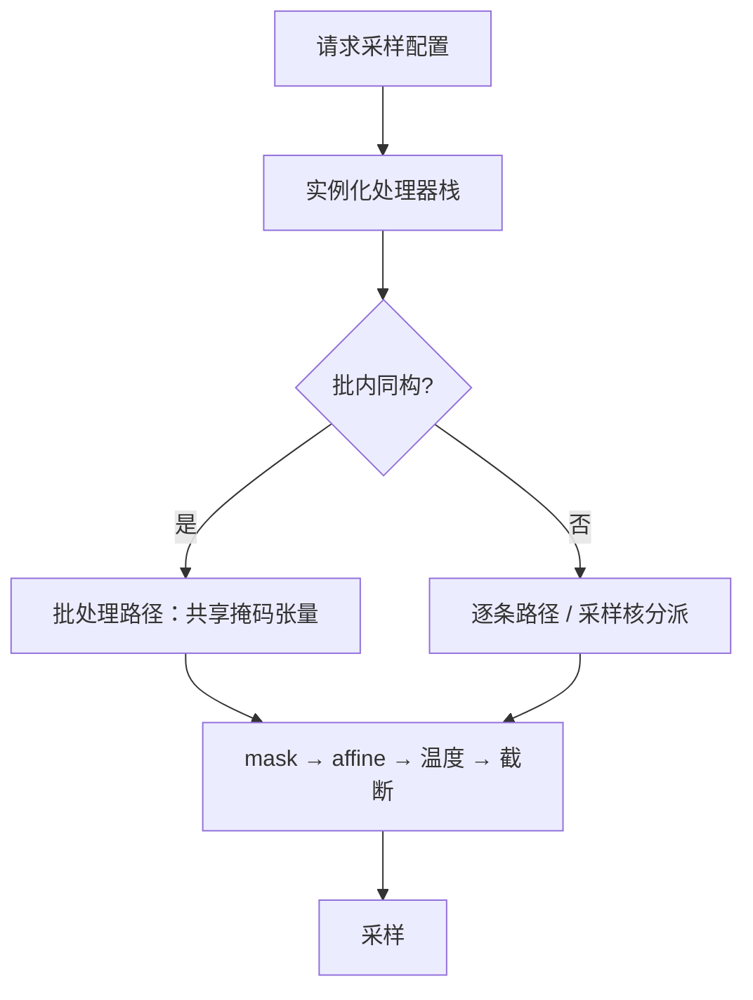

# logit 处理器栈的设计

每一步 logits 都该有唯一的责任人：栈不是插件袋，是一份按位置索引的契约。

<footer>—— 据 Transformers 的 LogitsProcessorList 与 vLLM 等引擎采样钩子的接口约定整理</footer>

[上一课](/llm/dec-multi-constraint)把多条约束并成每步的一个合法集。服务上这些操作不是请求临场拼出来的，而是每个请求带一根**处理器栈**：采样参数、惩罚、bias、掩码按固定次序串在采样前。机制零件基础课都给过了——[n-gram 阻断](/llm/ngram-blocking)、[logit bias](/llm/logit-bias)、[温度与截断](/llm/sampling-temperature-topp)、约束掩码。本课写服务侧：栈的契约、实例化、批量分派与回归。

## 问题

每请求的栈不同：A 请求要 JSON 文法加禁词，B 请求要低温加重复惩罚，C 请求什么都不带。连续批里 $B$ 条序列并行 decode，每步都要对各自的 logits 施各自的栈——掩码必须按序列（[约束解码课](/llm/constrained-decoding)的老结论），bias 是每请求的稀疏对，惩罚是每请求的**有状态**对象。把栈写成 `if json then ...` 的分支袋，结果是：顺序随实现漂移、状态挂错请求、评测与线上行为分叉。缺口是一份显式契约：每个处理器声明它对 logits 做什么、是否携带状态、必须排在哪。

## 方法

**操作分类与固定次序。** 每个处理器声明三类之一：mask（把非法位置置 $-\infty$，如文法、n-gram）、affine（逐 token 加减，如 bias、重复与频率惩罚）、scaler（温度）或 truncator（top-$k$ / top-$p$）。次序钉死：mask 族 → affine 族 → 温度 → 截断 → 采样。理由在机制上：mask 定义合法集，必须在一切软操作之前；截断之后的任何改写都破坏核采样的语义。任何实现偏离次序，都要在文档里声明并重测。

**实例化与状态。** 请求到达时按采样配置编译出栈：无状态处理器共享单例；有状态的（重复惩罚、频率计数）每请求实例化，状态随请求走。连续批换槽、抢占恢复时，栈与状态必须跟着序列迁移——丢状态的表现不是报错，是「惩罚悄悄失效」。

**批量分派。** 同构栈的请求合并走批处理路径（一张掩码张量加一组稀疏 bias）；异构栈走逐条路径或下推到采样核（[采样器内核](/llm/sampler-kernel)）。CPU 上的栈是 decode 的潜在同步点，重叠的教训与[结构化输出](/llm/structured-output-overhead)同一条。

## 机制

次序契约的正确性可以逐条论证：mask 在前，保证 affine 与截断只在合法集内活动；affine 在温度前，保证「同一 bias 在不同温度下硬度不同」的语义可复现（温度越低同一 $b$ 越接近禁令）；截断最后，保证核的定义域是全部前面的变换都生效后的分布。投机解码下栈还有一个义务：偏置与掩码必须同时进入目标分布与草稿校验的两侧，否则无损接受对的是未偏置的 $p$——这是 [logit bias 课](/llm/logit-bias)的边界在栈上的落点。

可观测性是栈的验收面：每步记录「哪个处理器把多少 token 打成 $-\infty$、哪些 token 被 affine 移出了核」。线上事故大多不是某个处理器算错，而是两个处理器在同一位置上打架——只有栈快照能定位。

回归测试要钉到「栈快照等价」：同一请求、同一前缀，逐处理器的中间 logits 与参考实现逐位比对。顺序挪一格，分布就不同——这是最容易过 CI、最容易伤用户的改动。

## 边界

栈是兼容性契约：处理器列表与次序的变更要走版本化，评测与线上必须同一版本（[logit bias 课](/llm/logit-bias)的「评测线上同一张 $b$」在栈上是同一句话）。栈长度有性能上限：每处理器每步至少 $O(|\mathcal{V}|)$ 或稀疏集大小，十几个处理器串联会把 CPU 侧变成屋顶——先合并同类（多个 bias 合成一个稀疏对列表），再谈下推。栈不解决的问题留给后课：序列何时结束是停止语义，流式怎么交付是流式课。

## 小结

- 栈契约三要素：操作类型（mask / affine / scaler / truncator）、是否有状态、固定次序。
- 次序钉死为 mask → affine → 温度 → 截断 → 采样；偏离须声明并重测。
- 有状态处理器属于请求，连续批迁移时状态跟序列走。
- 同构栈走批处理路径，异构栈逐条或下推采样核；CPU 侧是同步点。
- 投机解码下栈要进目标与草稿两侧；回归测试用栈快照逐位比对。
- 出处：据 Transformers 的 LogitsProcessorList 接口与 vLLM、SGLang 等引擎的 logits processor 约定整理；机制零件见 n-gram 阻断、logit bias 与采样各课。
