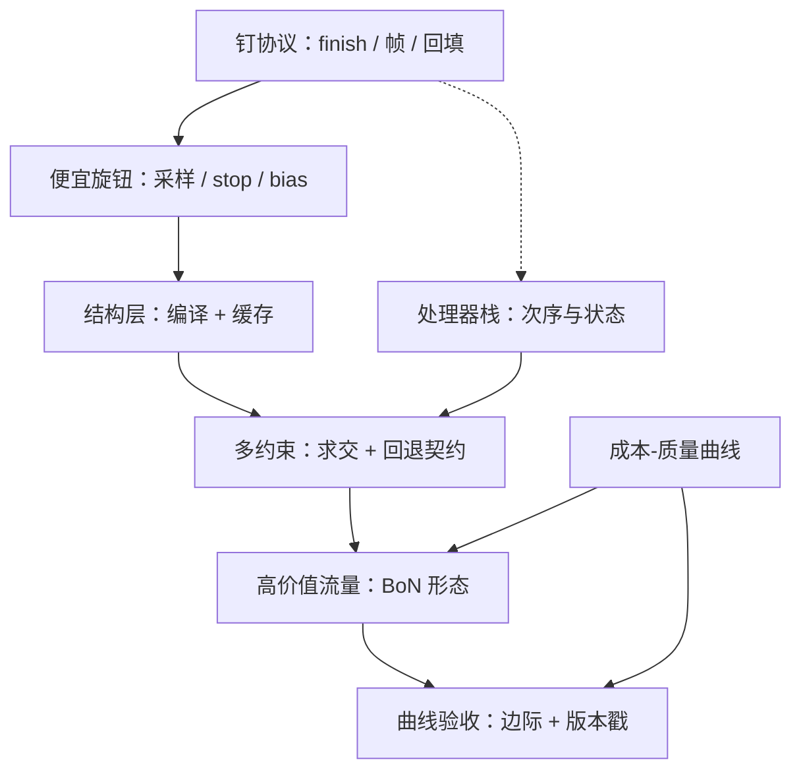
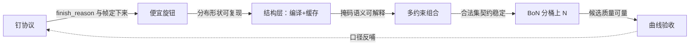

# 解码控制收束

收束不是把十课再讲一遍，而是回答：明天上线解码控制，先钉什么、后上什么、什么永远不碰。

<footer>—— 据 Willard & Louf, arXiv:2307.09702、XGrammar, arXiv:2411.15100、Cobbe et al., 2021 与 Snell et al., 2024 按本课程整理</footer>

[上一课](/llm/dec-cost-quality-curve)把全部旋钮收进成本-质量曲线。至此零件齐了：受控生成的四层地图、结构层的编译与缓存、多约束的组合、服务侧的栈、停止语义、流式事件、后处理管线与 $N$ 的交付形态。本课把它们装配成一张地图与一张决策单。上游是采样与掩码的机制课，下游是成本曲线给的分。**本课程到此收束。**

## 问题

解码控制的决策散在九课里：协议（finish_reason 全集、流式帧、回填规则）、结构（编译优化、缓存键、组合回退）、栈（次序契约、状态归属）、质量旋钮（BoN 形态、分桶）、验收（曲线、口径）。各课局部最优会互相拆台：协议没钉就上流式 UI，截断回填的 OOD 会记到模型头上；缓存键缺分词器指纹，命中率越高越危险；曲线没画就上 $N=16$，钱花在饱和区。上线要的是顺序，不是并行的清单。

直觉类比：把上线解码控制想成装修房子。钉协议是打水电地基（看不见但全屋踩在上面）；便宜旋钮是换灯刷墙（花钱少见效快）；结构层与多约束是定制柜体（要先量好尺寸再动工）；上 $N$ 是买高端家电（房子没收拾好就买，体验提升有限）。装修的坑几乎都是顺序错了，不是零件买错了。

## 方法

**决策单**，按「先钉协议、再上便宜旋钮、后建结构层、全程带账」排序：

1. **钉协议**：finish_reason 全集、流式帧（append / replace_tail / event）、一致性三角的回填规则。看不见的地基，其余各课都踩在上面。
2. **便宜旋钮先行**：采样参数按桶调好，stop 列表与 eos 集合对齐模板，必要的 bias 上线——成本近零，先把分布拧到该有的形状。
3. **结构层覆盖工具流量**：schema 收敛后编译，产物按「哈希 × 分词器 × 版本」缓存；确定边直接省步。
4. **多约束按契约组合**：硬约束求交、空集回退写死优先级、每条约束记生效点。
5. **高价值流量上 $N$**：按桶级 $p$ 选并发、瀑布或 leader-follow，打分器 SLO 单独钉。
6. **曲线验收**：每个旋钮上线前后同口径重测，报边际与版本戳。

永不碰的四件事：无回退策略的空支撑集；把截断当正常结束回填历史；拿打分器分数当交付质量报警；后处理静默改写进历史的文本。

## 机制

地图的骨架是三条不变量。**不变量一**：掩码改支撑集、不改权重——控制的一切语义都从这句出发，掩码过紧的质量悬崖、空集回退的必要性、约束不修复幻觉，都是它的推论。**不变量二**：每一步 logits 与每一次终止都有唯一责任人——栈的次序契约、会话状态机的 finish 分支、管线的一致性三角，都是「唯一责任人」在不同层面的化身；责任模糊的地方，就是事故查不出原因的地方。**不变量三**：任何质量声明都带着成本与口径——曲线不变量，它让本课程的旋钮与未来的旋钮（新的引导方法、新的验证器）在同一个坐标系里比较。引擎、分词器、schema 工具都会换代，三条不变量定了，决策单的顺序不动。

一张自检表：如果只做三件事——先把 finish_reason 与流式帧钉进协议，再给工具调用流量上带缓存的文法掩码，然后在主力流量画一条带版本戳的成本-质量曲线。多数服务在第三步之前就拿走了大半收益，后面的每一步都要求先证明前面拿不出来了。

六步决策单不是平行的菜单，每一步都依赖前一步交付的东西；顺序错了，后面一步的验收就没有锚点：

为什么重要：「掩码改支撑集、不改权重」这条不变量如果做反了——比如为了绕开空集偷偷改采样权重——输出看起来还是合法的，但模型的概率分布被换掉了，之后所有质量回退、A/B 对比与评测数字全部失真，而且很难查出来。控制层的每条红线，本质都是在保护「我们还在同一个模型上说话」这个前提。

## 边界

这张地图有时效：约束引擎在加代，验证器与测试时计算的最优配比随模型换代移动，流式协议在标准化。边界之外由相邻课程接棒：批里的成员边界与优先级归服务调度，前缀与 KV 的峰值归 KV 管理，上下文拉长之后的显存与调度是下一课程的题目。解码控制交付的始终是同一件事：把「模型应该说什么」之外的全部要求——结构、词法、属性、交付与账单——从希望变成可以验收的机制，并让每一分质量都能在正确的口径下被数出来。

## 小结

- 决策单六步：钉协议 → 便宜旋钮 → 结构层 → 组合契约 → BoN 分桶 → 曲线验收。
- 三条不变量：掩码只改支撑集、每步有唯一责任人、质量声明带成本与口径；参数换代，顺序不动。
- 永不碰：无回退的空支撑集、截断回填历史、打分器分数当交付质量、后处理静默改历史。
- 协议（finish_reason、帧、回填）是本课程各课共踩的地基，永远排第一。
- 便宜旋钮先于结构层，结构层先于 $N$；每一步用曲线证明前面的拿不出来了。
- 出处：Willard & Louf, arXiv:2307.09702；Dong et al., XGrammar, arXiv:2411.15100；Cobbe et al., 2021；Snell et al., 2024；按本课程十一课整理。
