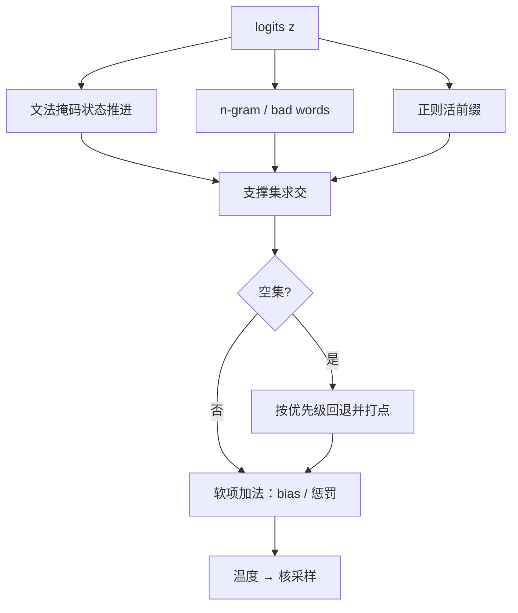

# 多约束的组合

硬约束求交集，软约束做加法；交集为空时，回退顺序是产品契约，不是运行时的随机数。

<footer>—— 据 Willard & Louf, arXiv:2307.09702、XGrammar 与 n-gram 阻断（Paulus, Xiong & Socher, ICLR 2018）的组合语义整理</footer>

[上一课](/llm/dec-grammar-cache)让编译产物与格局掩码可复用。真实请求很少只带一条约束：工具参数要过 JSON Schema，同时禁词表要生效，同时输出不能整句照抄检索片段，同时有长度预算。本课写组合：多条约束如何并成每一步的一个合法集与一个分布，冲突怎么办、空了怎么办。

## 问题

约束按作用面分两类：**支撑集操作**（掩码族——文法、正则、bad words、n-gram 阻断）与**打分操作**（logit bias、频率惩罚、判别器能量）。支撑集操作的组合语义是交集：每条约束定义「到此为止的合法前缀集合」，组合后每步可用支撑是各集合的交。打分操作的组合语义是加法：在最终支撑内按各项之和重排。麻烦出在三处：交集可能为空（n-gram 阻断吃掉文法的唯一合法 token）；组合后的合法集可能小到把模型逼进低概率区；多条软项的先后与权重没有先验，顺序不同分布不同。缺口是组合规范：谁先谁后、空集怎么回退、每条约束的生效怎么观测。

## 方法

**先交硬、再加软。** 每步先把所有支撑集操作按位求交（位图 AND，成本 $O(|\mathcal{V}|/64)$ 每条），得到合法集；再在合法集内施加打分操作；温度与核采样在最后。这条顺序是 [logit bias 课](/llm/logit-bias)单请求顺序在多约束下的展开。

**空集回退写进契约。** 交为空时按声明顺序放松：通常是软性词法约束（禁词、n-gram）先让位给结构文法——句子违法比出现重复短语严重；绝不允许静默放开文法。回退必须打点：哪条约束在第几步被放松，是验收与复盘的输入。

**状态并行推进。** 每条硬约束维护自己的自动机状态，随采样 token 独立转移；组合不需要合并自动机——product 自动机只是理论存在，实际用「各自状态 + 每步求交」，编译与缓存按组合键（各约束键的有序元组）走。

## 机制

按位求交便宜的原因：位图 AND 是机器字运算，四条约束叠加也远低于一次前向的零头；真正贵的不是求交，是空集之后的人工回退与重试。交集的正确性来自各约束的语义一致：每条都定义「合法前缀」，交仍是「合法前缀」，所以组合输出仍同时满足全部硬约束。但组合改变分布质量：合法集越小，截断分布离模型先验越远，[文法课](/llm/grammar-decode)对过紧掩码的警告在组合下被放大——「严格 JSON + 键序固定 + 禁词表」可能只剩一条骨架路径，多样本生成会塌成同一份输出。

组合键的缓存：同一组约束反复出现时，[编译缓存](/llm/dec-grammar-cache)按元组命中；约束集合一变，各分量缓存仍有效，只有组合层的求交结果可以按步重算——它便宜，不值得缓存。

观测比求解难：给每条约束记「最后生效步」，谁把支撑集打到只剩一两个 token、谁触发了回退，一目了然。没有这张表，多约束系统退化成玄学调参。

## 边界

不是所有组合都能硬叠：「关键词必现」与严格 JSON 的组合需要前瞻能量或事后验证，硬编成状态机会得到巨大的 product 且仍然不完备；跨字段不变量（`end` 不早于 `start`）本来就该留在生成后校验。组合条数有工程上限：合法集单调缩小，质量悬崖在前——按流量实测「合法集平均大小」比数条数可靠。回退顺序一旦公布就是兼容性契约：引擎升级改回退，等于改产品行为。

## 小结

- 硬约束按支撑集求交，软约束在交集内做加法；顺序是掩码 → 求交 → 空集回退 → 加法 → 温度与核。
- 每条硬约束独立推进状态，每步按位求交；组合键是有序元组，分量缓存各自有效。
- 空集回退按声明优先级，软词法让位结构文法，且必须打点。
- 合法集随组合单调缩小，质量悬崖与多样性塌缩要先测。
- 前瞻约束与跨字段不变量不进硬组合，交给能量项或事后校验。
- 出处：Willard & Louf, arXiv:2307.09702；Dong et al., XGrammar, arXiv:2411.15100；n-gram 阻断见 Paulus, Xiong & Socher, ICLR 2018。
