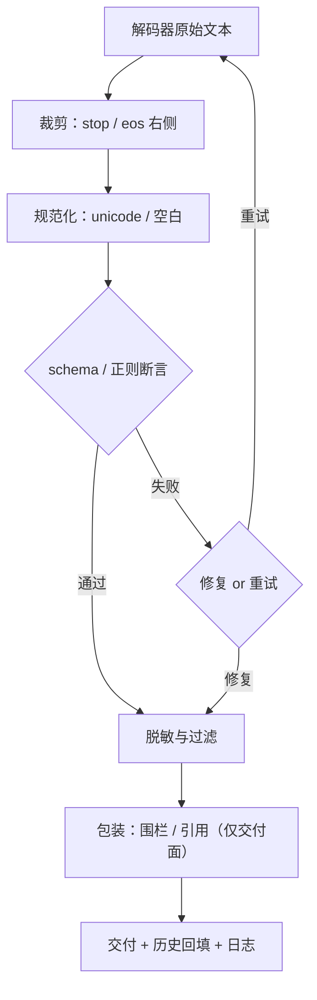

# 输出后处理管线

后处理的每一刀都要留底：改过的文本不再是模型的输出，回填历史、写日志、交付客户端，三处必须用同一份决定。

<footer>—— 据 OpenAI 兼容接口的输出约定与 JSON Schema 校验器实践整理</footer>

[上一课](/llm/dec-stream-reparse)把 token 流变成事件流交出去。本课管最后一公里：解码完成后的**后处理**。零件分散在基础课里：stop 命中后的裁剪在 [stop 课](/llm/stop-sequences)，schema 校验与回退在 [JSON 约束课](/llm/json-constrained-decode)，工具片段的切分在 [function calling](/llm/function-calling)。本课把它们排成一条有序管线，钉住每一步的输入输出不变量。

## 问题

一段生成文本从解码器出来，到成为交付物，要过若干刀：裁掉 stop 命中段及其右侧、剥离围栏与角色残片、规范化 unicode 与空白、schema 或正则校验、失败时修复或重试、脱敏与内容过滤、包装（加引用、加代码围栏）。这些步骤散落在网关、SDK 与业务代码里时，同一请求在不同客户端得到不同文本；更要命的是**回填历史用哪份文本**没有定论——模型下一轮见到的上下文与它上一轮实际生成的对不上，是又一处条件前缀 OOD。缺口是把后处理当系统对象：顺序、幂等、留痕、与解码层的关系。

## 方法

**固定阶段序**，每阶段声明不变量：

1. **裁剪**：stop 与 eos 命中段的右侧切除；多模式按最长匹配优先（[stop 课](/llm/stop-sequences)钉过）。不变量：输出是模型生成文本的真前缀。
2. **规范化**：unicode 形式、行尾、空白折叠。不变量：可逆或有留痕——规范化改变字节，回填与日志必须用同一份。
3. **校验**：schema `fullmatch` 断言（[正则课](/llm/regex-constrained-decode)的老规矩）。失败分两路：解码层回退（空支撑集）与内容越界（事实、取值），处理不同。
4. **修复**：JSON repair 是启发式，修复后的对象不再等于模型输出。日志存双份（原始与修复后），修复率是解码质量的观测指标。
5. **脱敏与过滤**：PII、内容分类，独立于 stop 的通道。
6. **包装**：加围栏、注入引用，只在交付面生效，不进历史。

### 一致性三角

三份文本必须对齐：**交付文本**（用户看到的）、**历史文本**（回填进下一轮上下文的）、**日志文本**（复盘用的）。包装层只影响交付面；历史回填用裁剪加规范化后的文本；日志存原始文本与每阶段的变更记录。三处各用各的，是复盘失真与 OOD 的共同根源。

## 机制

管线的正确性论证在不变量上：裁剪保证「交付的是模型说过的」，因此历史回填不引入模型没见过的形态；校验保证「进下游的是契约允许的」；修复是唯一会伪造模型输出的阶段，所以必须留底并单独计量。修复率是金丝雀：它突然升高，先查引擎、分词器或文法配置是否变化，而不是庆祝修复器好用——修复器掩盖的正是解码层配置的漂移。

与解码层的分工：掩码层的失败（空支撑集回退、降级路径）必须在管线里可见，标记到请求元数据；管线不静默吞掉解码层的事故，否则「总有输出」的表象会掩盖类型契约已经破裂的事实（[JSON Schema 课](/llm/json-schema-decode)的老边界）。

重试的经济学：修复是毫秒级、重试是秒级。管线应先修复再重试，且重试必须携带失败原因——「校验失败加错误信息再生成」是 [JSON Schema 课](/llm/json-schema-decode)的第一条解码路径，重试不声明原因等于让模型盲猜。

## 边界

后处理不能创造质量：它裁剪、规范化、验证、包装，不能把错答案改对——语义层的对错归验证器与重采样（[Best-of-N](/llm/best-of-n)）。安全过滤放在管线哪一段是产品决策：早过滤省下游计算，晚过滤少误杀上下文；但无论放哪，被滤内容都不回填历史。流式场景下管线要能跑增量（裁剪与脱敏在事件层之前的部分必须流式友好），整段校验仍在闭合后——流式与后处理的关系归流式课，本课钉的是完成后的段。下一课把候选从一条放大到 $N$ 条：best-of-n 的服务化。

## 小结

- 固定阶段序：裁剪 → 规范化 → 校验 → 修复 → 脱敏 → 包装，每阶段声明不变量。
- 一致性三角：交付、历史、日志三份文本的对齐规则必须写死，包装不进历史。
- 修复是唯一伪造模型输出的阶段：存双份、计量修复率，修复率突变先查解码层。
- 解码层事故（回退、降级）要在管线元数据可见，不静默吞掉。
- 重试先修复后重试，重试携带失败原因与上下文。
- 出处：据开放 API 输出约定与 JSON Schema 校验器实践整理；裁剪与校验语义见 stop sequences、JSON 约束、正则约束各课。
