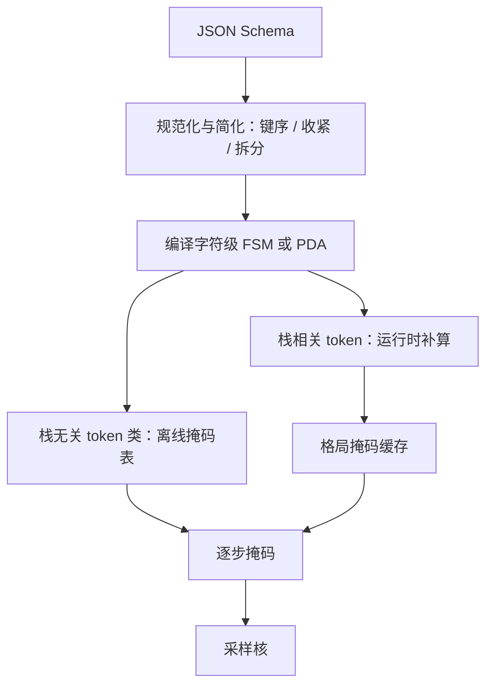
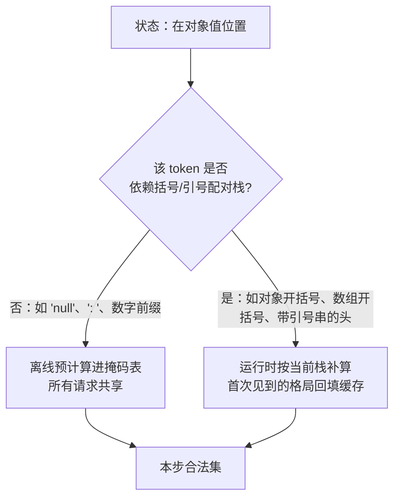

# JSON schema 编译优化

编译的艺在切一刀：栈无关的 token 类离线算成查表，栈相关的留给运行时；全表预计算是把内存烧给用不到的状态。

<footer>—— 据 Willard & Louf, arXiv:2307.09702 与 Dong et al., XGrammar, arXiv:2411.15100 的编译口径整理</footer>

[上一课](/llm/dec-controlled-advanced)把受控生成拉成四层地图，把结构这一层标给了本课程。基础侧的语义已经齐了：[JSON Schema 课](/llm/json-schema-decode)写 schema 作为产品合同，[JSON 约束课](/llm/json-constrained-decode)写类型进掩码，[结构化输出的开销](/llm/structured-output-overhead)点了「编译要缓存」的名。本课只钻编译本身：从一份 schema 文本到逐步可查的掩码，时间与内存花在哪、怎么压。后课的缓存与复用默认建立在本课的编译产物上。

## 问题

编译器的输入是 schema，输出不是「一个自动机」就完事：掩码必须定义在 **token 字母表**上，而 schema 的字符文法与 BPE 不对齐——数字、转义、键名都可能被切成多种子词路径。基准做法是对每个自动机状态扫描整个词表，成本 $O(|Q|\cdot|\mathcal{V}|)$：嵌套对象与递归 `$ref` 把 $|Q|$ 推高，十万级词表把乘积推到不可行。若每个请求现场编译，冷启动全部打在 TTFT；若全表预计算，内存先炸。缺口是三个决策：schema 怎么简化、字符级怎么升到 token 级、预计算与运行时在哪切一刀。

直觉类比：schema 是字符级的规则（「这里要一个引号、那里一个冒号」），而模型一次吐的是一个完整 token（可能是 `":` 也可能是 `"name`）。编译器干的活，就是把字符规则翻译成 token 规则——像把「每小时限速 60 公里」换算成「每分钟限速 1 公里」。换算错了（文法合法的字符序列拼不出任何 token），约束就会卡死。

## 方法

**先简化 schema，再编译。** 关掉 `additionalProperties`、固定键序（声明序或字典序）把对象语言压向近正则；`pattern` 下的子正则单独编译，防状态爆炸；超大 schema 拆成顶层信封加小对象，而不是一次编进掩码。这些是产品决策：紧 schema 好解析、好加速，松 schema 好写。

**字符级到 token 级。** 对每个状态扫描词表，把「token 的字节串能否从该状态合法消费」的判定结果建成索引：Outlines 在编译期建好状态到 token 集合的映射，热路径查表；XGrammar 把与栈无关的 token 类离线预计算成掩码表，依赖栈的 token 在运行时按当前格局补算，并用自适应缓存记住见过的格局。

**存储用位图或稀疏索引。** 合法集通常远小于词表；逐步传掩码时稀疏结构省带宽，与 GPU 前向重叠的细节归[开销课](/llm/structured-output-overhead)。

**编译要设预算。** 深层嵌套或狂野 pattern 让编译超时、内存超限时，应降级为「校验—重试」路径并打点，而不是让请求挂在编译器里。禁用来自用户的任意 pattern，或限时限内存——正则编译炸弹是老问题。

## 机制

优化的每一步都在改复杂度常数或指数。固定键序与禁止额外键，等价于把「对象」的语言从需要记忆任意键集合压成有限枚举，$|Q|$ 从组合级降到线性级。离线预计算把「每步扫词表」换成「每步查表」，代价是一次性 $O(|Q|\cdot|\mathcal{V}|)$；XGrammar 的切法把这一项限定在栈无关类上，栈相关部分摊到首次出现，是内存与运行时的折中。自适应缓存有效的原因是真实流量的格局分布高度集中：键名、固定标点、常见类型反复出现，缓存命中率天然高。

编译必须绑定分词器：换模型或换 tokenizer，token 级掩码表整体作废，这不是缓存失效，是正确性失效。可表示性空洞（文法允许、词表路径不允许）在编译期就应测出来，测法见 [JSON 约束课](/llm/json-constrained-decode)。

常见误区：初学者容易以为「编译慢一点等它算完就行」。实际上恶意或失控的 schema（深度递归 `$ref`、巨型正则）不是慢，是不终止——CPU 和内存会被一直吃下去。所以编译器必须带预算（超时、内存上限），超了就走「不约束、事后校验重试」的降级路径，让请求失败得快而便宜。

量级感受：$|Q|=10^4$、$|\mathcal{V}|=10^5$ 时全表是 $10^9$ 级条目，位图也要数百 MB——「全部离线」从来不是选项，切分才是。

「栈无关」与「栈相关」的区别决定了离线与在线的切分线。栈无关的 token 只看当前状态就能判定；栈相关的要看括号配对史，状态相同、栈不同，合法性就不同：

数字实例：一个典型工具调用 schema 编出的状态数 $|Q|$ 约几千到几万。若其中八成 token 判定与栈无关，离线表就只需存这八成；剩下两成在真实流量里九成以上会命中格局缓存——两边叠加，逐步开销从「每次扫十万词表」降到「基本查表」。

## 边界

编译优化不改变两条老边界：结构合法不等于内容正确；掩码过紧会把模型逼到低概率区，出现重复标点或最短骨架。不要在运行时用 Python 正则逐步过滤词表——那是被 Outlines 论文点名的反面路径。也不要把「编译快」当成 schema 可以随便写的理由：每一层递归与每一条 `pattern` 都会进编译账单，schema 审查比编译器调参便宜。编译产物的跨请求复用、键设计与失效，是下一课的主题。

## 小结

- 编译的三个决策：schema 简化、字符级到 token 级的升级、预计算与运行时的切分。
- 固定键序、收紧 `additionalProperties` 把状态数从组合级压到线性级。
- 栈无关 token 类离线成表，栈相关运行时补算加自适应缓存，是内存与延迟的折中。
- 编译设预算，超限降级为校验—重试；用户提供的 pattern 要限时限内存。
- 编译产物绑定分词器，换模型即重编译，属正确性而非缓存问题。
- 出处：Willard & Louf, arXiv:2307.09702；Dong et al., XGrammar, arXiv:2411.15100；Zheng et al., SGLang, NeurIPS 2024。
