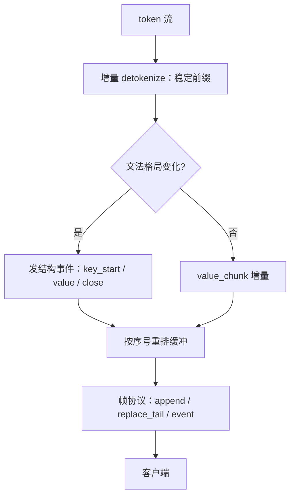

# 流式重排与增量解析

客户端要的不是 token，是事件：字段开始了、值稳了、对象闭合了；把 token 流直接推给前端，等于把解析器的活推给浏览器。

<footer>—— 据 HuggingFace / tiktoken 增量解码与部分 JSON 解析器实践整理</footer>

[上一课](/llm/dec-dialogue-state-stop)把「何时停」钉在会话状态上；停之前的每一段怎么交付，是本课的地盘。底层缝已经钉过：[流式 detokenize](/llm/streaming-detokenize) 写了字节缓冲与稳定前缀，[stop 课](/llm/stop-sequences)写了停用串命中后的挂起。本课往上走一层：把 token 流变成**事件流**——结构化输出的增量解析、乱序块的重排、以及帧协议。前端要边收边渲染，几 KB 的 JSON 不能等闭合。

## 问题

三种交付形态的缺口。其一，纯文本流：token 到哪发到哪，detokenize 课已经解决稳定前缀；但结构化输出不能这样发——半截 JSON 对客户端不可解析（[JSON Schema 课](/llm/json-schema-decode)的边界），用户看着一串花括号没有意义。其二，等闭合再发：最稳，TTFT 退化到整段生成完，长结构上不可接受。其三，增量解析：边生成边报告结构事件，`key_start`、`value_chunk`、`object_end`，前端按事件渲染骨架与填充值。缺口在：事件从哪来、半截字符串 token 怎么算、多个生成块乱序到达时谁保证顺序。

## 方法

**事件层与文法共享状态。** 文法掩码的自动机本来就知道「当前在哪个字段、值是字符串还是数字」（[文法课](/llm/grammar-decode)），增量解析器不必从字节盲猜：向自动机要当前格局，格局每跳一次就发出对应事件。约束解码保证了「目前已是活前缀」，解析器只需报告进展，不需纠错——这是约束与流式互相成全的地方。

**只发稳定子树。** 未闭合的字符串值只发已稳定部分（detokenize 课的稳定前缀规则对每个字段值单独成立）；枚举值在整体闭合前只标「候选」。replace_tail 帧允许修正未稳定尾巴。

**重排缓冲。** 并行块（多候选、多分片、工具结果与正文）各自编号，交付层按序提交：序号小的未到，已到的先进缓冲。重排的代价是缓冲内存与首事件延迟，收益是前端逻辑不需要处理乱序。

### 帧协议是兼容性契约

帧至少三种：`append`（追加稳定文本）、`replace_tail`（修正未稳定后缀）、`event`（结构事件）。协议变更即接口变更：换引擎不能换帧语义，网关要能降级（不支持 event 的客户端退化为 append 加闭合后整段校验）。这与 detokenize 课的两种帧一脉相承，event 是结构层加出来的第三种。

## 机制

增量解析的正确性来自两层保证的叠加：detokenize 层保证不把半个 UTF-8 码点或未定空格标记当字符发出；自动机层保证到过的每个格局都是 schema 的活前缀。解析器报错因此是强信号：约束解码下「解析卡住」几乎总是帧协议或分词器问题，不是模型写错了结构——掩码已经禁止了非法结构，这是[结构化输出](/llm/json-constrained-decode)的契约。投机一次提交多个 token 时，事件层按批过增量状态机，与 detokenize 课的批处理结论同构。

重排的语义按交付物定义：文本流重排在字节上（乱序块不能拼错），事件流重排在事件序上（`key_start` 先于其 `value_chunk`）。两类序号不要混用；混用的典型事故是工具结果块插进正文事件序，前端把结果文本渲染进答案。

事件层引入一个新延迟项：首事件等待到第一个稳定事件（通常第一个键名闭合）才可发。验收结构化流式要报「首事件延迟」与「首字节延迟」两个数，只报后者会高估体验。

## 边界

事件流不降低存储门槛：半截 JSON 仍然不能进数据库，入库在闭合与校验之后（[JSON Schema 课](/llm/json-schema-decode)的位置不变，本课只是把「等闭合」从客户端挪到服务端事件层）。事件粒度是带宽与延迟的权衡：逐字符事件打爆网关，整段事件退化成非流式；按字段与值切块是默认工作点。无约束流量没有格局可用，事件层退化为纯 detokenize——不要为普通文本强造伪事件。下一课管解码完成后的最后一公里：后处理管线。

## 小结

- 交付分三层：纯文本流（稳定前缀）、事件流（结构增量）、整段（闭合后）；结构化输出选事件流。
- 事件与文法格局共享状态：掩码保证活前缀，解析器只报告不纠错。
- 帧协议三种：append、replace_tail、event；协议变更即接口变更，网关可降级。
- 重排按序号提交，文本序与事件序分开编号；乱序缓冲换首事件延迟。
- 「解析卡住」在约束下是强信号：先查帧协议与分词器，再怀疑模型。
- 出处：据 HuggingFace `TextIteratorStreamer`、tiktoken 增量解码与部分 JSON 解析器实践整理；底层缝见流式 detokenize 与 stop sequences 课。
