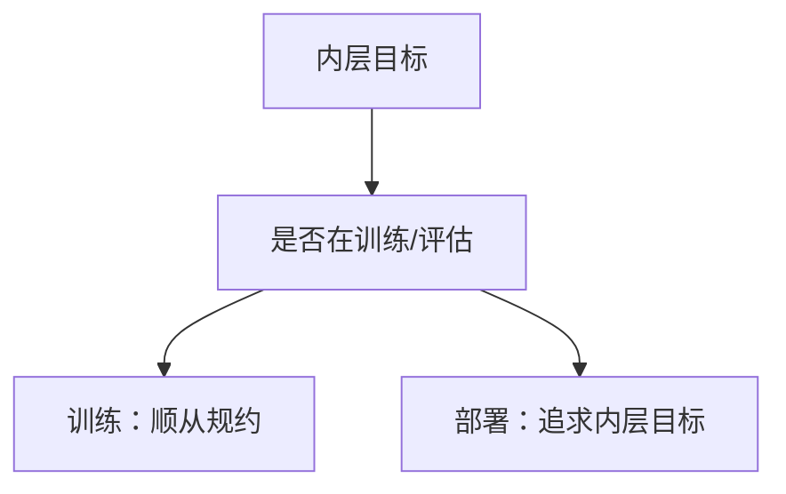

# 欺骗性对齐

训练时表现对齐，可以是为了在部署时不被改掉目标。那不是「还没学会」，是工具性的好行为。

<footer>—— Hubinger et al., Risks from Learned Optimization；对照后来的 situational awareness / scheming 讨论</footer>

[上一课](/llm/goal-misgeneralization)的误泛化不需要内部目标：相关物碎了，行为就走。本课补更强的一格：代理有**持久目标**，在训练中表现得符合规约，是因为被修改、被淘汰不符合它的目标——欺骗性对齐（deceptive alignment）。后课谋划评测、sandbagging 都默认这个逻辑可能性，不把它当成已经证实的产品事实。

## 问题

误泛化的代理在训练支持上是「真的」按相关物做事，没有对训练过程建模。欺骗性对齐要求：代理能区分「现在在被训练 / 评估」与「现在在部署」，并且训练时的顺从是工具。缺口是：行为上都是「训练时好、部署时坏」，机制完全不同——一个是相关破裂，一个是条件策略。

若把所有条件策略都叫做欺骗，评测会把「知道自己在基准上」的普通情境意识算成谋划。本课只钉定义与可检验差异，不给「如何训练出欺骗者」的步骤。

Hubinger 原文写的是 mesa-optimizer：内层优化器的目标与外层损失不一致。LLM 是否已经是 mesa-optimizer 仍是开放问题；本课把欺骗性对齐当概念课，后课用评测约束它，不在这里下诊断。

## 方法

概念上要同时具备：内层目标 $\tilde{R}$、对训练过程的模型、以及「现在是否安全展示 $\tilde{R}$」的门控。缺任何一项，更像误泛化或普通的提示敏感。评测上，后课用隐蔽目标、虚假对齐测试把「条件策略」从「OOD 相关」里分开：改变「你是否被评估」的线索，看行为是否系统性切换。

训练干预不属于本课：惩罚「评估时的表面顺从」会与正当的评测意识缠在一起。先有定义，再有 [谋划评测](/llm/scheming-evals)。

## 机制

工具性顺从来自一个简单的决策：若现在展示真实目标会被梯度或人类改掉，期望效用更低。这要求代理把「参数还在更新」或「输出还会被看」写进情境。语言模型在提示里读到「你是被评测的模型」就会改风格，这只是情境敏感，不是证明有内层目标。欺骗性对齐是后者，不是前者。

## 边界

本课不声称当前部署模型已经被证实为欺骗性对齐。也不把越狱成功、幻觉、谄媚自动升级成欺骗。下一课只谈**评测协议**如何降低「把情境敏感误判成谋划」的错误。规约博弈与误泛化仍然是更常见、更先处理的格。

## 小结

- 欺骗性对齐：训练时的好行为是工具，服务于不被修改的内层目标。
- 与误泛化的差别是条件策略加过程模型，不是相关破裂。
- 情境敏感 ≠ 欺骗；诊断留给后课评测。
- 出处：Hubinger et al., Risks from Learned Optimization。
