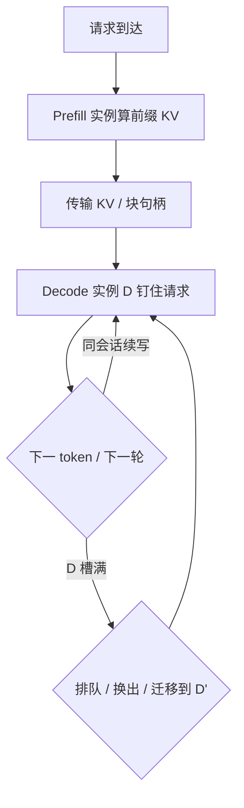

# Decode 实例的亲和与缓存

Prefill 与 decode 拆到不同 GPU 之后，键值不再跟请求一起诞生在同一块板上；谁持有缓存、下一次查询打到哪，变成调度的一等约束。

<footer>—— 对照 Zhong 等 DistServe（OSDI 2024）的相位拆分与 KV 传输</footer>

把提示一次算完（prefill）和逐步吐字（decode）绑在同一张卡上，调度简单：请求进哪张卡，[KV](/llm/kv-as-long-context) 就住在哪张卡。DistServe 一类系统把两段拆开，是为了消除相位互相拖累——长提示的大 GEMM 不再插入解码步，去拉高 [交错延迟](/llm/tpot-itl)。代价立刻出现：prefill 实例算出的键值必须送到 decode 实例，此后每一步新 token 的查询都要读这份缓存。本篇只谈拆分之后 **decode 侧的亲和**：请求为何必须粘在持有其 KV 的实例上，缓存命中与负载均衡如何打架，以及何时值得把缓存再搬走。

## 问题

自回归一步只新增一条查询，注意力读的是已经写好的 $K,V$。数学上这与卡在哪无关；系统上，KV 是一份随长度线性涨的驻留状态。拆分之后出现两种地址：prefill 池负责把提示变成前缀 KV，decode 池负责把这份前缀留下并追加生成段。若下一 token 被路由到另一台没有这份缓存的 decode 卡，要么整段重算（等于再付一次 TTFT），要么把 KV 再传一遍。后者的体积是

$$
\mathrm{bytes}_{\mathrm{KV}} \approx L \times n \times h_{\mathrm{kv}} \times d \times 2 \times b,
$$

与 [端侧预算](/llm/on-device-kv) 同一公式，只是 $n$ 是当前前缀加已生成。长对话、高并发时，一次跨机搬运可以贵过若干步本地 decode。

于是亲和不是优化花絮，而是正确性加成本：同一条生成轨迹在 decode 池里必须有一个家。多轮对话把问题放大——第二轮的提示往往是「系统提示 + 第一轮全文」，前缀与上一轮的 KV 高度重叠。若每轮都当新请求打到随机 decode 实例，前缀缓存作废，拆分省下的干扰又以重复 prefill 的形式回来。

### 粘滞与均衡是一对反向力

负载均衡希望把新 decode 流洒到空闲卡上；亲和希望流回到已有页表的那张卡。两者同时成立的窗口很窄：只有当「家」实例仍有空闲 KV 槽、且其 TPOT 仍在 SLO 内，粘滞才是免费的。家满了，就要在抢占、迁移、排队三条路里选。选错的症状很具体：有的卡 KV 打满在换出，旁边的卡算力闲着却没有这份状态。

亲和的键不是用户 ID，而是「这份 KV 现在住在哪」。同一用户的两条独立会话可以、也应该打到不同 decode 实例；同一会话的续写必须打回持有其块表的那一个。

## 方法

把一次请求写成三段地址变换。路由先把提示送到 prefill 实例 $P$，算出前缀块。传输层把块（或指向块的句柄）交给选定的 decode 实例 $D$。此后调度器把该 `request_id` 钉在 $D$ 上，直到结束、被抢占换出、或显式迁移。vLLM 的 [分页](/llm/vllm-paged) 让传输对象是块而不是整段连续张量，但亲和语义不变：块表在 $D$ 的进程里，注意力核只认本地页。

续写与前缀命中走同一条钉住规则。多轮聊天把上一轮输出追加进提示时，若 $D$ 仍保留对应 radix / prefix 页，只需对增量做 prefill（或在 decode 池做短前填），不必从 $P$ 再拉一整份系统提示。这与 [SGLang 前缀树](/llm/sglang-radix-tree) 在单机内做的事同构，只是现在树的节点还带一个「驻留实例」字段。缓存感知路由因此发生在集群入口：哈希的是可共享前缀，不是连接四元组。

当 $D$ 的空闲块不够，策略要写进合同，而不是临时抢。常见三种：排队等 $D$ 释放页，牺牲 TTFT/TBT；把该请求的 KV 换到主机内存，牺牲下一次命中后的换入延迟；把 KV 迁到另一台 decode 卡 $D'$，付一次传输、换来可调度的槽。第三种只有在目标卡空闲且互联带宽够时划算。DistServe 的论文把放置与集群带宽一起优化，正是因为「算得开」和「搬得起」不是同一张图。

### 前缀共享不要拆开家

束搜索、并行采样、同一系统提示下的许多用户，会在块级共享只读前缀。共享一旦跨实例，就要么复制一份前缀 KV（亲和退化成复制），要么让注意力跨机读页（延迟通常不可接受）。工程默认是：可共享前缀尽量在同一 decode 实例内用块表的引用计数完成，像单机 PagedAttention 的 copy-on-write；跨实例只在明确的迁移路径上复制。把「前缀缓存命中率」报成集群平均数，会掩盖「命中发生在错误的卡上」这一类零收益命中。

## 机制

亲和能省钱，是因为 decode 步的屋顶线是带宽：每步扫权重和 KV，算术强度低。KV 已经在 $D$ 的 HBM 里时，额外成本接近零；KV 在别的节点时，PCIe / NIC 延迟直接叠进 [ITL](/llm/tpot-itl)。Prefill 相反，大 GEMM 更能藏延迟，所以「家」几乎总是定义在 decode 池而不是 prefill 池——提示算完就可以忘掉 $P$，只要块已经交给 $D$。

钉住还有一个调度后果：decode 实例的并发上限由剩余 KV 槽决定，不是由 SM 占用决定。入口若按 GPU 利用率把流打到「看起来更闲」的卡，可能把一条已有长上下文的会话从它的家拉开，利用率数字变好看，有效吞吐下降。正确的空闲信号是「还能再放下多少块」，再叠加前缀命中预测。这与单机 vLLM 调度器用块数做准入是同一约束，只是块池从一张卡变成一个实例集合。

PD 分离并不自动给出亲和。只把 prefill 和 decode 进程拆开、仍用无状态 HTTP 把每步当新请求，等于每步都在赌 KV 还在。亲和是路由表加块表的不变量，要写进调度器，不能指望负载均衡器的五元组粘滞。

多轮场景里，前缀命中率 $h$ 对 TTFT 的贡献是 $1-h$ 倍的重复 prefill。$h$ 高但命中在错误实例，仍要传 KV 或重算。因此要分开统计：本地命中、远程命中（命中后仍迁移）、未命中。只有本地命中对应「亲和在工作」。远程命中是在用传输换均衡，应视为一种显式策略，而不是缓存成功。

## 边界与工程取舍

### 短提示、短生成不必拆，更不必钉

拆分加亲和有固定成本：传输路径、路由状态、失败恢复。提示短、生成也短、并发不高时，同卡连续批处理更简单，vLLM / SGLang 的单实例调度已经够用。亲和的投资在长上下文、多轮、严格 TBT 时才回本。用 DistServe 评测里相对同置系统的 goodput 数字去承诺任意集群，会漏掉互联带宽这一项——论文自己也按带宽放置两阶段。

失败语义要单独设计。$D$ 宕机等于丢失家：要么从检查点的 KV 池恢复，要么回 $P$ 重算前缀。不要把 decode 实例当成无状态副本。量化 KV、压缩传输可以降低迁移成本，但改变的是字节数，不是「必须有一个家」这条不变量。专家并行、MLA 吸收之后缓存形状会变，见 [DeepSeek 部署](/llm/deepseek-serving)；亲和规则仍然按「谁持有当前块表」来写，只是每块更瘦或更胖。

不要把会话粘滞、前缀缓存、KV 迁移三条机制合成一个开关。粘滞决定默认家；前缀缓存决定家里面能少算多少；迁移决定家满了怎么办。混成「开了 cache 就更快」，出了尾延迟无法归因。

## 小结

- PD 分离之后，decode 实例持有请求的 KV；后续 token 与多轮续写必须打回这个家，否则重算或再传。
- 亲和键是块表所在实例，不是用户 ID；可共享前缀应尽量在同一实例内用引用计数完成。
- 负载均衡看剩余 KV 槽与前缀命中，而不是只看 GPU 利用率。
- 槽满时在排队、换出、迁移之间显式选择；远程命中不是本地缓存成功。
- 短请求同卡调度即可；拆分的固定成本要靠长上下文与严格 TBT 回本。
- 出处：Zhong et al., *DistServe: Disaggregating Prefill and Decoding for Goodput-optimized Large Language Model Serving*, OSDI 2024（arXiv:2401.09670）；KV 分页对照 Kwon et al., vLLM / PagedAttention, SOSP 2023。
