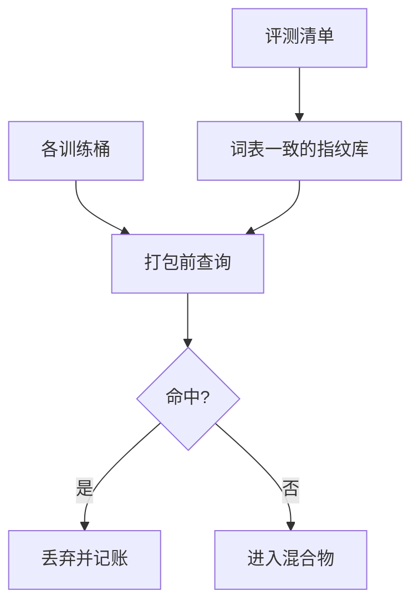

# 评测去污染流水线

训练里见过基准的题面或近重复，测试分数就不再是泛化；去污染必须发生在加载器之前，并且对合成与网页用同一把尺子。

<footer>—— Brown 等 GPT-3 的污染分析；Lee 等对训练数据重复的工作；Dodge 等对 C4 的文档化</footer>

[上一课](/llm/textbook-synthetic)把教师生成的习题写进混合物，泄漏面立刻大于爬虫。网页转载、GitHub 上的基准副本、指令集对评测的改写，本来就已经在。本课不重讲如何生成教科书。缺口是一条强制流水线：在冻结词表的切分下，检测训练数据与评测数据的重叠，并规定命中之后删、改还是把该评测降级为「受污染」。课程排序与退火默认走过本关。

## 问题

GPT-3 已经报告过基准污染。Dodge 等人指出 C4 里存在评测文本。Lee 等人证明重复抬高记忆。合成课之后，教师可能直接默写 GSM8K。工程上缺的不是「知道会污染」，而是：以哪一层字符串做匹配（文档、段落、n-gram、经过切分的 token 序列）、阈值如何随语言 fertility 调整、以及命中后的动作谁说了算。

只在英语空白分词上做 13-gram，高 fertility 语言与代码会对不齐。应在本项目冻结词表的 token n-gram 上做，与训练真正看见的离散序列一致。这是词表课对数据课的还债。

### 近重复不是精确命中

改数字、换变量名、翻译题面，精确哈希会漏。需要 MinHash / 归一化（去空白、小写、标识符抽象）的近重复，与 [网页去重](/llm/web-clean-dedup) 共用工具，但对照集是评测而不是另一页网页。过严会把普通算术句杀掉；过松分数虚高。应分评测集设策略：高风险闭卷集更严。

去污染不能只跑一次。指令桶、合成桶、新抓取都要接同一服务。时间切割：评测发布之后的抓取更可疑。

## 方法

清单化所有公开探针及其变体。对每条评测文档生成若干指纹：token n-gram 集合、归一化文本哈希、代码抽象语法指纹。训练语料在打包前查询指纹库，命中则丢弃该段落或整页（网页丢段落、合成丢掉整题）。日志记录命中率按桶分解：哪一桶在漏题。发版报告里写清：每个基准的污染率上限与实际值；超标则降级该分数。

与影响函数的负分样本对接：高负影响且靠近评测指纹的，优先人工抽检。不要用影响函数替代指纹——太贵也太迟。

### 训练中评测的自污染

若把评测当验证循环跑，解码结果写回共享盘再被加载器读到，会二次污染。训练中评测课会要求隔离；本课先规定：评测文本不得进入任何训练桶的对象存储前缀。

聊天模板包装后的评测题，指纹必须包含「去模板」步骤，否则同样题面因角色标记不同而漏检。

## 机制

语言模型会记忆高频、重复、以及与损失特别合拍的跨度。评测一旦进入支撑集，生成变成检索。去污染是在离散序列层面切断这条路径。它不保证没有语义泄漏（同一知识点不同题面），只保证字面与近字面不在训练集里。这是评测可解释性的下限，不是能力上限。

## 边界

去污染不提高密度，不替代质量过滤。过度抽象的代码指纹会误杀整个算法课教材——那是合成桶的合理内容，应改用「与具体评测题面」的更窄指纹，而不是放弃代码预训练。下一课在已清洁的混合物上谈顺序：先易后难是否值得，还是随机打乱更稳。

## 小结

- 本课不重讲合成方法；只补训练对评测的字面与近字面切断。
- 指纹必须用冻结词表的 token 序列，并含去模板、近重复。
- 命中按桶记账；超标降级分数，而不是默默改题。
- 评测产物不得写回训练存储。
- 出处：Brown et al., GPT-3, 2020；Lee et al., 2022；Dodge et al., *Documenting Large Webtext Corpora*；Sainz 等对评测泄漏的讨论。
