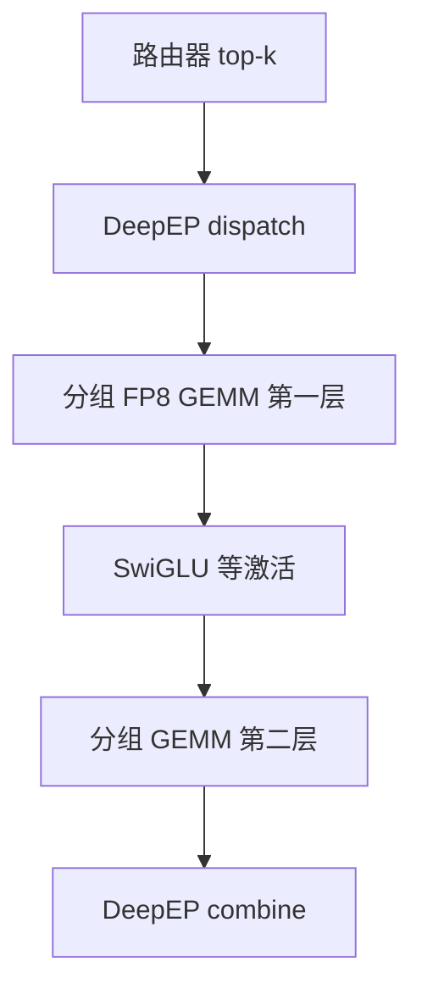

# DeepGEMM

    
MoE 的专家层不是一张大方阵，而是许多形状随路由变化的分组 GEMM；核必须按当前 $(M,N,K)$ JIT 出来，并与 dispatch 后的 token 布局咬合。

<footer>—— DeepSeek-AI，DeepGEMM：面向 FP8/BF16 与 MoE 的 Tensor Core 核库</footer>

专家并行把 token 送到持有专家的 GPU 之后，本地计算是两层（或 SwiGLU 的门与上投影）矩阵乘。cuBLAS 擅长大方阵、稳定形状；MoE 一步里每个专家的 token 数 $M$ 都在变，还有 FP8 缩放、掩码掉空槽、以及和通信重叠。DeepGEMM 是 DeepSeek 开源的 Tensor Core 核库：干净的 CUDA、运行时 JIT、覆盖 FP8/BF16（后续版本还扩展 FP4、Mega MoE 融合等），并明确让 `m_grouped_fp8_gemm_nt_masked` 一类接口吃 [DeepEP](/llm/deepep) 低延迟核的输出。本篇写分组 GEMM 为什么不能当普通 BLAS 调；通信语义见 [EP All-to-All](/llm/ep-all2all)。

## 问题

V3 的 MoE 层：共享专家加 256 个路由专家，每 token 激活 8 个路由专家。落到一张卡上，是「若干专家、每个专家一段变长 token」。若把空槽 pad 成密集大矩阵再调一次 `gemm`，算力打在 padding 上，还多一次搬运。若对每个专家各调一次 cuBLAS，启动开销在解码的小 $M$（常常几十到二百）上压过有效 Tensor Core 时间。FP8 还要求缩放因子与 tile 对齐：V3 用细粒度 tile/block 量化，反量化必须藏进核，不能先还原成 BF16 再乘。

CUTLASS / CuTe 已经能写这类核，但模板代数重、编译慢。DeepGEMM 的设计叙事是：少而精的核心核、JIT 出当前形状、便于学习 Hopper 上的优化，而不是再包一层完整模板语言。它不是「发明了矩阵乘」，是把 V3 训练与推理真正用的那组形状和精度做成可复用库。

### 掩码分组而不是稠密填充

DeepEP dispatch 之后，本 rank 的缓冲往往仍按最大容量对齐，空位要掩掉。`m_grouped_fp8_gemm_nt_masked` 的名字写明三件事：沿 $M$ 分组（每专家一段）、FP8、有掩码。调用方传入各组的有效长度，核在 Tensor Core 上只对有效 tile 提交 MMA。布局必须与通信核约定同一 permute，否则会出现「专家 A 的权重乘到专家 B 的 token」。这是系统契约，不是数值精度问题。

解码期每专家 $M$ 小，核是访存墙：权重要从 HBM 读出，token 却不多。V3 因此让每卡少挂专家（解码甚至一卡一专家），使一次加载的权重能摊到该卡所有 token 上，并用少量 SM 跑 MoE，把 SM 留给 MLA。DeepGEMM 要在这种小 $M$ 上仍然接近屋顶线，而不是只报训练时 8K token 的 TFLOPS。

## 方法

### JIT 与形状缓存

第一次碰到某组 $(M,N,K)$、精度、对齐，JIT 编译核并缓存；之后同形状零额外编译。MoE 的 $M$ 逐步变化，缓存命中取决于调度是否把 batch 修整到若干档（例如对齐 8/64）。完全动态的 $M$ 会导致缓存爆炸与频繁编译，服务启动预热应覆盖常见档位。库强调安装时不必预编译全部 CUDA，降低分发成本，把代价挪到首次调用。

常规稠密 GEMM（注意力吸收后的投影、共享专家、非 MoE 层）走同一套 FP8/BF16 原语，便于整网同一量化故事。后续 Mega MoE 把 EP dispatch、第一层线性、SwiGLU、第二层线性、combine 收进更大核，与 NVLink 计算重叠——那是更激进的融合，依赖对称内存与多进程启动，不是所有引擎默认路径。写「我们用了 DeepGEMM」时应写清调用的是 grouped GEMM 还是 Mega 融合。

### 与 DeepEP 的交接

低延迟 dispatch 的输出可能是按专家交错或按 rank 分段的特殊 layout。DeepGEMM 文档写明 grouped 接口的一个典型输入就是 DeepEP 低延迟核的输出。引擎不应在中间插 `contiguous()` 打回通用 NCHW，那会把通信与 GEMM 之间的带宽红利吃掉。反向训练还要把梯度 combine 回去，FP8 前向与 BF16 combine 的精度分界与 V3 报告一致。

## 机制

### 为什么 FP8 GEMM 要和通信同一精度策略

V3 在 MoE 上投影前把激活量化成 FP8 再 dispatch，使链路上的字节与 Tensor Core 输入一致，避免「BF16 传输、到卡再量化」。缩放因子取 2 的幂等约定，是为了反量化乘成移位。DeepGEMM 的 FP8 核必须理解同一套 scale 布局（tile 级或 block 级），否则数值与训练图分叉。combine 保持 BF16，是因为加权求和与残差对误差更敏感。库若只提供「FP8 乘 FP8 出 FP8」而引擎在 combine 前乱转精度，报告中的稳定训练叙事无法复现。

分组核的并行轴是专家（组）× tile。负载不均时，热专家的 $M$ 大、冷专家的 $M$ 近 0，SM 利用率被热组限制。这再次把问题交回路由与冗余专家，而不是再写一个更聪明的 GEMM。

H100/H800 的 FP8 Tensor Core 峰值很高，但 MoE 的有效 TFLOPS 常远低于峰值，因为 $M$ 小、scale 反量化、以及通信占用 SM。对比 cuBLAS 的公平方式是：同一 grouped 形状、同一 FP8 布局、含或不含 mask 一致。不要用方阵 FP8 峰值宣传 MoE 加速比。

### 与 CUTLASS 生态的位置

DeepGEMM 借用 CUTLASS/CuTe 的一些概念（TMA、warpgroup MMA、pipeline），但避免重度模板。对学习核优化，仓库比从 CUTLASS 例子里抽 MoE 路径更短。生产上，有的栈继续用 CUTLASS 或供应商 BLAS；有的栈（SGLang 等）接 DeepGEMM。性能数字必须绑 GPU 代际：Ampere 无硬件 FP8，不是目标硬件。

## 边界与工程取舍

JIT 首次延迟会进冷启动 TTFT，预热或持久化编译缓存是必须的。形状未对齐时的正确性（mask、scale 广播、专家下标与权重行的对应）比再抠 1% TFLOPS 更要紧。一次 layout 错位会表现为「MoE 层输出分布漂、但损失看起来还在降」，极难查。Mega MoE 把 dispatch 到 combine 收进同一核，上限更高，Nsight 上却更难把通信与 MMA 拆开；未稳定前应先跑分离的 DeepEP + grouped GEMM 路径。

不要把 DeepGEMM 写成「替代 FlashAttention」：注意力走 [FlashMLA](/llm/flashmla)，专家 MLP 走这里。也不要在 Ampere 上期待同一套 FP8 核。共享专家与路由专家的形状不同，可能要两次调用，不要强行填进同一 grouped 批次里却忘了共享专家不过路由。数值对照应以 V3 报告的细粒度 FP8 策略为准：tile 或 block 的 scale 不能随手改成逐张量一条 scale。

出处：DeepSeek-AI，*DeepGEMM*，https://github.com/deepseek-ai/DeepGEMM；精度与 MoE 布局见 *DeepSeek-V3 Technical Report*，arXiv:2412.19437。CUTLASS 是 NVIDIA 的独立项目。不要伪造 DeepGEMM 的会议论文号。

版本演进快（FP4、PDL、更快 JIT）。引用应带 git 修订或发布日期，以及调用的 API 名。2025 年的 grouped FP8 说明不能自动覆盖 2026 年的 Mega MoE 路径。

## 小结

- DeepGEMM 为变长分组、FP8 缩放和掩码空槽提供 Tensor Core 核，对准 MoE 专家层。
- 与 DeepEP 的 layout 契约比「调 GEMM」本身更关键。
- JIT 按形状缓存；服务要预热常见 $M$。
- 小 $M$ 解码是访存墙，需与一卡少专家、少通信 SM 的部署一致。
- 出处：deepseek-ai/DeepGEMM；DeepSeek-V3 报告。
