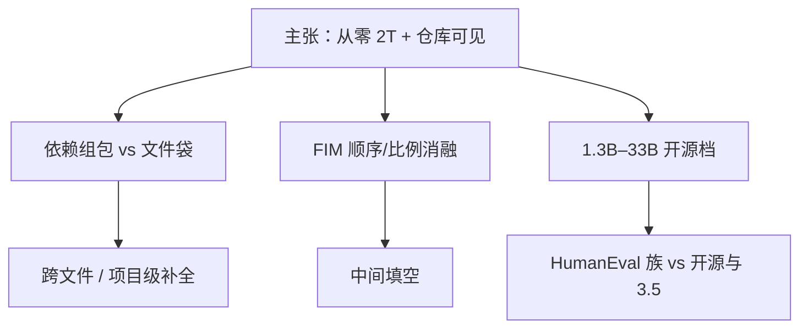

# DeepSeek-Coder 论文

    
从零用 2 万亿 token 训代码模型：仓库级组包看见跨文件依赖，再在 16K 窗口上做填中训练；开源档从 1.3B 到 33B。

    <footer>—— Guo 等，DeepSeek-Coder: When the Large Language Model Meets Programming，arXiv:2401.14196</footer>

数据配比、FIM 排列与许可边界见 [DeepSeek-Coder](/llm/deepseek-coder)。本篇钉 Daya Guo 等人 2024 年 1 月这篇技术报告式论文（arXiv:2401.14196）：它要和 Code Llama / StarCoder 划开的三条主张是什么、仓库级构造与 FIM 消融在实验上支持到哪一步、以及「Instruct 33B 超过 GPT-3.5 Turbo」这句话的评测合同。不把 [DeepSeek-Coder-V2](/llm/deepseek-coder-v2) 的 MoE、128K 或编译器反馈 RL 写回第一代。需要配方时读前一篇；需要引用原文表与贡献列表时读这篇。

## 问题

开源线在 HumanEval / MBPP 上落后闭源，当时的归咎经常是「参数不够」或「token 不够」。Guo 等人要证伪的是另一件事：多数开源语料以**文件为独立文档**，import 的定义落在另一文件时，因果 LM 从未为这条边付过预训练损失；IDE 更常是中间挖空，只用下一 token 预测会把 FIM 分布推给后训练。论文把这两个分布错位写成主问题，而不是再发一个「我们也有 33B」的模型卡。

对照基线是 Code Llama（从 Llama 2 继续训）与 StarCoder（从零、文件级为主）。DeepSeek-Coder 选从零 2T，是为了词表与层规范按代码来；同时必须证明从零的账单买到了**跨文件可见性**和**系统的 FIM 消融**，否则只是更贵的 StarCoder 复制。16K 窗口写进摘要，是因为组包后的多文件序列需要装得下，不是为了文档 QA 外推竞赛。

### 贡献列表是三条，不是「全面 SOTA」

原文自我定位：(1) 预训练阶段做仓库级数据构造；(2) 系统比较 FIM 策略对代码预训练的影响；(3) 开源 1.3B–33B 并在项目级补全上展示 16K。引用时若只抄 Instruct 对 GPT-3.5 的句子，等于丢掉正文真正可复查的部分。SOTA 叙事绑定 2024 年初的 HumanEval/MBPP/DS-1000 等表，不能外推到 2026 年的 LiveCodeBench 或 SWE-bench 代理。

英文 10% 在原文里是 GitHub Markdown 与 StackExchange，不是 Common Crawl 网页。3% 中文明确与代码无关，避免中文博客代码被重复计入 87%。配比写错会把「技术自然语言接地」讲成「通用对齐」。

## 方法

工序：爬取（GitHub 截止 2023 年 2 月，87 种语言）→ 规则过滤（行长、字母比例等，保留体积约三成）→ 依赖解析与仓库组包 → 仓库级去重 → 质量筛。组包目标是让被依赖文件与使用方进入同一训练序列。去重针对 fork 海，避免同一函数在损失里被当成高频模式。这些步骤落地篇已写；原文作为论文还多了一层**对照实验设计**：文件级随机抽样 vs 仓库组包，应在跨文件补全 / 仓库级基准上拉开，而不是只在 HumanEval 上比——单文件面试题看不见 import 图。

预训练目标：NTP + FIM，窗口 16K。FIM 消融比较拼接顺序与比例，结论写入最终配方；FIM 本身引用 Bavarian / StarCoder，论文卖的是代码域、从零 2T 设定下的配置，不是发明填中。Instruct 用指令数据把 Base 拉到对话写代码、解释与修复。评测叙事：Base 33B 在当时开源对比中全面领先；Instruct 33B 在多数代码基准上超过 GPT-3.5 Turbo，缩小与 GPT-4 的缺口；6.7B Base 用来说明「小一个数量级仍可接近 CodeLlama-33B」。

### 论文量过、也量不出的东西

量过：HumanEval、MBPP、多语言 HumanEval、DS-1000、仓库/项目级补全、FIM 配置对续写与填空的双向影响。量过的对照：同尺寸或更大的 Code Llama、StarCoder。量不出：动态导入与字符串路径导致的依赖图缺边有多大；87 语长尾在过滤后是否仍有统计功率；Instruct 对齐强度相对后来带执行反馈的迭代（OpenCodeInterpreter、V2 RL）差多少。截止日期 2023-02 意味着库版本会过时，这不是评测脚本能修的。

6.7B 接近 33B Code Llama 的句子是**参数效率**叙事，绑定那张表的基准与解码协议。把它抄成「7B 等于 33B 的仓库代理」，越权。

## 机制

仓库组包改变的是注意力在预训练里的可见集合：`foo.py` 里对 `bar()` 的查询，键可以是同序列 `bar.py` 的定义。文件袋切断这条边，模型只能靠参数记忆公共 API。论文把「第一次在预训练做仓库级构造」写成贡献，读者应理解为**训练分布**主张，而不是推理时任意拼接文件就能复现——服务期仍要检索或手工选文件，16K 装不下 monorepo。

### FIM 消融证明的是配方，不是新注意力

FIM 改排列，不改核。消融若显示 prefix-suffix-middle 更稳，那是位置编码与因果掩码下「先看见后缀」更接近 IDE 条件。比例过高伤害从左到右生成，过低则中间补全欠拟合。原文的价值是把这条权衡在从零 2T、16K 设定下走完，并公开 Base/Instruct 两套权重让别人在同一分布上接着做指令或代理，而不是把 FIM 留成闭源 IDE 的秘密。

从零 2T 与「Llama 2 再继续训 500B」不是同一条资本曲线。DeepSeek-Coder 的 33B 要为代码分布单独付预训练账单；好处是控制符与词表按代码来。引用时不要写成 Code Llama 的中文复制，路线相反。

87/10/3 把源码、英文技术自然语言、中文通识分开计数，避免「代码百分比」被文档里的代码块重复膨胀。机制上，10% 英文是库用法与报错修复的监督，比把文档推迟到 Instruct 更早进入梯度。

## 边界与工程取舍

### 超过 GPT-3.5 的句子绑定 2024 年 1 月的表

对手是当时的 Turbo 与开源稠密模型，不是 GPT-4o，不是带测试循环的代理。HumanEval 点数对应题量小，几个百分点不要做成排名法律。仓库组包依赖静态解析：单仓多语言、生成代码、动态 import 会缺边，组包收益下降。许可需读当时代码许可与模型许可是否分离。FIM 推理必须用训练特殊符；用 Chat 模板让 Instruct「写中间缺的函数」是另一分布。

不要把 1.3B 的端侧延迟与 33B 的基准分写进同一句能力声明。不要把 V2 的 128K 窗口回溯成这篇的 16K 项目级。需要执行反馈多轮修复，读 [OpenCodeInterpreter](/llm/opencodeinterpreter)，那是后训练与运行时循环，不是这篇预训练论文的合同。

出处：Guo et al.，*DeepSeek-Coder: When the Large Language Model Meets Programming*，arXiv:2401.14196，2024。续作 DeepSeek-Coder-V2 分篇。复现仓库组包需要依赖解析器版本；只下载权重、用 `###` 拼接多文件，复现不了预训练分布。

## 小结

- 原文三条贡献：仓库级预训练构造、FIM 策略消融、1.3B–33B 开源加 16K 项目级补全。
- 从零 2T，语料 87% 代码 / 10% 英文代码相关 NL / 3% 中文；GitHub 截止 2023-02。
- Instruct 33B 对 GPT-3.5 的超分绑定当时代码基准，不是仓库代理或 Live 榜。
- 跨文件能力来自训练可见性；推理拼接任意文件不能自动等同组包。
- 出处：Guo et al.，arXiv:2401.14196；落地对照见 [DeepSeek-Coder](/llm/deepseek-coder)。
