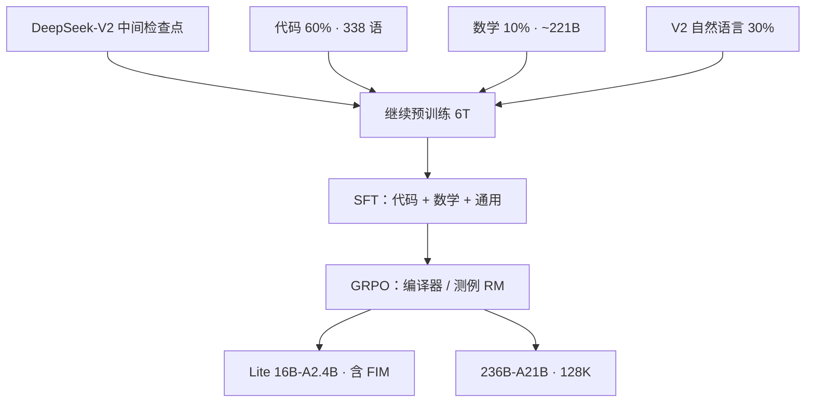

# DeepSeek-Coder-V2

    
从 DeepSeek-V2 的中间检查点再吃 6 万亿 token：语言从 86 种扩到 338 种，窗口 16K 到 128K，用编译器反馈做 GRPO，开源 MoE 对上 GPT-4 Turbo 一档的代码与数学。

    <footer>—— Zhu 等，DeepSeek-Coder-V2: Breaking the Barrier of Closed-Source Models in Code Intelligence，arXiv:2406.11931</footer>

DeepSeek-Coder-V2 不再从零训稠密代码模型，而是接在 [DeepSeek-V2](/llm/deepseek-v2) 中间权重上 **继续预训练 6T**（连同 V2 已见过的约 4.2T，报告合计约 **10.2T**）。架构继承 V2 的 [MLA](/llm/mla-kv) 与 [DeepSeekMoE](/llm/deepseek-moe)：开源 **Lite 16B（激活约 2.4B）** 与 **236B（激活约 21B）** 的 Base/Instruct，上下文 **128K**。语言从 Coder-V1 的 86 种扩到 **338 种**。本篇写 Zhu 等人的**继续预训练配比、对齐与评测主张**，MLA 路由与共享专家不整段复制 V2 专文。

## 问题

开源 Coder-33B 仍明显落后 GPT-4 Turbo、Claude 3 Opus、Gemini 1.5 Pro。把 33B 稠密再加宽，训练与 KV 都贵；从零再造 200B 级代码模型，重复支付通用语言能力的账单。V2 已经用 MLA 把 KV 压小、用细粒度 MoE 把激活维持在约 21B，中间检查点同时具备通识与长窗潜力。缺口在**代码与数学的密度**：V2 通用配比不够「像代码模型」，V1 又没有 128K 与 300+ 语言。

继续预训练还要防止通识回退——纯代码 6T 可能把 MMLU 与对话打崩。Lite 要在 2.4B 激活上保留补全（FIM），236B 则面临 FIM 与满参数 NTP 的成本权衡。对齐阶段仅 SFT 不足以让竞赛代码稳定过测例，需要把**编译器与测试**接进强化学习。

### 中间检查点，而不是 V2 成品再蒸馏

报告写明：从 **DeepSeek-V2 的 intermediate checkpoint** 继续训，不是把已对齐的 V2-Chat 再蒸馏成代码模型。这样语言建模头与专家仍处在预训练分布，6T 代码–数学–文本混合可以直接接 Adam 式继续训。消融用 1B 稠密验证新代码库：HumanEval 30.5→37.2，MBPP 44.6→54.0。

Lite 与 236B 共享 MoE 设计语言，不共享「是否 FIM」。报告：16B Lite 在对齐阶段仍用 FIM 以保留补全；236B 继续预训练以 NTP 为主。不要假设两档 Instruct 都能当 IDE 中段补全后端。

## 方法

继续预训练混合：**60% 源码、10% 数学、30% 自然语言**。源码约 1170B token，GitHub 截止 2023 年 11 月，过滤与近去重沿用 V1 管线，语言扩到 338。数学约 221B，用与 DeepSeekMath 相同的召回管线从 Common Crawl 取，大约是 DeepSeekMath 120B 的两倍。自然语言直接从 V2 语料抽样，承接通识。相对 V1 的 87/10/3，V2 把中英通识提到 30%，并单列 10% 数学——这是「代码模型也要会竞赛数学、还要能聊天」的配比声明。

上下文 16K→128K，报告写明用 YaRN 一类外推配合长上下文训练，使仓库与长文件进得去。结构上第一层 FFN 稠密、其余 MoE 等设定跟 V2，不在此重写专家数表。

对齐先 SFT：指令集混合 V1 的代码数据、DeepSeekMath 的数学数据、V2 的通用指令。再 **GRPO**（算法见 [GRPO](/llm/grpo) 与 DeepSeekMath）：代码域用编译器反馈与测试构造偏好，训练奖励模型引导策略，使回答对测例负责。这是相对 V1 纯 SFT Instruct 的主差分。

## 机制

### 配比是通识保险

60/10/30 让同一套专家既接到 GitHub 的长尾语言，也接到数学网页与通用文本。数学与代码共用符号操作，继续预训练把两条能力一起抬，是报告用 MATH / AIME 与 HumanEval 同时报高分的配比原因；30% 自然语言则是 MMLU 79.2、Arena-Hard 65.0、MT-Bench 8.77、AlignBench 7.84 仍能「像通用模型」的条件——这些主观分用来证明**没有**把 V2 通识训没。相对 V1 的 87% 代码，V2 主动把代码比例降下来，换的是「代码模型也能上 Arena 风格对话」；这是产品定位，不是「代码越少越好」。

### 编译器进入 GRPO

GRPO 在代码上的奖励比「像不像人类写的逐步解释」更硬：测例失败则组内相对优势为负。SFT 提供可编译的格式与工具调用习惯，RL 把通过率推上去。128K 服务能成立，前提是 MLA 把 KV 压到可部署（V2 专文的 93.3% 缓存下降是基础设施，不是 Coder 论文新发明的注意力）。语言从 86 到 338 主要是数据覆盖：配置语言、模板、小众脚本出现在 1170B 里，而不是 338 个专家。

旗舰评测主张（报告口径，须注明基准版本）：HumanEval 90.2%；MBPP 在 EvalPlus 管线上 76.2%；LiveCodeBench（2023-12 至 2024-06）43.4%；SWE-Bench 开源首次超过 10%。MATH 75.7%，接近当时 GPT-4o 的 76.6%，AIME 2024 超过若干闭源表。这些数字描述 236B Instruct 档，不能贴到 Lite。仓库级真实修复刚过 10%，说明 HumanEval 高分与「能改真实 GitHub issue」仍是两回事。

继续预训练 6T 的优化器与学习率表报告写得比数据配比少，复现成本主要在语料重建与 MoE 集群，而不是抄一条 LR。YaRN 把窗口接到 128K，必须与发布配置里的插值因子一致，否则长文件补全会在后半段失焦。许可证允许商用，但 236B 总参的落盘体积决定了「可下载」不等于「可单机服务」；Lite 才是边侧默认。

「对标 GPT-4 Turbo」写在代码与数学基准上。通用 Arena 风格分数是「没有崩」，不是宣称全面超过 GPT-4o 聊天。Lite 的 HumanEval 再高，也不承担 236B 的 SWE-Bench 叙事。

## 边界与工程取舍

236B 总参的部署是 MoE 集群问题：激活 21B 只描述 FLOPs 量级，专家并行、MLA 吸收核、128K KV 缺一则复现不了报告延迟。Lite 适合单机，但 LiveCodeBench / SWE-Bench 叙事属于旗舰。338 语的长尾没有单语充分测例。FIM 在 236B Instruct 上不是默认卖点。数据截止 2023-11，CVE 与新框架会过时。许可 permissive，但专家权重体积使「商用可下」不等于「边侧可跑」。从 V2 中间点继续训，意味着 Coder-V2 的通识上限仍受那份中间检查点约束：6T 代码数学可以加尖，不能把没见过的世界知识变出来。

不要把 V3 / R1 的无辅助损失与冷启动回写进 Coder-V2。YaRN 与训练长度必须与发布配置一致，否则 128K 只是配置字段。

SWE-Bench 刚过 10% 说明仓库级真实修复仍极难。用 HumanEval 90% 外推「可替代工程师」与报告自己的 SWE 数字矛盾。

## 小结

- Coder-V2 从 V2 中间点继续训 6T，合计约 10.2T；MoE 16B-A2.4B 与 236B-A21B，128K，338 语。
- 配比 60% 代码 / 10% 数学 / 30% 自然语言，在抬代码数学的同时保住通识。
- 对齐为 SFT + 带编译器反馈的 GRPO；Lite 额外保留 FIM。
- 旗舰评测对标当时闭源 Turbo / Opus / Gemini 的代码与数学表，Lite 不可混用。
- 出处：Zhu 等，*DeepSeek-Coder-V2*，arXiv:2406.11931，2024。架构对照 DeepSeek-AI，*DeepSeek-V2*，arXiv:2405.04434。
