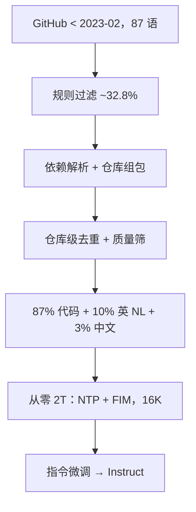

# DeepSeek-Coder

    
从零用 2 万亿 token 训代码模型：仓库级组包看见跨文件依赖，再加 16K 窗口上的填中训练，开源档从 1.3B 到 33B。

    <footer>—— Guo 等，DeepSeek-Coder: When the Large Language Model Meets Programming，arXiv:2401.14196</footer>

DeepSeek-Coder 是 DeepSeek 第一代开源代码模型，**从零预训练 2T token**，不是通用 LLM 上短短继续训一层。公开档位覆盖约 **1.3B 至 33B** 的 Base 与 Instruct（社区常见 1.3B / 6.7B / 33B）。语料按报告为 **87% 源码、10% 英文代码相关自然语言（GitHub Markdown、StackExchange）、3% 与代码无关的中文**，编程语言 **87 种**，GitHub 截止 2023 年 2 月。原文贡献有三条：把**仓库级数据构造**做进预训练；系统比较 **FIM 策略**对代码预训练的影响；16K 窗口下的项目级补全。许可偏宽松，允许研究与商用（以当时仓库与模型卡为准）。本篇写 Guo 等人这篇，不把后来的 [DeepSeek-Coder-V2](/llm/deepseek-coder-v2) MoE 或 [MLA](/llm/mla-kv) 提前写进来。

## 问题

闭源代码模型把评测上限抬高，开源线（CodeLlama、StarCoder 等）在 HumanEval / MBPP 上仍有可见缺口。差距不只是参数：多数开源语料以**文件**为独立文档，import 的定义落在另一文件时，因果语言模型从未在训练里同时看见两端。IDE 补全更常是「中间缺一块」而不是「从文件头写到尾」；只用下一 token 预测，FIM 分布要靠后训练硬补，补不齐。

过滤与去重决定代码语料是「有用的项目」还是「压缩包与生成垃圾」。StarCoder 式规则（平均行长、字母比例等）能把体积打到约 32.8%，但仍可能在仓库内留下近重复 fork。跨文件能力若只在微调出现，基座的注意力从未为「另一文件的键」付过预训练损失。

### 仓库是图，不是文件袋

报告把「第一次在预训练阶段做仓库级构造」写成贡献：解析依赖，把同一项目里相互引用的文件组织进同一训练序列，而不是随机抽样单文件。这样跨文件生成在预训练目标里就有梯度。16K 窗口是为了让组包后的多文件上下文装得下，不是为了文档 QA。

英文 10% 不是「通用网页」。Markdown 与 StackExchange 对库用法、报错和修复有直接监督；3% 中文是为了中文理解，明确与代码无关，避免再把中文博客里的代码重复计入 87%。

## 方法

数据工序：爬取 → 规则过滤 → 依赖解析 → **仓库级去重** → 质量筛选。规则与 StarCoder 同类：平均行长 >100 或最大行长 >1000 的文件丢掉，字母比例过低丢掉，等等。依赖解析确定文件在项目内的引用关系，组包时让被依赖文件与使用方进入同一上下文。仓库级去重针对 fork 与复制项目，避免同一代码在损失里出现太多次。质量筛选再去掉明显损坏或自动生成的低信息文件。

预训练目标是下一 token 预测 **加上** FIM（报告摘要写 fill-in-the-blank）。FIM 把一段代码切成 prefix / middle / suffix，按特定顺序拼接，让模型在看见前后文时还原中段，对应编辑器的中间补全。报告用专门实验比较 FIM 配置（顺序、比例）对预训练的影响，结论用于最终配方——这是相对「大家都知道该加 FIM」多出来的消融，而不是发明 FIM 本身（Bavarian 等、StarCoder 已用）。上下文长度 **16K**。

Instruct 用指令数据微调，使模型能对话式写代码、解释与修复。评测上 Base 33B 在报告的开源对比中全面领先；Instruct 33B 在多数代码基准上超过当时的 GPT-3.5 Turbo，缩小与 GPT-4 的缺口。6.7B 级 Base 被用来说明「小一个数量级仍可接近大 5 倍的 CodeLlama-33B」。

## 机制

仓库组包改变注意力可见集合：查询在 `foo.py` 里调用 `bar()` 时，键可以是同序列里 `bar.py` 的定义，而不必把整个函数体在当前文件再写一遍。这直接服务跨文件补全与仓库级补全基准。文件级随机打散则把这条边切断，模型只能靠参数记忆常见 API，记不住用户项目里的私有函数。

### FIM 改排列，不改核

FIM 改变的是序列排列，不是注意力公式。训练时中段被挪到要预测的位置，推理时 IDE 给出前后文，模型填洞。消融若显示某种拼接顺序（例如 prefix-suffix-middle）更稳，那是因为位置编码与因果掩码下，「先看见后缀」对中段的条件更接近真实补全。比例过高会伤害普通从左到右生成；过低则补全任务欠拟合。16K 提供同时容纳「若干相关文件」的容量，但仍远小于后来 V2 的 128K——第一代的项目级是**局部仓库切片**，不是整仓塞进上下文。

### 从零 2T 的资本曲线

从零 2T 与「通用 67B 再继续训代码」不是同一条资本曲线。DeepSeek-Coder 的 33B 稠密要为代码分布单独付预训练账单；好处是词表与层规范按代码来，不必迁就通用聊天的控制符。英文 10% 的 Markdown 与 StackExchange 把「如何用这个库」写进预训练，比在 Instruct 里才第一次见到文档更早。仓库级去重则避免 fork 海把同一函数的损失放大成虚假的高频模式。

从零 2T 与「通用 67B 再继续训代码」不是同一条资本曲线。DeepSeek-Coder 的 33B 稠密要为代码分布单独付预训练账单；好处是词表与层规范按代码来，不必迁就通用聊天的控制符。

## 边界与工程取舍

87 种语言的长尾（配置文件、模板语言）在过滤后仍然稀疏，HumanEval 不能代表它们。仓库组包依赖解析质量：动态导入、字符串拼接路径、单仓多语言，图会缺边。16K 装不下大型 monorepo；服务时仍要检索或手工选文件。Instruct 对齐强度低于后来带编译器反馈 RL 的 V2。数据截止 2023 年 2 月，库版本与语言标准会过时。

许可需读当时 DeepSeek 代码许可与模型许可是否分离。评测超过 GPT-3.5 的句子绑定报告所用基准与时间，不能外推到 2025 年的 LiveCodeBench。不要把 1.3B 的本地补全延迟当成 33B 的能力声明。

FIM 推理必须使用与训练一致的特殊符与拼接顺序。用 Chat 模板让 Instruct「写中间缺的函数」是另一分布，分数会掉。

## 小结

- DeepSeek-Coder 从零预训练 2T，87 语、16K 窗口，开源约 1.3B–33B Base/Instruct。
- 预训练贡献是仓库级组包与去重，以及 FIM 配置消融；目标为 NTP+FIM。
- 语料配比 87/10/3 把代码、英文技术自然语言与中文通识分开。
- 跨文件能力来自训练可见性，不是推理时临时拼接任意文件就能复现。
- 出处：Guo 等，*DeepSeek-Coder: When the Large Language Model Meets Programming*，arXiv:2401.14196，2024。
