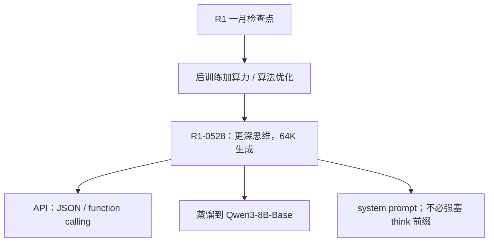

# DeepSeek-R1-0528

    
这是一次次要版本升级；复杂推理的提升来自后训练里加大的计算与算法优化，AIME 2025 上平均思维 token 从约 12K 升到约 23K。

    <footer>—— DeepSeek-AI，DeepSeek-R1-0528 模型卡与 API 发布说明，2025-05-28</footer>

[DeepSeek-R1](/llm/deepseek-r1) 与 [R1 论文](/llm/deepseek-r1-paper) 写的是 2025 年 1 月那条管线：V3-Base 上的 [GRPO](/llm/grpo)、冷启动、蒸馏到 Qwen / Llama。**R1-0528** 是 5 月 28 日的检查点刷新，官方自己叫 minor upgrade，没有另发一篇与 2501.12948 并列的训练报告。本篇只钉模型卡、API 变更说明与 Hugging Face 权重上能核对的差分：更深的思维、工具协议、以及一条新的 8B 蒸馏。不要把 0528 写成新 MoE 或新优势估计器。

## 问题

一月版 R1 在竞赛数学上已经能对标当时的 o1-1217，但产品缺口立刻暴露。思维链默认很长，却仍缺原生 function calling 与严格 JSON；Agent 循环要把工具协议叠在聊天模板外。幻觉在长链里被放大：看起来在验证，终点仍可能捏造引用。一月蒸馏线挂在 Qwen2.5 / Llama 上，社区到 5 月已经换成 [Qwen3](/llm/qwen3) 生态，旧蒸馏不再是「当前小模型上的 R1 程序」。

0528 要回答的不是「再发明一次 Zero」，而是：在同一骨架上把后训练算力与算法旋钮再拧一档，换更深的搜索，同时把助手协议补进可服务接口。官方把 AIME 2025 的跳变归因于**思维深度**，而不是换基座。

### 次要版本与不可复现的算力

模型卡明确写：相对上一版，推理深度与推断能力的提升来自后训练阶段**增加的计算资源**与引入的算法优化机制。配方细节——题库增量、[GRPO](/llm/grpo-paper) 的 $\varepsilon$ / $G$、是否沿用 DAPO 一类 clip 变体——**没有**写成可复现附录。能引用的是公开分数、生成协议与接口差分。把第三方博客里的「据说用了某某算法」写进方法节，会污染这条检查点的出处。

Hugging Face 卡片列出约 685B 参数张量；家族叙述仍是 V3 线 MoE（公开口径约 671B 总 / 37B 激活）。685 与 671 的差来自分片、量化辅助张量或卡片统计口径，不要据此宣称「换了一代专家数」。

## 方法

**评测协议（官方）。** 所有模型最大生成长度 **64K**。需要采样的基准：温度 $0.6$，top-$p=0.95$，每题 16 条估计 pass@1。这与一月报告里 Zero 训练期温度 1、组大小 16 不是同一件事：这里是**评测**，不是再训超参。

**相对一月 R1 的表上差分（模型卡）。** 数学：AIME 2024 pass@1 $79.8\to 91.4$，AIME 2025 $70.0\to 87.5$，HMMT 2025 $41.7\to 79.4$，CNMO 2024 $78.8\to 86.9$。代码：LiveCodeBench（2408–2505）$63.5\to 73.3$，Codeforces-Div1 评分 $1530\to 1930$，SWE-Verified（Agentless）$49.2\to 57.6$，Aider-Polyglot $53.3\to 71.6$。知识 / 推理：GPQA-Diamond $71.5\to 81.0$，HLE（纯文本）$8.5\to 17.7$，MMLU-Pro $84.0\to 85.0$。工具：BFCL v3 多轮 37.0，Tau-Bench Airline 53.5 / Retail 63.9（GPT-4.1 扮演用户）。官方声明幻觉下降、前端与 vibe coding 体验变好，并支持 JSON 输出与 function calling。API **调用方式不变**，思维模式仍走既有 thinking 指南。

AIME 测试集上，上一版平均约 **12K** token / 题，0528 约 **23K**。同一套 pass@1 协议下，分数与长度一起涨，是这条升级最硬的机制陈述。

### 接口与蒸馏，而不是新骨架

相对旧 R1 的用法，0528 改了两条服务约定：（1）**现在支持 system prompt**，官网示例为「该助手为 DeepSeek-R1，由深度求索公司创造。今天是{日期}。」（2）**不必**再在输出开头强塞思考标签来强迫进入思维模式。Web / App 温度取 $0.6$。文件上传与联网搜索另有官方中英模板，引用编号写成 `[citation:X]`；这些是产品封装，不是训练损失。

蒸馏：用 0528 的思维链后训练 **Qwen3-8B-Base**，得到 DeepSeek-R1-0528-Qwen3-8B。结构同 Qwen3-8B，词表配置与 0528 对齐。模型卡称该 8B 在开源档 AIME 2024 上为当时 SOTA，相对 Qwen3-8B +10.0 个百分点（86.0 vs 76.0），并接近 Qwen3-235B-A22B 的 thinking 档（85.7）。GPQA-Diamond 上 8B 蒸馏是 61.1，低于教师的 81.0——长链文本迁得动竞赛数学，迁不完教师的知识面。许可仍是 MIT，允许商用与再蒸馏。引用训练原理时仍指向 DeepSeek-R1 报告（arXiv:2501.12948），不要伪造一篇 0528 专文。

## 机制

把 AIME 2025 从 70 拉到 87.5，官方解释是思维变深，而不是换一套注意力。对 [结果监督](/llm/grpo) 的策略来说，更长的搜索提高撞上可解析正确答案的概率，组内相对优势继续偏向长轨迹——0528 把这条曲线又走了一截。12K→23K 是**平均**思维长度，不是新的硬窗口；截断 `max_tokens` 会直接吃掉这档增益，与一月专文里的服务警告相同，只是常数更大。

工具协议进模型，改变的是可被强化学习或拒答采样强化的**动作空间**：模型可以在思维之后发出结构化调用，而不是只在自然语言里假装调用。Tau-Bench 与 BFCL 出现在表上，说明评测集已经从「解竞赛题」扩到多轮工具。这不证明 0528 的 RL 主损失改成了工具奖励；只证明发布时这些能力被测了。

SimpleQA 从 30.1 降到 27.8。更深思维会抬竞赛与 GPQA，不必抬短事实问答；HLE 从 8.5 到 17.7 也不能外推成「幻觉全面下降」。引用「降低幻觉」必须对着官方句子，不要抹掉 SimpleQA 这格。

### 8B 蒸馏测的是轨迹，不是 671B 的压缩最优

一月蒸馏是「仅 SFT、不再 RL」，0528-Qwen3-8B 同样是把教师思维链写成数据。AIME 上 8B 追上 235B thinking，说明竞赛程序高度可模仿；GPQA 与 LiveCodeBench 上的缺口说明知识与工程环境不能单靠抄链补齐。服务上不要拿 8B 的 AIME 去替代教师的 SWE-Verified。词表与 Qwen3-8B 不完全相同，部署不能假设「随便换 Qwen3 模板」。

## 边界与工程取舍

0528 **没有**公开完整 RL 配方，不能写成「官方确认改用 DAPO / GSPO」。对照闭源 o3 / Gemini 2.5 Pro 是模型卡当时的定性句（approaching），分数以各家自己的协议为准。SWE-Verified 用 Agentless，HLE 只用文本题，Tau-Bench 用 GPT-4.1 扮用户——换框架数字会动。

上下文仍是 V3 家族的长窗（公开服务常见 128K 档），生成预算官方评测钉 64K；不要把 MiniMax-M1 的 1M 输入写到 R1 头上。产品若按短 SLA 切思维，0528 相对一月的主增益会消失。函数调用需走平台文档；strict JSON schema 在 beta 端点，不是权重里多了一层约束头。

API 文档写 No change to API usage。集成方改的是模型名与思维开关，不是聊天补全的字段布局。本地权重与平台 `deepseek-reasoner` 是否逐 bit 一致，以当时文档为准。

### 何时不必升级到 0528

只需要一月 R1 的数学水平、且服务预算卡在 12K 思维附近，升级会买来更贵的 KV 与延迟。不需要工具协议的批处理解题，function calling 不是理由。要可复现算法而不是检查点分数，读 [R1 论文](/llm/deepseek-r1-paper) 与后续开源配方，而不是这份模型卡。

## 小结

- R1-0528 是 2025-05-28 的后训练刷新，骨架仍是 V3 线 MoE；官方称 minor upgrade，无独立训练论文。
- AIME 2025 pass@1 $70\to 87.5$，平均思维约 $12\mathrm{K}\to 23\mathrm{K}$ token；评测最大生成 64K，温度 0.6。
- 补了 JSON / function calling 与 system prompt；不再要求输出开头强塞思考标签。
- 蒸馏得到 R1-0528-Qwen3-8B：AIME 2024 86.0，接近当时 Qwen3-235B thinking，GPQA 明显低于教师。
- SimpleQA 略降；「接近 o3」是当时定性，不是全表支配。
- 出处：DeepSeek-AI，*DeepSeek-R1-0528* 模型卡与 https://api-docs.deepseek.com/news/news250528/；训练原理仍见 *DeepSeek-R1*，arXiv:2501.12948。
