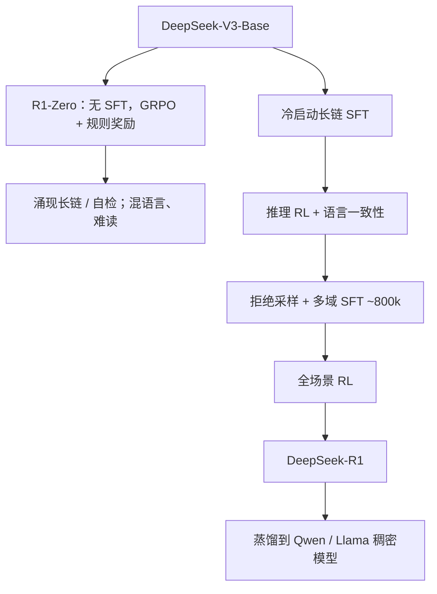

# DeepSeek-R1 论文

    
R1-Zero 从基座直接大规模强化学习，不先做监督微调；R1 再用冷启动与多阶段训练把可读性补回来，并把长链蒸馏到稠密小模型。

    <footer>—— DeepSeek-AI，DeepSeek-R1: Incentivizing Reasoning Capability in LLMs via Reinforcement Learning，2025</footer>

DeepSeek-R1 报告给出两个检查点与一条蒸馏线。DeepSeek-R1-Zero 从 DeepSeek-V3-Base 出发，跳过 SFT，用 [GRPO](/llm/grpo-paper) 与规则奖励做大规模 RL，长链、自检与试错在训练曲线上自己长出来。DeepSeek-R1 在 RL 前加入数千条冷启动长链，并经过「推理 RL → 拒绝采样再 SFT → 全场景 RL」；报告称推理任务对标当时的 OpenAI-o1-1217。开源还包括 1.5B–70B 的 Qwen / Llama 稠密蒸馏。推理时行为与服务含义见 [DeepSeek-R1 与推理时行为](/llm/deepseek-r1)；本篇钉论文里的阶段、奖励、超参与表上的数。

## 问题

常规助手先 SFT 模仿人类短解，再 RLHF。人类示范很少出现「写数千 token 草稿纸再改答案」，过程人标又贵。作者想验证：若奖励**只看最终对错与格式**，不管中间写什么，策略会不会自己发明可用的中间过程？这要求可验证任务（数学、代码、能判分的逻辑），以及一种不必再训与 671B MoE 同规模 critic 的 RL。GRPO 在 DeepSeekMath 里已经用过；R1 把它拉到 V3 基座与数万 token 的生成长度。

Zero 立刻暴露产品缺陷：中英混杂、难读、思维对用户不友好。第二个问题是：如何在不把长链能力打回去的前提下加入人类可读先验，并覆盖写作、事实问答、自我认知等非可验证场景。第三个问题是社区复现成本：完整 RL 太贵，长链文本能否单靠 SFT 迁到小稠密模型。

### 作者明确没有采用的路线

报告写明 R1-Zero **不用**过程奖励模型，也**不用** MCTS 当主训练环。中间过程不被逐步打分，信用完全来自终点规则。这与 [Lightman](/llm/verify-step) 的验证器路线、[VinePPO](/llm/vineppo) 的训练期逐步 MC 都不同。引用时不要把 PRM 或树搜索写进 R1-Zero 的方法节。

AIME 2024 上 Zero 的 pass@1，初版摘要写 15.6%→71.0%，后续修订稿图与表出现 77.9% 等更新。cons@16 为 86.7%。引用必须标明版本与 pass@1 / 投票协议。R1 主表 AIME pass@1 约 79.8%，与报告中的 o1-1217 对照。

## 方法

**奖励。** 可验证题：答案对错（数学解析、代码测试）。格式：思维落在指定标签内，便于切分。没有逐步过程分。R1 的推理 RL 阶段另加语言一致性（目标语言词占比），以减轻混写，作者承认这会微损推理分。第二段全场景 RL 把有用性、无害性接回奖励模型（对摘要或可见回答打分，并考虑思维），与规则奖励并存。

**GRPO 设定（Zero）。** 学习率 $3\times 10^{-6}$，KL 系数 $0.001$，rollout 温度 1。每题 16 个输出；最大长度在约 8.2k 步前为 32,768，之后 65,536，曲线在该点有一跳。共约 10,400 步、1.6 epoch。每步 32 道题，batch 512。每 400 步把参考策略换成最新策略。每次 rollout 8192 条，切 16 个 mini-batch，内层只训 1 个 epoch。clip $\varepsilon$ 在 R1 阶段叙述中出现过较大值（文中写到 10）以配合长链。

**R1 四段。** （1）数千条冷启动：人把 Zero 风格改成第一人称、可读、语言一致，再让模型扩写并经人审，SFT V3-Base。（2）与 Zero 类似的推理 RL，加语言一致性。（3）在 RL 检查点上拒绝采样，混入 V3 的写作 / 事实 / 自我认知等监督，约 80 万样本，再 SFT。（4）全场景 RL：推理规则奖励 + 有用无害。蒸馏：用 R1 轨迹对 Qwen2.5 与 Llama-3.1/3.3 等做 **2–3 epoch 纯 SFT、不再 RL**，上下文 32,768，报告把「小模型再 RL」留给社区。

### 与 PPO 的附录对照

附录在 DeepSeek-Coder-V2-Lite 上比 PPO 与 GRPO：PPO 对 GAE 的 $\lambda$ 敏感，$\lambda=0.95$ 明显弱于 GRPO，$\lambda=1.0$ 才接近。PPO 还要价值模型显存。R1 选 GRPO 是资源与稳定性，不是定理上淘汰 PPO。KL 放在损失里、并周期性更新 $\pi_{\mathrm{ref}}$，是为了避免 InstructGPT 式逐步 KL 惩罚隐式打压长度——长链正是他们要的。

## 机制

### 长度是被奖励定价的，不是架构加出来的

终点正确率随思维变长而升时，组内相对优势偏向更长的探索轨迹，平均回复长度在训练曲线上上升。反思、换解法，是 token 空间里的探索被强化，不是额外模块。格式奖励把思维与答案切开，既方便解析，也方便产品折叠。混语言：奖励不管用哪国语言思考，若中英切换偶然提高正确率就会留下；冷启动把分布拉回服务语言。

组大小 $G=16$、温度 1、最大长度数万，是这条涌现曲线的实验条件。把 $G=1$ 或把 max length 截到聊天默认，复现的不是这篇论文。

### 蒸馏证明文本程序可迁移

小模型没做 RL，只模仿 R1 的长链。报告用这一点说明：昂贵探索的结果可以写成数据。这不等于计算最优压缩，也不等于小模型拥有同一搜索深度——截断与教师失败模式会一起过来。32B 蒸馏在部分数学集上接近当时 o1-mini 一档，具体格以原文表为准，且与 s1-32B 的 1K SFT 不是同一数据量级（R1 蒸馏约 800k）。

## 边界与工程取舍

规则奖励覆盖不了开放写作；第二段 RM RL 才补助手属性，其 RM 细节不如数学规则透明。过程无监督意味着假推理仍存在：看起来在验证，中间仍错，只要终点过检查器。过度思考：简单题仍可能写很长。o1-1217 对照受 API 与官方数限制，报告已说明部分封闭分数来自官方披露。许可证与权重以当时仓库为准。

不要把 V3 的 MLA/MoE 写成 R1 的贡献；骨架是 V3，变的是后训练与长度分布。不要把 GRPO 写成 2025 年才出现——它来自 2024 的 DeepSeekMath。

公开权重使复现与蒸馏成为可能；完整 Zero 的 RL 算力与数据配比仍有报告未列全的部分（题库构成、代码环境细节）。写「完全可复现」要谨慎，写「算法与阶段公开」是准确的。

### 何时不必走 R1 全流程

只有 1K 条教师长链、没有 RL 集群，看 [s1](/llm/s1-budget-forcing)。已有逐步人标、想做验证器，看 Lightman。对话短、延迟紧，不要把 R1 当默认聊天策略。需要无偏逐步信用分配且买得起训练期 MC，VinePPO 回答的是另一问。

## 小结

- R1-Zero：V3-Base 上纯 GRPO + 规则奖励，无 SFT、无 PRM、无 MCTS；长链在 RL 中涌现。
- R1：冷启动 SFT → 推理 RL → 约 80 万拒绝采样 SFT → 全场景 RL。
- 超参公开到组大小、KL、长度跳变步、周期性更新参考策略。
- 蒸馏小模型默认仅 SFT；报告把小模型再 RL 留给社区。
- AIME 等数字须标明 pass@1 / 投票与论文版本；o1 对照是当时声明。
- 出处：DeepSeek-AI，*DeepSeek-R1: Incentivizing Reasoning Capability in LLMs via Reinforcement Learning*，arXiv:2501.12948，2025。
