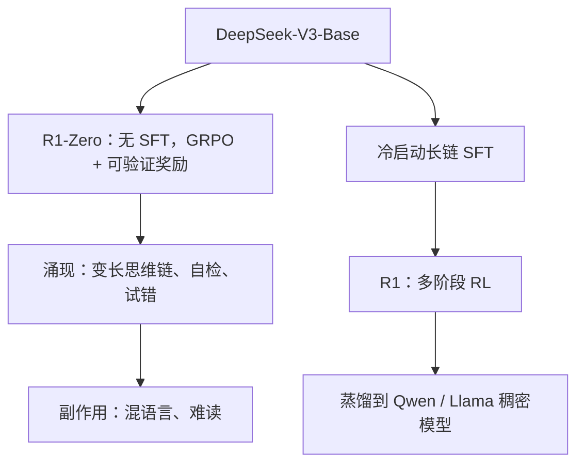

# DeepSeek-R1 与推理时行为

    
R1-Zero 在未做监督微调的基座上直接大规模强化学习，长链验证与反思会自己长出来；R1 再用冷启动把可读性补回来。

    <footer>—— DeepSeek-AI, DeepSeek-R1: Incentivizing Reasoning Capability in LLMs via Reinforcement Learning, 2025</footer>

DeepSeek-R1 讨论的不是新的注意力公式，而是**推理时行为**：模型在给出答案前生成很长的思维链，包含试错、回溯与自检。报告给出两个检查点。DeepSeek-R1-Zero 从 DeepSeek-V3-Base 出发，**跳过 SFT**，用群体相对策略优化（GRPO）做大规模 RL，奖励只看最终对错与格式，不管中间步骤写什么。DeepSeek-R1 在 RL 前加入冷启动数据与多阶段训练，以修复 Zero 的可读性与中英混杂，并在推理任务上对标当时的 OpenAI-o1-1217。开源还包括把 R1 轨迹蒸馏到 Qwen / Llama 稠密小模型。本篇写训练如何改变 decode 行为，不重写 V3 的 MLA/MoE。

## 问题

常规助手模型在 SFT 里模仿人类写的短解答，RLHF 再按偏好打分。这种工序会限制探索：人类示范里很少出现「写八百 token 的草稿纸再改答案」。若目标是竞赛数学、代码与需要多步搜索的题，短解答的模仿学习不够，而过程监督又贵。R1-Zero 的问题设定是：只用**可验证奖励**（答案对不对、是否包在指定格式里），让策略自己发明中间过程。代价立刻出现在推理时：生成长度暴涨、语言切换、对用户不友好的思维痕迹。R1 要在不把「长链能力」打回去的前提下，把这些产品缺陷修掉。

### 推理时计算是一等公民

同一道题，R1 类模型会花几十到上千个 token 在「想」，再给短答案。墙钟延迟、KV 占用、计费都按思维链长度走，而不是按最终答案长度走。这与 V3 作为通用聊天模型的 decode 分布不同。服务若仍按「输出 256 token」的 SLA 切，会把思维截断，准确率回到未 RL 的基座。架构仍是 V3，变的是序列长度分布与停止条件。

不要把 R1 写成「新 MoE」。权重骨架与 V3 同类；差异在后训练与解码出的 token 统计。蒸馏得到的 1.5B–70B 稠密模型更没有 MLA，它们只是模仿 R1 的长链文本。

## 方法

GRPO（先在 DeepSeekMath 等工作中提出，R1 报告采用）对每个提示采样一组输出，用组内奖励的均值与方差估计基线，从而**不训练与策略同规模的 critic**。相对 PPO，省掉价值模型的显存与算力。R1-Zero 的奖励是规则式的：数学/代码可核对最终答案；格式奖励要求思维落在指定标签内。没有逐步过程奖励，也没有人类写的思维示范。

R1 的多阶段路径在 Zero 暴露问题之后加入：冷启动 SFT（可读的长链）、RL、拒绝采样再 SFT、再 RL 等（以报告第 2 节的阶段划分为准）。目的是保留 Zero 发现的验证/反思模式，同时降低中英混写、提高可读性。蒸馏：用 R1 生成约 80 万样本，对 Qwen2.5（含 Math 档）与 Llama-3.1/3.3 等稠密模型做 **仅 SFT、不再 RL** 的迁移，报告明确把「再 RL」留给社区。

## 机制

可验证奖励把优化目标钉在「最终答对」。策略发现：更长的搜索轨迹提高组内相对优势，于是长度上升——这是强化学习对「思考时间」的定价，不是架构里多了一层循环。反思与换一种解法，是生成模型在 token 空间里的探索，被组内相对排名强化。格式奖励把思维与答案分开，便于解析，也便于在产品里折叠思维块。

Zero 的混语言可以理解为：奖励不管语言，中英代码切换若偶然提高准确率就会被留下。冷启动用人类可读的长链把分布拉回主要服务语言，再 RL 时探索被锚在可读区域。蒸馏表明：**长链文本本身**携带可迁移的推理程序；小模型不必重复昂贵的 RL，只要模仿轨迹。报告也写明蒸馏模型没做 RL，因此不是 R1 的计算最优压缩，只是存在性证明。

### 推理时行为对系统的含义

Decode 变长使 MLA 的 KV 优势更关键：思维链往往比答案长一个数量级，缓存按思维长度增长。投机解码、分段总结思维、或在高置信时提前停止，都会改变准确率—延迟曲线，这些是服务策略，报告不保证。评测必须允许足够的 `max_tokens`，并按官方模板包思维标签；用短 max length 去打 AIME，测的是截断，不是模型。

组相对基线使同一题的多个样本互为对照。采样温度与组大小 $G$ 会改变优势估计的噪声。复现 R1-Zero 却把 $G=1$，GRPO 退化，长度与反思都不必出现。超参以报告为准，不要从博客抄一组未注明的数。

## 边界与工程取舍

### 长链默认不是产品默认

可验证奖励覆盖数学、代码、逻辑谜题，覆盖不了开放式写作与无法自动判分的任务。把 R1 当通用聊天默认，会得到又慢又爱自我辩论的助手。过程无监督意味着思维链可以看起来严谨、中间步骤仍错，只有最终答案被奖励——「假推理」仍然存在。安全与越狱：长链可能把拒绝策略绕开或相反地过度拒绝，需要单独评测。产品上应把「思考开关」与 max length 当成显式策略：竞赛题打开长链，短指令关闭或截断，并缓存已吸收的 MLA 状态以免思维 token 把并发打穿。蒸馏小模型更适合做本地推理草稿，不适合假装自己是 671B 的 RL 策略。

蒸馏小模型继承教师的解题分布，也继承教师的失败模式；在没有 RL 的情况下，长度控制更弱或更刻板，取决于 SFT 数据如何截断。许可证与权重以当时 GitHub 仓库为准。引用 DeepSeek-R1 报告（arXiv:2501.12948）与其中的 GRPO 出处（Shao et al., DeepSeekMath，2024），不要把 GRPO 写成 2025 年才第一次出现。

o1 对照是报告当时的声明，封闭模型版本会变。写「对标 o1-1217」要带报告日期与任务子集，不要扩成「全面超过所有 OpenAI 模型」。

## 小结

- R1-Zero：V3-Base 上纯 RL（GRPO + 规则奖励），涌现长链推理，伴随可读性与语言混合问题。
- R1：冷启动 + 多阶段训练，保留推理能力并改善产品行为。
- 推理时计算随思维链增长；截断 max length 会直接打掉收益。
- 蒸馏把长链轨迹迁到稠密 Qwen/Llama，默认仅 SFT。
- 出处：DeepSeek-AI, *DeepSeek-R1*，arXiv:2501.12948，2025。
