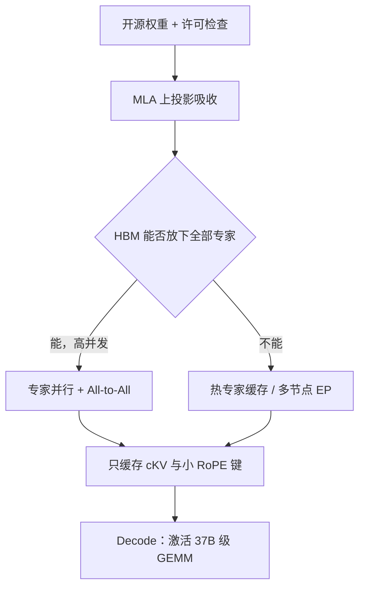

# DeepSeek 开源栈与部署约束

    
MLA 可以在推理图里吸收上投影，decode 只缓存潜向量；专家却必须用并行或缓存策略装进显存——开源权重能下，不等于单机能服。

    <footer>—— 对照 DeepSeek-V2 / V3 技术报告中的 MLA 吸收与 MoE 通信，以及仓库中的许可与推理说明</footer>

DeepSeek-V2、V3、R1 的权重公开，代码仓库常用 MIT，模型另附许可并声明可商用——具体以当时 `LICENSE` / `LICENSE-MODEL` 为准。能下载与能部署是两件事。V3 级模型总参 671B，激活 37B；服务时 HBM 先被**专家权重**填满，再被 **KV** 填满，最后才轮到 37B 激活对应的计算。本篇把三条部署约束写清：MLA 吸收后的缓存形状、[专家并行](/llm/expert-parallelism) 与专家缓存、许可与精度栈。不写攻击、越权或破解量化保护。

## 问题

稠密 70B 的心理模型是：张量并行切矩阵，KV 按 GQA 头数涨。DeepSeek 两条都改了。MLA 的潜向量若按张量并行在每张卡上复制一份完整吸收后的投影，省下的 KV 会被复制吃回去，有效 batch 上不去。MoE 的 256 专家若在每张生成卡上复制全份，671B 放不进节点；若切专家，token 必须 All-to-All，decode 小 batch 时通信税高于 GEMM。R1 还把序列拉长，KV 与延迟同时恶化。开源栈（vLLM、SGLang、TensorRT-LLM 等）要在「能跑」和「跑得像论文」之间做选择。

### 显存账的三项

第一项是参数：FP8 下 671B 仍需多卡；BF16 近似翻倍。第二项是 KV：吸收后的 $c^{KV}$ 加小 RoPE 键，远小于 MHA，但仍随并发 × 层数 × 长度线性涨；R1 思维链把长度乘数抬高。第三项是激活与通信缓冲：EP 的 dispatch 缓冲、MTP 头（若加载）、CUDA Graph 工作区。只报「37B 激活所以一张 80GB 够」会漏掉第一项。

许可约束与显存约束独立。MIT 代码允许改推理核；模型许可允许商用不等于允许改名闭源再分发——读原文条款。本篇不把条款当法律意见，只提醒部署清单里要有这一行。

## 方法

MLA 吸收：训练时展开的 $W^{UK},W^{UV}$ 在部署时乘进查询侧或输出侧，使内容注意力成为对 $c^{KV}$ 的线性函数。服务进程应加载**融合后**的权重，或在启动时做一次离线融合，避免每步物化满头 $K,V$。未吸收的实现能出对的数，但缓存回到 MHA 量级，V2 报告里那 93% 的 KV 降幅不会出现。RoPE 旁路键不能吸收，必须按头缓存，体积仍远小于内容 KV。

专家侧两条路。训练拓扑缩小版：专家并行，每卡常驻若干专家，token All-to-All，适合大 batch prefill 与高并发。单机/小并发：不能常驻全部专家时，用 [专家缓存](/llm/moe-inference-cache)——热专家留 HBM，冷专家在主机内存，命中失败再搬。共享专家始终在卡上。V3 的路由偏置 $b_i$ 要与权重一起加载，否则负载与训练不一致。

开源推理栈的常见组合是：数据并行复制注意力（含 MLA 潜投影），专家并行切 FFN，张量并行度取 1，以避免 MLA 投影在 TP 维上重复。具体开关随框架版本变，以官方 recipe 为准，不要把某一版 vLLM 命令写成论文的一部分。

## 机制

吸收把「多头 KV」从激活变成权重。权重不随 $T$ 增长，所以长思维链（R1）时 MLA 的相对优势更大。TP 切注意力会在每张卡复制潜投影，等于用计算换通信后，又把 MLA 的参数优势让掉——这是框架博客里建议 DeepSeek 走宽 EP、窄 TP 的原因。EP 则相反：注意力复制、专家分片，KV 按 DP 份数并行，有效缓存容量随卡数增加。

专家缓存的命中率在对话 decode 上往往高（路由粘滞），在长 prefill 上低（token 多、专家发散）。TTFT 被冷专家 PCIe 搬运主导时，稀疏的 FLOPs 优势看不见。FP8 权重减半显存，但需要对应的 GEMM 核与校准；核未就绪时退回 BF16，节点数立刻翻。MTP 头可用于推测解码加速，不用则应不占常驻 HBM。

### 许可、精度与「官方能跑」清单

仓库通常区分代码许可与模型许可；V3 系列声明支持商用。量化权重、第三方再导出、地区与使用场景限制以模型卡为准。不要假设 Apache 2.0。精度栈：训练报告写 FP8，推理框架可能提供 FP8 与 BF16 两条路径；KV 也可再量化，这与权重 FP8 是不同旋钮。R1 模板（思维标签）必须与训练一致，否则路由与长度统计都变。

「开源栈」包括：权重、融合脚本、EP/DP 配置、MLA 核、MoE grouped GEMM、偏置、分词与聊天模板。只换成 Hugging Face 里的 `AutoModel` 贪心生成，测到的延迟不是 V3 报告里的推理效率。

## 边界与工程取舍

### 容量规划要写清精度与并发

单机 8×80GB 能不能服 V3，取决于量化、上下文、并发和是否 offload 专家，不是一个永恒的是/否。H200 / H20 与 H100 的 HBM 差一截，recipe 不能互抄。网络差的多机 EP 会让 decode 比单机 offload 更慢。安全与内容过滤不在架构里，开源权重默认不带封闭 API 的完整护栏。规划时应固定四元组：精度（FP8 还是 BF16）、并行（EP/DP/TP）、最大上下文、目标并发；改其中一项，节点数就要重算。把 R1 与 V3 聊天当成同一 SLA，会在思维链高峰把 KV 池打满——这是调度问题，不是「开源栈不成熟」一句话能概括的。

不要把社区「单卡跑 671B」的演示（极端量化、极短上下文、不吸收 MLA）当成生产容量规划。DeepSeekMoE 的设备限制路由若在推理关掉，质量与训练分布不一致。Lite / 小蒸馏模型（R1 的 Qwen 蒸馏档）部署约束完全不同，不要用 V3 的 EP 故事去吓 7B 用户。

引用停留在 V2（arXiv:2405.04434）、V3（arXiv:2412.19437）、R1（arXiv:2501.12948）与官方仓库说明。框架性能数字随版本变，写系统对比要钉版本，不要给 vLLM 编造论文编号。

## 小结

- 部署 DeepSeek 先算专家权重显存，再算 MLA 吸收后的 KV，最后才是 21B/37B 激活 FLOPs。
- MLA 吸收是推理图变换；不吸收就得不到报告中的缓存降幅。
- 高并发走专家并行；装不下则走专家缓存或更多节点，共享专家常驻。
- 许可分代码与模型；商用与再分发读原文。精度（FP8/BF16）改变节点数。
- R1 的长链把 KV 与延迟乘数放大，模板与 max length 属于部署约束。
- 出处：DeepSeek-V2 / V3 / R1 技术报告与对应 GitHub 仓库的推理与许可说明。
