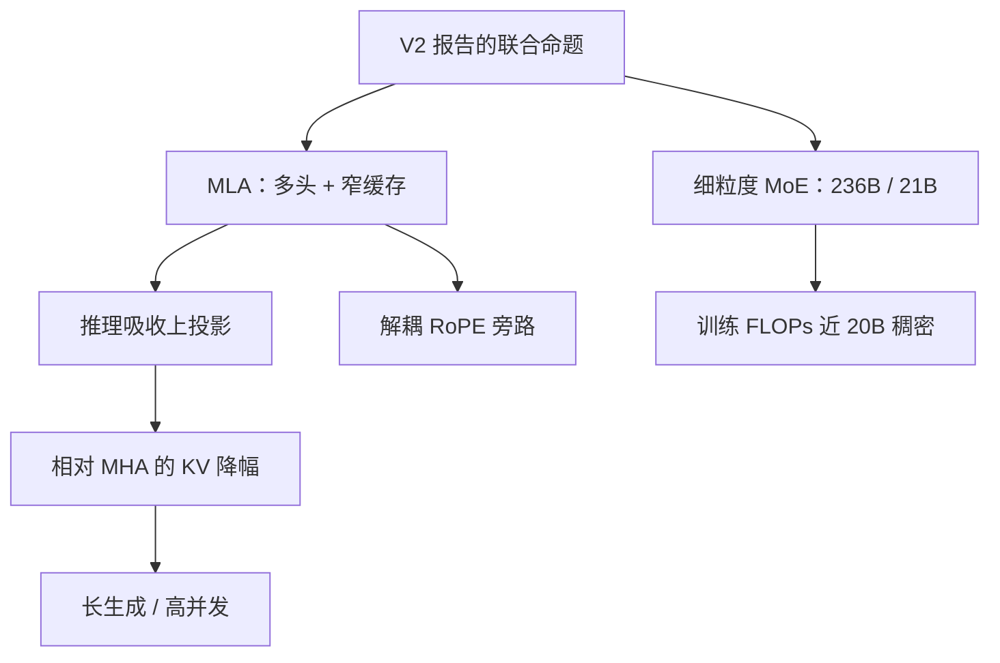

# MLA 原文 DeepSeek-V2

    
我们提出多头潜在注意力：对键值做低秩联合压缩；推理时把上投影吸收进权重，解码只需缓存压缩后的潜向量。

    <footer>—— DeepSeek-AI，DeepSeek-V2 技术报告，arXiv:2405.04434，2024</footer>

DeepSeek-V2 报告（2024 年 5 月）把 **Multi-head Latent Attention (MLA)** 作为与 DeepSeekMoE 并列的架构贡献写出。总参数 236B、激活约 21B、上下文 128K、预训练约 8.1T token；相对稠密 DeepSeek 67B，训练费用约降 42.5%，KV 缓存约降 **93.3%**，最大生成吞吐约 **5.76×**。MLA 的压缩轴、吸收与解耦 RoPE 的公式见 [MLA](/llm/mla) 与 [MLA 对 KV 的压缩](/llm/mla-kv)；V2 如何把 MLA 与细粒度 MoE 咬合见 [DeepSeek-V2 MLA 与 MoE](/llm/deepseek-v2)。本篇写 **报告原文如何为 MLA 辩护**：为什么不满足于 GQA、消融与档位怎么设、93.3% 的分母是什么、Lite 16B 扮演何种角色。

## 问题

服务侧 KV 随 $T\times h\times d_k$ 涨，长生成、高并发时先于权重打满 HBM。GQA 减 KV 头数，组内共享值空间，继续减会伤质量。MQA 更极端。V2 仍想保留很多头——报告量级上内容路径可以到 128 头——又要把 decode 缓存从「头数×头宽」换成「每 token 一条窄潜向量」。训练必须仍按多头算分数，否则与 MHA 质量合同对不上；RoPE 作用在头内坐标上，不能被共享瓶颈直接旋转掉。

报告同时要付训练账单：67B 稠密再加宽一倍不可接受。MLA 单独省的是推理字节与部分投影，**不是**把注意力变成线性；训练 FLOPs 的大头仍在 MoE 稀疏上。写 MLA 原文若只谈缓存、不谈它在 236B 报告里的位置，会把 5.76× 吞吐全部记在注意力头上。

### 压缩轴写进报告的对照表

GQA 的轴是头；MLA 的轴是每个 token 的秩。同一份 $c^{KV}\in\mathbb{R}^{d_c}$（V2 常用 $d_c=512$）经上投影展开多头内容键值；解耦 RoPE 键 $d_R=64$ 量级必须另存，因为旋转破坏吸收所需的纯线性。满宽 MHA 每 token 每层约 $2\times 128\times 128$ 个数；MLA 的 $c^{KV}$ 512 个数加 RoPE 键 $128\times 64$。93.3% 是相对 **他们设定的 MHA 基线**，不是相对 Llama-2-70B 的 GQA-8。换头宽，百分比会变。

Lite 档约 16B 总参、2.4B 激活、32K 上下文，用来证明同一套 MLA+MoE 在小规模成立。不要用 Lite 延迟外推 236B 的 EP 集群，也不要用 236B 的榜代替 Lite 的本地实验。

## 方法

训练图显式展开多头 $q,k,v$，RoPE 打在旁路，梯度流过 $W^{UK},W^{UV}$。部署时内容路径吸收：$(q^C)^\top k^C$ 变成对 $c^{KV}$ 的线性型，输出侧吸收 $W^{UV}$。检查点里的权重仍是未吸收的训练布局；融合发生在启动时一次，不是逐步生成时现乘。报告把这条写成「economical and efficient」的注意力半边：头可以多，缓存跟 $d_c$ 走。

质量辩护依赖与 MHA / GQA 的对照（报告图表）：MLA 目标贴近 MHA 的多头表达，而不是贴近 MQA 的单库。过窄的 $d_c$ 先伤精确记忆（实体、长数字），语言模型损失可能仍平滑——报告用下游与内部消融支持「瓶颈够用」，读者在复现时应单独报检索类任务。128K 来自长上下文训练与位置方案，MLA 只让 KV 在内存上可行，不自动给长度外推。

### 数字要分列，不能合成一个百分比

42.5% 训练费用、93.3% KV、5.76× 生成吞吐，分母不同：训练相对 67B 稠密配方与集群账单；KV 相对 MHA 形状；吞吐还含 MoE 激活稀疏、实现融合、batch。只上 MLA、FFN 仍稠密，训练账单不会降那么多。只上 MoE、注意力仍 MHA，128K 服务会被 KV 打死。报告的设计约束是联合的；MLA 原文专文仍应把注意力数字从 MoE 数字里拆开写：每 token 每层字节数、$d_c$、$d_R$、$h$，而不是只抄 93.3%。

开源权重以 DeepSeek-V2 仓库为准。没有融合核时，实现若逐步物化满头 $K,V$ 再缓存，压缩幅度退回 MHA，报告中的服务卖点不会出现。辅助损失均衡专家是 V2 配方，V3 才改偏置；复现 MLA 时不要顺手删 aux。

## 机制

报告用「联合压缩」强调 $K$ 与 $V$ 共享 $c^{KV}$：键方向与值内容从同一潜状态解码，参数和缓存都更省。头间差异在 $W^{UK},W^{UV}$ 的行块里，权重不随 $T$ 复制。吸收成立当且仅当内容路径纯线性且 RoPE 不打在 $k^C$ 上。这些机制专文已写。原文作为 **模型卡式报告** 多出来的是：把 MLA 放进 8.1T 预训练、SFT 与 RL 的全流程，并给出相对上一代稠密模型的经济性句子。没有这组句子，MLA 只是又一种低秩注意力；有了这组句子，它成为可服务的 236B 级 MoE 的注意力半边。

不要把 MLA 理解成对已生成的 MHA 缓存做 PCA。低秩是训练写路径上的瓶颈。事后压缩 GQA 缓存是另一类方法，误差来自逼近已有激活。

### 和 GQA 论文、和 V3

Ainslie 的 GQA 从多头检查点上转换、少 KV 头。MLA 从零按瓶颈训练、多查询头。不能把 V2 写成「DeepSeek 版 GQA」。V3 沿用 MLA 并改 MoE 均衡与 MTP；写 V2 原文不要倒填无辅助损失。FlashMLA 等推理核是后续系统工作，不是 2405.04434 的实验设置。

## 边界与工程取舍

### 复现要对齐训练图与推理图

关掉吸收、或把 128 头改回 8 头 GQA，都不再是报告中的 MLA。小集群放不下与 MLA 配套的 160 专家 EP，复制不了联合设定。评测吞吐必须声明是否吸收、精度、并发与上下文，否则无法与 5.76× 对照。$d_c$ 是质量–缓存旋钮；加宽线性增加缓存，类似 GQA 加 $h_{\mathrm{kv}}$。极短生成、极大前填时，MLA 优势缩小，融合核写得差甚至慢于 GQA。

第三方博客的层表不能代替报告超参。Lite 与 236B 共用设计语言，通信规模不同。许可与权重以官方发布为准。把 V2 当「开源 67B 的便宜升级」会低估：没有 grouped GEMM 与 MLA 核时，理论 KV 降幅与墙钟无关。

出处：DeepSeek-AI，*DeepSeek-V2: A Strong, Economical, and Efficient Mixture-of-Experts Language Model*，arXiv:2405.04434，2024。公式见 MLA 专文；联合系统见 V2 MLA 与 MoE 专文。

## 小结

- V2 报告提出 MLA：每 token 联合压缩 KV，推理吸收上投影，RoPE 走旁路。
- 93.3% KV 降幅相对报告内 MHA 基线；与 42.5% 训练费用、5.76× 吞吐分列。
- 质量目标贴近多头而非 MQA；$d_c$ 过窄先伤精确记忆。
- Lite 验证小规模；满血数字含 MoE，不能单记在 MLA 上。
- 出处：DeepSeek-AI，arXiv:2405.04434。
