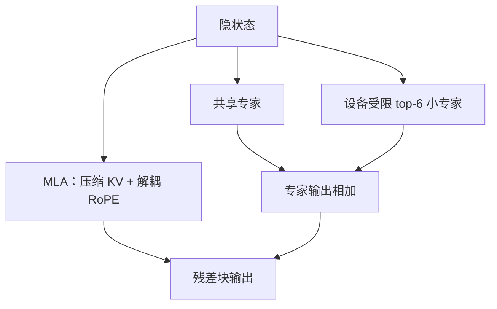

# DeepSeek-V2 MLA 与 MoE

    
MLA 把键值压进潜向量以砍推理缓存；DeepSeekMoE 用细粒度专家在可控激活下把总参数做到 236B。

    <footer>—— DeepSeek-AI, DeepSeek-V2: A Strong, Economical, and Efficient Mixture-of-Experts Language Model, 2024</footer>

DeepSeek-V2 把两条通常分开做的效率轴写进同一份报告：注意力侧用 [多头潜在注意力](/llm/mla)（MLA）压缩 KV，前馈侧用 [DeepSeek MoE](/llm/deepseek-moe)——细粒度路由专家加共享专家。总参数 236B，每 token 激活约 21B，上下文 128K。相对前代稠密 DeepSeek 67B，报告给出训练费用约降 42.5%、KV 缓存约降 93.3%、最大生成吞吐约 5.76 倍。预训练约 8.1T token，再接 SFT 与 RL。本篇写 V2 如何把 MLA 与 MoE 咬合，不把 V3 的无辅助损失与 MTP 提前写进来。

## 问题

服务百亿以上稠密模型时，decode 的 KV 往往先于权重把 HBM 吃满；同时，把 67B 再加宽一倍，训练账单不可接受。GQA 减 KV 头，会牺牲头内独立的值空间；把 FFN 做成 Mixtral 式 8 选 2，组合数少、专家肥，激活一升成本就回去。V2 要的是：推理缓存接近「窄潜变量」而不是「头数 × 头宽」，训练 FLOPs 接近 20B 级稠密模型，而总容量仍是 200B 量级，以便装多语言、代码与长尾知识。

### 两条轴必须同时成立

只上 MLA、FFN 仍稠密，训练仍按满宽 FFN 付钱。只上细粒度 MoE、注意力仍是 MHA，128K 服务会被 KV 打死。V2 的设计约束是联合的：MLA 让头可以很多（报告量级上到 128 头）而缓存跟 $d_c$ 走；MoE 让 FFN 总参很大而每 token 只走共享专家加 $k$ 个小专家。第一层 FFN 保持稠密——底层更靠近嵌入，公共变换重，稀疏收益小——其余层再 MoE。

236B / 21B 描述的是参数，不是「相当于 21B 稠密模型的全部行为」。注意力仍按序列长度计 FLOPs；MLA 省的是 KV 字节与部分投影，不是把注意力变成线性。对照 67B 稠密时，要分列训练 FLOPs、KV、吞吐，不要只报一个百分比。

## 方法

MLA 对每个 token 的键值做低秩联合压缩：下投影得到 $c^{KV}\in\mathbb{R}^{d_c}$，训练时再上投影展开多头内容键值；RoPE 走解耦的小维度旁路，以免旋转破坏吸收。推理时内容路径的上投影可以乘进查询或输出权重，decode 主要缓存 $c^{KV}$ 与很小的 RoPE 键。细节与公式见 MLA 专文；V2 报告给出的工程后果是 KV 相对 MHA 降一个数量级。

DeepSeekMoE 在 V2 的典型配置是：**2 个共享专家 + 160 个路由专家，每 token 激活 6 个路由专家**（第一层除外）。共享支路始终计算；路由为 token-choice top-$k$。专家内部仍是 SwiGLU，中间维被切细。为了让 All-to-All 不把一个 token 打到所有 EP 节点，使用设备限制路由：先锁定最高分专家所在设备，再在有限设备集合内补齐 $k$。负载均衡在 V2 仍走辅助损失，而不是 V3 的偏置方案。

## 机制

MLA 的缓存形状从 $[T,h,d_k]$ 变成 $[T,d_c]$ 加 $[T,h,d_R]$。头间差异主要在权重矩阵里，不随 $T$ 复制。这与 GQA「少头」相反：V2 追求的是多头表达、窄激活缓存。吸收成立的前提是内容路径纯线性；RoPE 必须旁路，否则部署融合会算错位置。训练图仍显式展开多头，梯度完整流过上投影。

细粒度 MoE 让同样激活中间维对应 $\binom{160}{6}$ 量级的专家组合，而不是 Mixtral 的 $\binom{8}{2}=28$。共享专家承接公共映射，避免每个小专家都学一份停用词变换。设备限制路由把通信从「任意 $k$ 台」收成「少数邻居」，这是 160 专家能训起来的系统条件。激活 21B 意味着前向 GEMM 与一个中型稠密模型同阶，但专家并行的延迟与负载不均是稠密模型没有的税。

### 和 Mixtral、和纯 GQA 稠密模型的对照

Mixtral：肥专家、无共享、$k=2$、注意力仍是 Mistral 底盘。V2：瘦专家、有共享、$k=6$、注意力是 MLA。不能把「都是 MoE」写成可替换实现。Llama 2 70B 一类 GQA 稠密模型：KV 按 8 头级缩小，FFN 每 token 全算。V2 的 KV 更小、FFN 更稀疏，实现复杂度更高，开源推理框架若只接了 GQA 核，跑 V2 会退化为错误的满 KV 或错误的专家计数。

Lite 档（报告中的 16B 总参、约 2.4B 激活）用来验证同一套 MLA+MoE 在小规模成立，上下文 32K。不要用 Lite 的延迟去外推 236B 的 EP 集群，也不要用 236B 的榜去代替 Lite 的本地实验。

## 边界与工程取舍

### 复现要对齐训练图与推理图

V2 的质量来自两轴叠加，消融要分开：关掉 MLA 吸收、或把 160 专家并回 8 专家，都不再是 V2。小集群放不下 160 专家的 EP，复制不了训练设定。128K 依赖位置方案与长上下文训练，不是 MLA 自动给的；MLA 只让 128K 的 KV 在内存上可行。辅助损失会干扰主目标，这是 V3 改配方的动机，V2 复现时不能直接删掉 aux 而不补均衡手段。把 V2 当「开源 67B 的便宜升级」会低估系统工作量：没有融合核时，MLA 的展开会把缓存打回多头；没有 grouped GEMM 时，160 专家的碎片计算会把 21B 激活的理论优势吃光。评测吞吐必须声明是否吸收、EP 度数与精度，否则无法与报告中的 5.76 倍生成对照。

开源权重与报告以 DeepSeek-V2 仓库为准。引用官方技术报告（arXiv:2405.04434），不要把第三方博客的层表当成论文超参。推理融合 MLA 与训练展开必须成对测试，只对齐 loss 对不齐生成。Lite 与满血 236B 共用设计语言，但通信规模不同，不能把笔记本上的 Lite 延迟写成 V2 家族的服务能力。

93.3% 的 KV 降幅是相对他们设定的 MHA 基线，不是相对任意 GQA 70B。换一组头宽、头数，百分比会变。写系统论文应同时给出每 token 每层的字节数。

## 小结

- DeepSeek-V2：236B 总参、约 21B 激活、128K；预训练约 8.1T。
- MLA 联合压缩 KV，推理可吸收上投影，缓存跟潜变量走。
- MoE 为 2 共享 + 160 路由、激活 6 个路由专家，加设备限制路由。
- 第一层稠密 FFN；注意力效率与 FFN 稀疏正交，必须同时做才匹配报告中的训练与服务数字。
- 出处：DeepSeek-AI, *DeepSeek-V2*，arXiv:2405.04434，2024；MLA 与 DeepSeekMoE 专文见本目录相邻篇。
