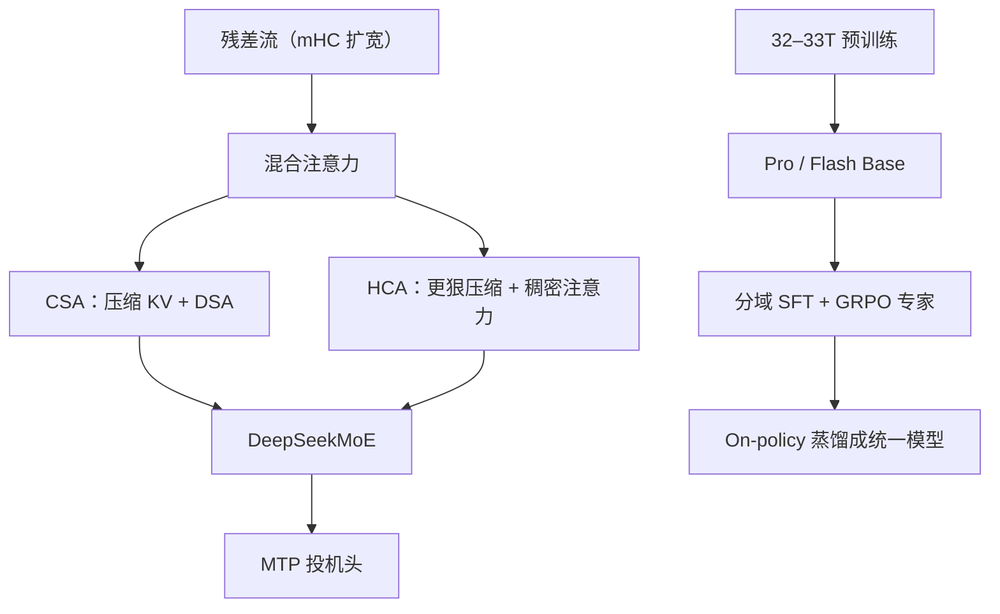

# DeepSeek V4

    
在百万上下文设定下，V4-Pro 相对 V3.2 只需约 27% 的单 token 推理 FLOPs 与 10% 的 KV；把超长上下文做成可日常服务的默认，而不是演示开关。

    <footer>—— DeepSeek-AI，DeepSeek-V4: Towards Highly Efficient Million-Token Context Intelligence，arXiv:2606.19348</footer>

[DeepSeek-V3](/llm/deepseek-v3) 把细粒度 MoE 与 MTP 做成开源旗舰骨架；V3.2 把 [DSA](/llm/deepseek-sparse-attention) 接到长上下文。2026 年 4 月 24 日的 **DeepSeek-V4 Preview** 把目标改成「买得起的 1M 窗口」：同时开源 **V4-Pro**（1.6T 总量 / **49B** 激活）与 **V4-Flash**（284B / **13B** 激活），官方服务默认 1M。技术报告 arXiv:2606.19348 写明混合注意力 **CSA + HCA**、流形约束超连接 **mHC**、以及 **Muon** 优化器。2026 年 8 月 13 日左右的 **V4-Pro-0813** 被写成取代预览的正式档，强化智能体。本篇以预览报告与官网新闻为骨架，正式档的价目与 DSpark 以当时公告为准，不把未写入报告的层宽表从二手文抄来。

## 问题

推理模型把测试时计算当成第二缩放轴，但标准注意力对超长序列是二次的。智能体轨迹、跨文档分析、Think Max 所需的超长思维，会先被 KV 与 FLOPs 卡住，而不是被「不会想」卡住。V3.2 已经用 DSA 降长上下文费用；V4 要回答的是：能否让 **1M 成为所有官方服务的默认**，并且 Pro 在 1M 上仍只有 V3.2 大约四分之一的单 token 计算、十分之一的 KV。

第二个问题是后训练如何在数学、代码、智能体、指令上分别变强，再收成用户看见的一个检查点。V3 式「一个混合推理模型」仍然成立，但专家要先分域养成。

### Pro 与 Flash 是两条激活曲线，不是两个窗口档

官网同一天放出两档，窗口都是 1M，都支持思考 / 非思考。Pro 打的是智能体编码、世界知识与数理代码的开源上限；Flash 打的是接近 Pro 的推理、更小激活、更快响应。报告：Flash 预训约 **32T** token，Pro 约 **33T**。Think Max 是 Pro 上的最大推理力度，不是另一个权重文件的别名。预览 API 名 `deepseek-v4-pro` / `deepseek-v4-flash`；旧的 `deepseek-chat` / `deepseek-reasoner` 曾映射到 Flash 的非思考 / 思考，并计划在 2026-07-24 后退役。

1M 上下文上 Pro 相对 V3.2：约 27% 单 token FLOPs（按等价 FP8）、10% KV；Flash 进一步到约 10% FLOPs、7% KV。专家权重走 FP4，现有硬件上 FP4×FP8 峰值往往仍等于 FP8×FP8，报告把更大的效率留给未来器件。

## 方法

骨架仍是 Transformer + DeepSeekMoE + 与 V3 相同的 MTP。MoE 亲和度从 Sigmoid 换成 $\sqrt{\mathrm{softplus}(\cdot)}$；无辅助损失的平衡仍在，并加轻微序列级平衡以免单条序列极端倾斜。去掉路由目标节点数限制；最初若干块的稠密 FFN 改成按 token ID **哈希路由**的 MoE。这些是报告写明的「小改」；大改在注意力与残差。

### CSA / HCA 与 mHC

**CSA（Compressed Sparse Attention）**先沿序列压缩 KV，再跑 DSA。**HCA（Heavily Compressed Attention）**把 KV 压得更狠，但注意力保持稠密。二者混排，用来换长上下文的 FLOPs 与缓存。**mHC** 把残差流扩宽 $n_{\mathrm{hc}}$ 倍，但把残差映射 $B_l$ 约束到双随机矩阵（Birkhoff 多面体）上：行和列和为 1、非负，谱范数 $\le 1$，深层连乘仍稳定。无约束的 Hyper-Connection 在深堆上会数值炸；Sinkhorn–Knopp 把原始 $B$ 投影回该流形。输入 / 输出映射用 Sigmoid 保证非负有界。优化器改 **Muon**，换更快收敛与更稳的万亿 MoE。

后训练两段：各域（数学、代码、智能体、指令）先 SFT 再 GRPO，得到专家；再用 on-policy 蒸馏、反向 KL，把能力收进一个统一模型。后训练对 MoE 专家与 indexer 的 QK 路径做 FP4 量化感知训练。推理侧设计异构 KV 与落盘策略，以便共享前缀复用。

Think Max 需要足够长的上下文预算（社区文档常写至少约 384K 量级，以当时 API 指南为准）。采样推荐温度 1.0、top-p 1.0。预览与 0813 正式档的智能体分数不是同一行，引用要写检查点名。

## 机制

CSA 把「先稀疏再算」接到压缩后的序列轴上，长度带来的二次项作用在更短的压缩长度上；HCA 用更小的 KV 换一层仍能精确归一化的稠密注意力，避免全程稀疏把针检索打穿。二者必须混用：只有 DSA 会在某些全局依赖上丢分，只有重度压缩稠密层则算不过来。mHC 提供一条几乎不增加层内 FLOPs 的宽度轴——真正算子仍吃 $d$ 维，扩的是残差流。双随机约束保证这一宽度轴不会变成深层放大系数。

Muon 替代 Adam 系，与 K2 的故事同类：正交化更新换 token 效率，稳定训练是前提。分域专家再蒸馏，避免单一 RL 奖励把数学文风写进办公智能体。Flash 知识容量小于 Pro，但在更大思考预算下推理可以接近；难智能体仍是 Pro 的主场。

### 预览与正式档

4 月预览把 1M 做成默认并开源权重。8 月 GA（V4-Pro-0813）官方强调智能体能力与 Responses API / Codex 集成，思考力度扩到 low / high / max；价目随后按峰谷调整，**具体数字以当时定价页为准**，不要把预览期的 0.87 美元 / M 输出写成永恒。DSpark 一类投机模块若出现在 GA 说明里，是服务侧附件，不是报告里 CSA 公式的一部分。

## 边界与工程取舍

报告是 **preview** 版本的架构与训练叙述；0813 的智能体增益来自后训练与产品集成，未必改 CSA/HCA 公式。哈希路由只用于最前若干 MoE 层，不要写成全程。mHC 的 $n_{\mathrm{hc}}$ 具体整数以报告表格为准，未引用原表就不要填。权重在 Hugging Face `deepseek-ai/deepseek-v4` 集合；许可以仓库为准（社区常写 MIT，仍以 LICENSE 文件为准）。V4 官方新闻强调文本智能体与长上下文，不要把未写入报告的原生视频生成写进本篇。

1M 默认改变的是账单形状：缓存未命中时输入价仍按百万计。把整仓无压缩塞进窗口，先打的是钱。Think 与 Non-Think 混评没有意义。

出处：DeepSeek，*DeepSeek-V4 Preview* 官网新闻（2026-04-24）；DeepSeek-AI，arXiv:2606.19348。GA 检查点以 2026-08 官方公告为准。

## 小结

- V4-Pro 1.6T/49B、V4-Flash 284B/13B，官方默认 1M 上下文；预训约 32–33T token。
- 混合 CSA+HCA 降长上下文 FLOPs 与 KV；mHC 约束残差；优化器 Muon；MoE/MTP 承 V3。
- 后训练先分域专家再 on-policy 蒸馏；Think / Non-Think 与 Max 力度是解码制度。
- 预览与 0813 正式档要分开引用；价目会变。
- 出处：官网新闻与 arXiv:2606.19348。
