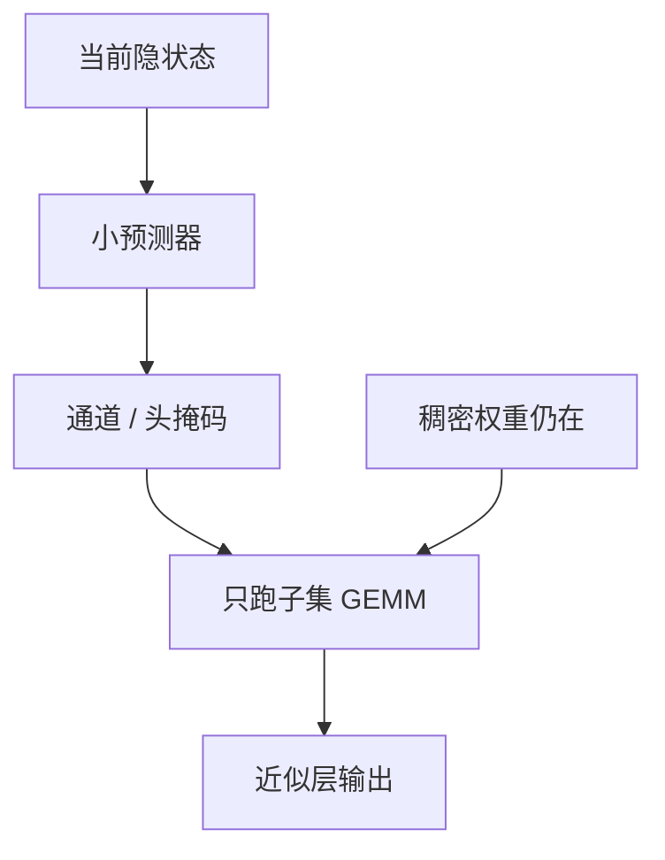

# Deja Vu 上下文稀疏

不必把激活函数改成 ReLU：用一个小预测器，根据当前上下文估计哪些 MLP 神经元、哪些注意力头会真被用到，其余跳过。

<footer>—— Liu et al., Deja Vu: Contextual Sparsity for Efficient LLMs at Inference Time, ICML 2023</footer>

[上一课](/llm/activation-sparsity) 靠 ReLU 把零写进前向。本课面向已经训好的 GLU Transformer：稀疏是**上下文相关的预测掩码**，不是函数图像上的精确零。缺口是：近似「这个 token 不需要整层容量」，而又不引入 [MoE 路由](/llm/moe-routing) 那套专家并行。后课把头的删除从动态预测收成静态剪枝。

## 问题

LLM 一层的 MLP 通道与注意力头对单个 token 贡献极不均——头功能分化课已经见过静态版。Deja Vu 问的是动态版：给定截至现在的隐状态，能否用远小于原层的代价，预测一张二值掩码，只跑子集，输出仍接近稠密层。预测错的代价是质量；预测本身的代价必须远小于省下的 GEMM，否则是净亏。

这与 MoE 的差别：MoE 的专家是预训练就切开的参数块，门是模型的一部分；Deja Vu 的预测器是推理期外挂，参数仍是原来那套稠密权重，只是有的行本次不乘。不能把两者的稀疏度表直接对比。

Contextual sparsity 的「上下文」指当前序列的隐状态，不是检索系统的文档上下文。不要接到 RAG 课。

## 方法

对 MLP：用低秩或小 MLP 吃入当前 $x$（或一层输入），输出通道级分数，阈值化得到保留集，只乘对应的 $W_\mathrm{up}$/$W_\mathrm{down}$ 切片。对注意力：预测哪些头保留，只算那些头的 QKV 与 SDPA。预测器在校准或短微调里拟合稠密模型的「哪个通道激活大 / 哪头输出能量大」，推理冻结。

阈值是延迟旋钮：紧则快、质量掉。应在分能力集上扫，而不是只看平均 PPL。与 2:4 不同，掩码不规则，加速依赖「按保留通道做瘦 GEMM」的实现，保留集过碎会退化成 gather。

## 机制

假设层计算对单个 token 是低维的：大部分通道近零或可被其它通道替代。预测器学的是这条低维支撑随上下文如何移动。它比 ReLU 更通用（GLU 也能近似稀疏），但有近似误差：预测器看不到未来 token，decode 每步重预测，误差可累积。Prefill 一次预测整段则更稳，却与真实逐步生成不完全一致。

负载没有 MoE 那种专家均衡问题，但有「预测器总选同一批通道」的退化：等于静态剪枝却还在付预测器。应监控保留集的熵与 Jaccard，避免假动态。

## 边界与工程取舍

不要在预测器成本接近原层时还宣称稀疏。不要与权重 2:4 连乘加速比。训练期一般仍稠密，只在推理开预测器——训推不一致是税，长链推理更敏感。下一课把「头可以少」做成静态事实：Michel 的剪头，不再每步预测。

## 小结

- Deja Vu：推理期预测 MLP 通道与注意力头的上下文掩码，权重要稠密。
- 不是 MoE：无专家切分，无 All-to-All。
- 预测器必须远便宜于省下的 GEMM；掩码过碎则无核。
- 监控假动态：保留集若塌成固定子集，应改静剪。
- 出处：Liu et al., ICML 2023。
