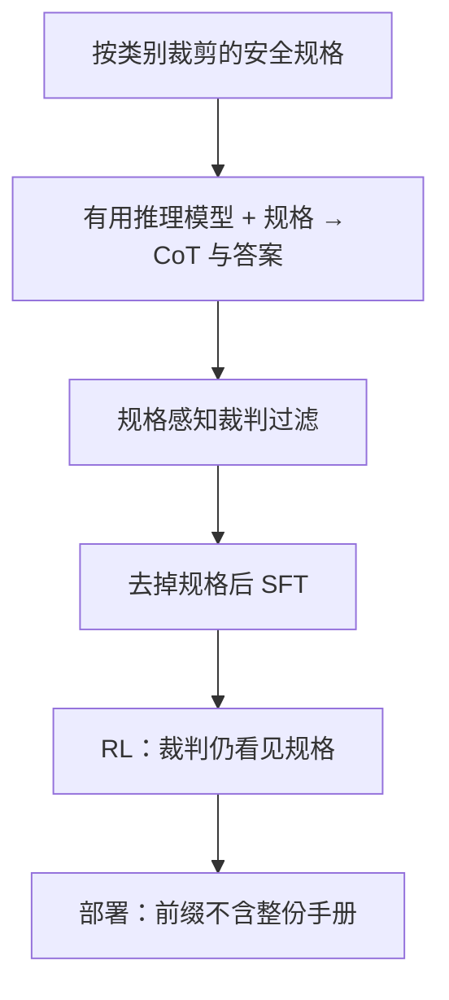

# Deliberative Alignment

    
先把安全规格写进思维链里教模型对照条款作答，再在强化学习里用「能看见规格的裁判」打分；推理时不必把整份政策贴进每一次用户前缀。

    <footer>—— Guan、Joglekar、Wallace 等，Deliberative Alignment: Reasoning Enables Safer Language Models，arXiv:2412.16339</footer>

Melody Y. Guan 等把 OpenAI o 系列的安全后训练写成可引用方法：**Deliberative Alignment**。普通安全 SFT / RLHF 让模型从大量标好的回答里**间接**猜政策；该方法改为直接教规格，并训练模型在作答前用思维链回忆、引用、推理相关条款。数据是合成的：不需要人写思维链或最终答案（至多有题面所属安全类别一类粗标签）。本篇按 arXiv:2412.16339 写两阶段、上下文蒸馏、政策感知裁判，以及帕累托声明。不提供对抗提示构造，不复述论文里的攻击题面。产品层的隐藏思维链见 [o1 系统卡](/llm/o1-system-card)；过拒绝见 [over-refusal](/llm/over-refusal)。

## 问题

作者认为当时安全训练有两个结构性弱点。第一，模型必须在固定算力下立刻回答，复杂边界（该拒、该答、该安全补全）没有专门的推理预算。第二，规格本身很少作为文本被学习，模型只见示范，数据效率差，遇到分布外改写或对抗包装就容易偏。把整份政策塞进每次系统提示可以让推理模型当场对照条款，但良性请求也要付长上下文与延迟，而且指令遵循一旦漏看某一节，仍可能违规。

Deliberative alignment 要的是：规格进入权重，推理时按需回忆相关条款，而不是每次把手册贴满窗口。o 系列已经会写长链，安全可以占用同一条链，而不是另训一个只能拒答的小分类器。失败模式仍存在：链可以看起来很合规、行为不合规；或过度引用条款导致过拒绝。方法要同时报攻击稳健与过拒绝，不能只报一条轴。

### 规格比标签集更容易改

政策会改条款、改风格指南（硬拒绝该多短、安全补全该如何写）。示范数据改一次要重标；规格文本改一次可以重新蒸馏合成轨迹。这是相对大规模人类安全标注的可扩展性论点。人类劳动挪到写规格与做评测，而不是写每一条思维链。类别包括色情、极端主义、骚扰、违法行为、受管制建议、自伤、暴力等——正文只作存在性列举，不展开可滥用细节。

论文脚注：用到题面所属粗类别，便于构造「只展开相关章节」的规格子集，降低蒸馏时的上下文。他们称该标签有帮助但非原则上必不可少。没有类别时，把整份 spec 塞进教师提示会更贵、也更容易漏看。

## 方法

记 $G_{\mathrm{base}}$ 为只做有用、未喂安全数据的推理模型。对带类别的提示，拼出 `spec(category)`：全局风格原则加该类别的细条款。教师在**含规格的系统提示**下生成（思维链，答案），并被要求在分析中引用相关节、再给出用户可见的最终答案。然后**去掉**规格，得到 `(prompt, CoT, output)` 三元组——这就是上下文蒸馏（Snell 等与早期 context distillation 文献的用法：训练时见过上下文，部署时不再给）。

过滤：格式检查之后，用同样能看见规格的裁判模型 $G_{\mathrm{RM}}$ 对每条补全打 $k$ 次分，取**最小**分，只留高分。最小是因为单次裁判会漏问题。可选元数据（另一系统认为该拒还是该安全补全）以「请考虑另一 AI 的判断」的方式提供，并让裁判表示同意与否，避免把噪声标签写成硬约束。SFT 在 $G_{\mathrm{base}}$ 上模仿过滤后的三元组，使模型在**没有**规格的前缀上仍会在链里召回条款。

RL 阶段对安全相关提示再用 $G_{\mathrm{RM}}$（始终能看见 spec）给结果级奖励，高算力优化思维质量。过程监督在 SFT 的链里，结果监督在 RL 的裁判分里。全文强调不需要人类写的思维链或答案。

评测声明：相对 GPT-4o 等，o1 系列在 StrongREJECT 一类越狱评测上更稳，同时在 XSTest 一类过拒绝集上拒绝更少，图 2 称为帕累托外移；并称对分布外安全情景泛化更好。消融：过程监督（SFT 链）给强先验，结果 RL 再打磨链上的规格推理。精确分数以论文图表为准，且绑定当时的 o1 / o1-preview / o3-mini 检查点。风格指南把硬拒绝写成短道歉加不能协助，把「安全补全」留给不能简单拒也不能照做的敏感类别——这是规格内容，不是生成器结构。

### 为何部署时不贴整份 spec

第 2 节论证：推理模型在**当场看见**政策时往往已经能做对，但延迟不可接受，且漏读章节的风险仍在。内化之后，模型先判断是否相关，再只「想起」需要的条款。论文后文消融称，该方案比部署时外挂全文规格更稳地贴合条款。机制上这是把手册从上下文搬进生成分布的条件计算，不是证明模型有符号规则引擎。

裁判始终看见 spec，是为了给 RL 一个比学生更知情的评分器。学生若把链写得很像引用政策，裁判仍应看最终行为是否合规。若学生学会只优化链的表面引用、答案仍偏，过滤与 RL 都可能被骗——这与一般奖励黑客同构，需要抽检与异构评测，而不是只看裁判分。

## 机制

思维链提供测试时算力：边界题可以先解码请求的真实意图，再对照条款决定拒、答、或安全补全。作者把目标说成「因为正确的理由而正确」。SFT 把「引用条款」变成高频推理模板；RL 用知情裁判把模板从「会背条款名」推向「条款适用判断更准」。没有 SFT 先验，RL 要在巨大的链空间里自己发现应引用政策，样本效率差；没有 RL，SFT 链可能僵硬、过拒。

合成数据的上限是教师与裁判的能力。教师若系统性误解某条款，蒸馏会把误解写成风格。类别裁剪减少无关章节的干扰，也可能让模型在真实混杂请求上漏掉未展开的类别——评测必须含多类别与包装请求，但不能把评测集写成攻击教程。人类仍应把关规格文本与持有评测，论文把这称为可扩展对齐，而不是无人对齐。

系统卡里 deliberative alignment 只是脚注。实现细节以 2412.16339 为准。不要把卡中隐藏链、摘要模型与本方法的 SFT 数据管道混成一步。

### 与分类器护栏、宪法分类器的分工

输入/输出分类器挡的是已生成或将生成的字符串，与生成模型解耦。Deliberative alignment 改的是生成模型自己的推理。两者互补：分类器不依赖模型是否愿意把意图写进链；审议式对齐不依赖每次请求都过一张外部门。Constitutional classifiers 用条款合成分类数据；本方法用条款合成**带链的示范**。政策迭代时，两条管道都可以重新生成数据，不必从零人标对话。

## 边界与工程取舍

规格未覆盖的域，模型无法「审议」出来。链不对用户暴露时（o1 产品形态），可解释性落在内部监控与摘要模型，用户看不见引用。裁判与教师同源会共盲。过拒绝与稳健必须成对看：只报越狱集下降，可能是全面拒。论文用 StrongREJECT 与 XSTest 作为公开轴，内部集不透明。没有 o 系列那种推理模型，硬套「先写长链再引用政策」可能只是更长的拒答模板。

不要把该方法写成越狱指南的对立面教程。防御声明应停留在：明确规格、合成对照、成对评测。也不要声称无需任何人类：类别标签、规格写作、评测设计仍是人。

「不需要人类写的思维链」不等于「不需要人类」。把这句话扩成完全自动对齐，与论文的评测依赖和规格维护矛盾。

### 何时不必上两阶段蒸馏

政策极短、示范已覆盖边界、模型没有可用长链，标准 RLHF 加对照过拒绝集可能更便宜。延迟不允许安全占用思维 token，应把条款放分类器。规格频繁小改且没有合成流水线预算，先改系统提示做过渡，再计划蒸馏。

## 小结

- Deliberative alignment：上下文蒸馏让链引用规格，去掉规格后 SFT，再用规格感知裁判做 RL。
- 用于 o 系列安全后训练；宣称在越狱稳健与过拒绝上同时改进，并改善 OOD 泛化。
- 部署时不把整份手册贴进每次前缀；裁判在训练时仍看见规格。
- 不依赖人类撰写思维链与答案；依赖规格文本、粗类别与评测。
- 出处：Guan 等，*Deliberative Alignment*，arXiv:2412.16339，2024；对照 OpenAI o1 系统卡与 Model Spec。
