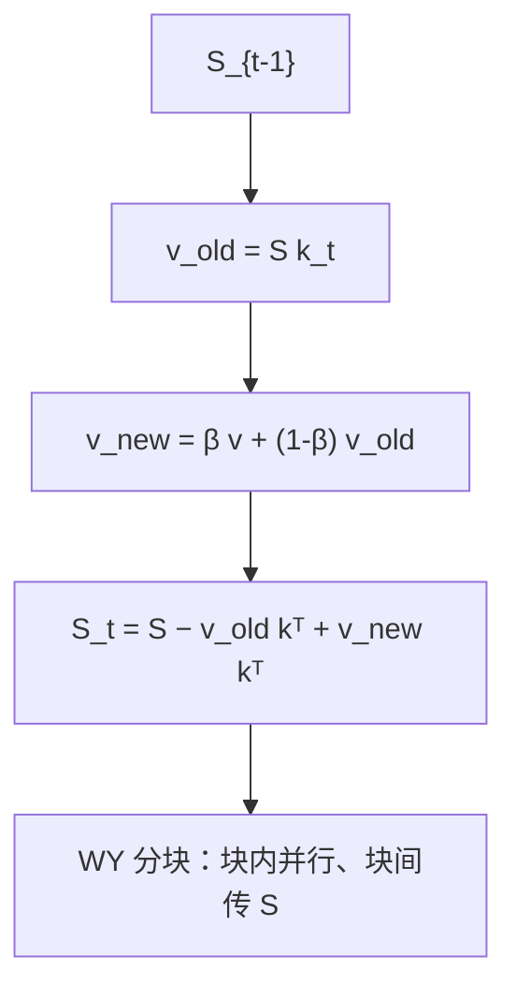

# DeltaNet

    
先读出当前键上的旧值，再按写入强度插值后写回；联想记忆的更新于是变成一条 delta 规则，而不是只做加法。

    <footer>—— 对照 Schlag et al., 2021；并行算法见 Yang et al., NeurIPS 2024</footer>

线性注意力把过去收成 $S_t=\sum_i v_i k_i^\top$，新联想只做加法，键一多就碰撞。[Linear Attention](/llm/linear-attention) 写核化；[Infini-Attention](/llm/infini-attn-paper) 把 delta 当作长程记忆的一种写法。本篇写 DeltaNet 本身：Schlag、Irie 与 Schmidhuber 2021 年的快速权重更新，以及 Yang、Wang、Zhang、Shen 与 Kim 2024 年如何用 Householder 的紧凑 WY 表示把逐步递推变成沿序列可分块并行。没有后者，前者停在小规模翻译与合成检索。

## 问题

加法记忆不能释放槽位。序列长于键维之后，新 $vk^\top$ 叠在旧方向上，检索变成叠加。模型需要按*当前键*去改对应的值，而不是给所有键加一份外积。Widrow–Hoff / delta 规则正是：预测错了多少，就沿该输入方向改多少。

Schlag 等人把这条规则接到线性 Transformer 上，合成联想与小规模语言建模优于普通线性注意力。算法是逐步的：每步依赖 $S_{t-1}k_t$，不能直接套线性注意力的块内并行。Katharopoulos 式线性时间、常数内存的循环实现仍然沿长度串行，Tensor Core 吃不满，扩不到十亿参数、千亿 token。2024 年的问题因此是算法工程：在不物化每步 $d\times d$ 状态的前提下，沿长度并行。

DeltaNet 不是 Mamba。Mamba 的选择在离散化与状态维上；DeltaNet 的选择在「读旧值、写残差」这条键相关改写。对照应是线性注意力 / GLA，不要写成 SSM 的一个超参。

### 快速权重视角

$S$ 是测试时更新的权重矩阵，$o_t=S_t q_t$ 是用该权重做一次线性读。加法规则是 Hebb 式外积；delta 规则是对 $\|S k-v\|^2$ 的一步梯度。Irie 等人把这类层叫做 fast weight programmers。规模化之前，这条线的证据在小模型与合成任务；规模化之后，才谈得上与 Mamba、GLA 比困惑度。

## 方法

### 更新公式

令 $v_t^{\mathrm{old}}=S_{t-1}k_t$，写入强度 $\beta_t=\sigma(W_\beta x_t)\in(0,1)$，

$$
v_t^{\mathrm{new}}=\beta_t v_t+(1-\beta_t)v_t^{\mathrm{old}},
$$

$$
S_t=S_{t-1}-v_t^{\mathrm{old}}k_t^\top+v_t^{\mathrm{new}}k_t^\top=S_{t-1}(I-\beta_t k_tk_t^\top)+\beta_t v_tk_t^\top.
$$

$\beta_t=1$ 时旧值沿 $k_t$ 被换掉；$\beta_t=0$ 时状态不动。输出仍是 $o_t=S_t q_t$。递推矩阵 $I-\beta_t kk^\top$ 是广义 Householder。逐步复杂度仍 $O(Ld^2)$，与加法线性注意力同阶，常数更大，因为多一次读旧值。

### 分块 WY：沿长度并行

Yang 等人指出 $S_t=\sum_{i\le t} u_i k_i^\top$，伪值 $u_i=\beta_i(v_i-v_i^{\mathrm{old}})$。块内 Householder 连乘用紧凑 WY：

$$
P_{[t]}^r=I-\sum_{i=1}^r w_{[t]}^i k_{[t]}^{i\top},
$$

$w,u$ 由块内严格下三角系统一次解出（UT / WY），再

$$
S_{[t+1]}=S_{[t]}P_{[t]}+H_{[t]},\quad O_{[t]}=Q_{[t]}S_{[t]}^\top+(Q_{[t]}K_{[t]}^\top\odot M)(\cdots).
$$

块间只传 $d\times d$ 状态，块内是 GEMM 与一个 $C\times C$ 三角结构，$C$ 取 64/128。前向反向都沿长度并行。库实现见 Flash Linear Attention。

1.3B / 100B token 上，作者报 DeltaNet 的语言建模与零样本优于同设定的 Mamba 与 GLA；合成与真实检索基准上同样。每隔一层滑窗、或加两层全局注意力的混合，可超过普通 Transformer 对照。长度外推相对 GLA / RetNet 弱，作者推测就是缺少显式衰减——这直接指向 [Gated DeltaNet](/llm/gated-delta-net)。

## 机制

### 为什么碰撞会减轻

加法把所有键的值堆在同一矩阵里，读 $Sq$ 是叠加。Delta 沿 $k_t$ 做一次秩一修正，近似「覆盖该地址」。键不正交时覆盖会漏到邻居，这是线性记忆的硬限制，不是实现 bug。$\beta_t$ 提供软覆盖：重复出现的键可以逐步改写，而不必一步抹掉不确定的旧值。

Householder 连乘若逐步做，每步都写 $d\times d$，带宽打满。WY 把连乘收成 $C$ 个 $d$ 维向量，IO 从 $O(C d^2)$ 降到 $O(C d)$ 量级再加块内 GEMM，这才和 FlashAttention 争占用。没有这步，DeltaNet 只是一条好看的 RNN。

$\beta_t$ 取到 $(0,2)$ 会引入负特征值，后续工作用来讨论状态跟踪。2021/2024 主实验把 $\beta$ 放在 $(0,1)$。复现时不要默认打开负区间。

### 混合层补的是地址而不是门控

滑窗给局部 softmax 尖峰；两层全局注意力给全文精确读。这与「给 delta 加 $\alpha_t$」不同：混合是改层类型，门控是改同一循环核。2024 文的混合说明纯 DeltaNet 在真实语言上仍缺某种精确检索；2025 的门控说明它还缺遗忘。两条后续不要并成一句。

## 边界与工程取舍

头维受 SRAM 限制时状态偏小，召回先掉。作者提到分块对角 Householder 作为可能出路。无衰减则远距离信息清不掉也淡不掉，文档拼接任务会脏。逐步推理很便宜，训练必须用分块核；用 PyTorch 循环训 1.3B 不现实。

不要把 2024 的 1.3B/100B 写成已经替代 7B Transformer。混合超过 Transformer 的声明绑在作者的对照设定上。Infini-Attention 里的 delta 是压缩记忆的一种更新，与作为主干层的 DeltaNet 共享规则、不共享系统栈。

数值上 $I-\beta kk^\top$ 要求键的尺度受控，通常对 $k$ 做归一。未归一时 Householder 不再是收缩，状态会炸。短卷积等局部卷积是实现里常见附加，不是 2021 公式的一部分，消融要分开报。

并行算法的关键不在又一条 RNN 公式，而在承认 $S_t$ 仍可写成 $\sum u_ik_i^\top$。一旦伪值 $u_i$ 能在块内用三角系统解出，其余与普通线性注意力的 chunkwise 相同：块间扫描状态，块内 $(QK^\top\odot M)$ 乘伪值。这解释了为何 FLA 库能把 DeltaNet 和 GLA 放在同一套占用里。块长 $C$ 太大，三角解 $C\times C$ 变贵且占用 SRAM；太小则扫描步数变多。实践中 $C$ 与头维一起受片上存储约束，这才是「1.3B 能训、再大要分块对角」的来源。

相对 softmax，DeltaNet 仍然没有竞争归一化，多键可以同时以大内积贡献。检索强于加法线性核，是因为覆盖减少碰撞，不是因为恢复了单纯形尖峰。合成联想任务上的优势不应直接读成「已可替换满注意力做 RAG」：真实检索还涉及需要精确拷贝的稀有字符串，混合层或门控往往仍必要。

引用时区分 Schlag et al. 2021（规则与小规模证据）与 Yang et al. 2024（并行算法与 1.3B）。只写「DeltaNet 2024」会把快速权重的来源抹掉。

## 小结

- DeltaNet 用 delta 规则沿当前键读旧值、写新值，减轻加法线性记忆的碰撞。
- 更新是广义 Householder；逐步形式无法沿长度吃满 GPU。
- Yang 等人用紧凑 WY + 分块把训练变成块内 GEMM、块间传状态。
- 1.3B / 100B 上优于同设定 Mamba 与 GLA；混合注意力层可再抬下游。
- 缺少显式衰减，长度外推是已知弱点，由 Gated DeltaNet 补。
- 状态容量仍受头维限制；键需归一以保证收缩。
- 出处：Schlag, Irie, Schmidhuber，线性 Transformer 的 delta 规则，2021；Yang et al.，*Parallelizing Linear Transformers with the Delta Rule over Sequence Length*，NeurIPS 2024，arXiv:2406.06484。
