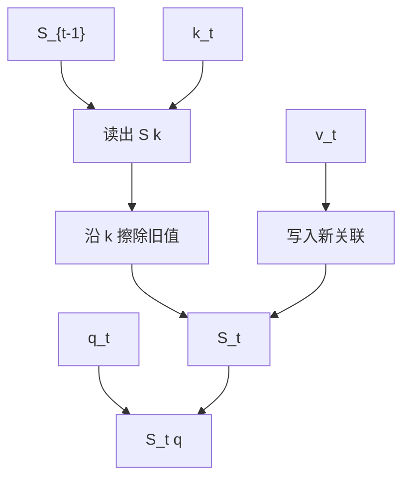

# 增量规则与关联记忆

线性注意力的状态更新若改成 delta 规则，写入新键值时会擦除该键旧有的关联，状态更像一张可改写的表。

<footer>—— Schlag, Irie &amp; Schmidhuber, Linear Transformers Are Secretly Fast Weight Programmers, ICML 2021；并行 delta 规则见 Yang et al., 2024</footer>

[上一课](/llm/hgrn)的更新是对新输入做凸组合，旧状态按门缩小，没有「这个键以前写过什么」的寻址擦除。[GLA](/llm/gated-linear-attention) 的 $S\leftarrow G\odot S+kv^\top$ 同样是加性写入。本课补 delta 规则：用当前键去读旧状态，把冲突分量减掉再写。这是快权重 / 关联记忆路线。下一课 TTT 把整段更新看成测试时的一步梯度，是同一想法的优化表述。

## 问题

加性外积遇到重复键会叠两层值，读出来是糊的。Softmax 注意力每次都拿完整 KV 表，天然以最新或分数最高者为准。线性状态若想模拟「变量赋值」，需要：**写入键 $k$ 时，先去掉 $S$ 里与 $k$ 相关的旧行**。缺口就是这条 delta / 误差修正更新，而不是再加一个遗忘门。

Schlag 等人指出线性 Transformer 等价于快权重编程器，delta 规则是其中更像记忆改写的一种。Yang 等人给出沿长度并行化的算法，使它能进现代训练核。

这里的「键」是内容向量，不是注意力课里必须经过 softmax 的那张表。状态仍是固定大小矩阵。

## 方法

一种常见形式：

$$
S_t=S_{t-1}-\beta_t(S_{t-1}k_t)k_t^\top+\beta_t v_t k_t^\top,
$$

即在 $k_t$ 方向上把旧读出 $S_{t-1}k_t$ 换成 $v_t$，$\beta_t\in(0,1]$ 为写入强度。$\beta=1$ 且 $k$ 单位化时，近似投影到与 $k$ 正交补再写入，旧关联被擦。读出仍 $o_t=S_t q_t$。

$\beta_t$、以及是否对 $k$ 归一化，决定稳定性。未归一化时反复写同一方向会数值炸掉。并行化要把这种 rank-1 更新收进结合结构，比对角门更绕，需要专门分块（Yang 等人的工作），不能假设 GLA 核直接能跑 delta。

### 与加性线性注意力

加性：$S+=kv^\top$，适合累积证据。Delta：适合覆写。语言模型两者都需要——计数、求和要累积，变量绑定要覆写。混合层或混合头可以分摊，本课只把覆写算子钉死。

## 机制

把 $S$ 看成线性映射「键 $\mapsto$ 值」。Delta 是对这张映射做一步校正，目标是 $Sk\approx v$。多次不同键的校正叠在同一 $S$ 上，键不正交就会互相干扰——容量仍是矩阵的秩与条件数，不是无限槽位。正交性越好，越像一张表；随机高维键近似正交，这是为何 $d_k$ 不能太小，连回[头维](/llm/head-dim-vs-heads)。

精确单点召回取决于键是否撞车以及 $\beta$ 是否把旧值擦干净。这比纯加性强，仍弱于保存全表的 softmax。

Fast weight programmer 的说法：慢权重是 $W_q,W_k,W_v$，快权重是 $S_t$，每个 token 改写快权重。TTT 会把「改写」说成「对快权重做梯度步」。

## 边界

并行核不通用，缺实现则训练退回逐步，不可用。键碰撞时 delta 会误擦。$\beta$ 学崩会要么不写要么每步清空。不要把 delta 规则宣传成「线性复杂度的精确 KV」——表的槽数仍由状态秩决定。下一课把校正步写成显式的测试时损失下降，解释会更干净，算法可以仍是本课这种 rank-1 更新。

## 小结

- Delta 规则在写入时擦除同键旧关联，让线性状态更像可改写的映射，而不是纯累加。
- 容量仍受状态秩与键正交性限制，不是无损 KV 表。
- 并行训练需要专门分块，不能假定 GLA 核兼容。
- 累积证据与覆写变量是两种需求，不要只用一种更新。
- 出处：Schlag et al., ICML 2021；Yang et al., 2024。
