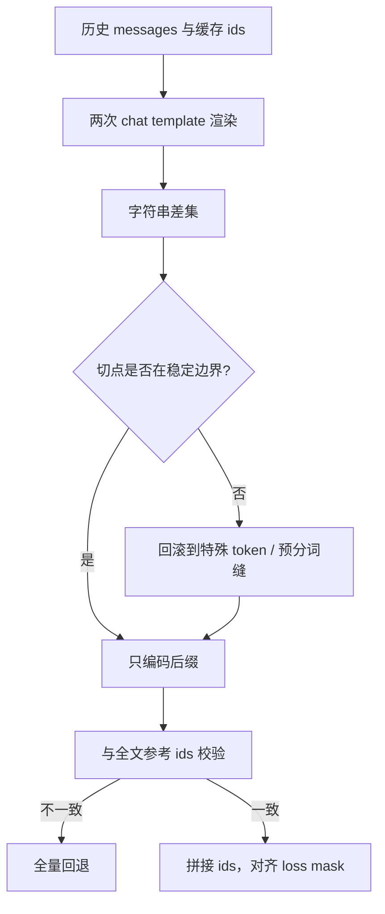

# Delta Tokenization 与边界 token

<div class="epigraph">
<p>分词不是可拼接的：$\mathrm{tok}(A)\Vert\mathrm{tok}(B)$ 可以不等于 $\mathrm{tok}(A\Vert B)$。多轮只编码增量，必须先退到一条证明安全的边界，再把新 token 接回去。</p>
<footer>—— 对照 Sennrich 等 BPE（ACL 2016）的非组合性；工程配方见 veRL 多轮 delta tokenization 与 Zhang、Cao 的 TokTier（arXiv:2607.29678）</footer>
</div>

多轮代理与在线强化学习有同一条硬约束：**训练侧用的 token id，必须等于推理侧真正生成、真正看到的 id**。把整段 `messages` 每步重新 `apply_chat_template` 再全量编码，既贵，也容易在边界上漂出另一串 id。veRL 的多轮文档把对策写成 **delta-based tokenization**：对 `messages[:i]` 与 `messages[:i+1]` 各渲染一次字符串，只对二者差集编码，并把损失掩码钉在新助手段上。这看起来像字符串切片，真正的坑在 **边界 token**——特殊标记、换行、生成提示，以及 BPE 在拼接处可能改写的最后一个子词。本篇写增量编码为何必须回滚边界，以及它和 [chat template](/llm/chat-template)、[多轮对话数据格式](/llm/multiturn-format) 怎样咬合。

## 问题

BPE 与 SentencePiece 先按预分词规则切成 piece，再在 piece 内做合并。预分词边界通常不能被合并跨过，但 **piece 内部的合并依赖左右字符**。给已编码前缀再追加后缀时，若从字符最长公共前缀硬切，切点可能落在某个 token 中间：左边的尾字符与右边的头字符会合成一个新 token，整段 id 与「从头编码全文」不一致。Sennrich、Haddow、Birch 2016 年的 BPE 论文并不讨论服务端增量，但它已经把「子词切分由相邻字节决定」写成算法事实。Zhang 与 Cao 的 TokTier 把同一事实写成服务契约：增量拼接的输出必须与参考分词器对全文编码逐 id 相等，否则前缀 KV 的键会静默失效。

多轮对话还叠了一层 [chat template](/llm/chat-template)。模板不是简单把新消息 append 到旧字符串末尾：它会在轮次之间插入 `<|im_start|>` / `<|im_end|>`、角色名、以及 `add_generation_prompt=True` 时的助手起始标记。Qwen 一类 ChatML 还会在助手结束符后补换行；GLM 一类会在工具观察处插入 `<|observation|>`。这些都是 **边界 token**：它们不属于用户正文，却决定条件前缀从哪开始、损失从哪开始。只对「最新一条消息的纯文本」做 `tokenizer.encode`，几乎总会漏掉或错切这些标记。

### 为何不能对增量字符串直接 encode

设上一轮渲染结果是字符串 $P$，本轮是 $C$，字符差集 $C[|P|:]$。若直接

$$
\mathrm{ids}(C)\;\stackrel{?}{=}\;\mathrm{ids}(P)\;\Vert\;\mathrm{encode}(C[|P|:]),
$$

等式在两类地方破裂。第一类是 BPE 合并跨过切点：末尾半个词与新文本的开头合成另一 id。第二类是模板在 $P$ 末尾写入了「生成提示」（如 `<|im_start|>assistant\n`），而 $C$ 里同一位置后面接的是助手正文；差集编码会把提示和正文粘成一段，或把提示重复进损失。veRL 的写法因此把两次渲染的 `add_generation_prompt` 设成不同值：前一次 `True` 把提示算进已有前缀，后一次 `False` 让差集只含新正文（外加该轮真正新增的结束符）。

<span class="marginnote">前缀 KV 缓存按 token id 寻址，不是按 Unicode 寻址。增量分词只要在边界漂一个 id，后面整段都对不齐：看起来命中了缓存，读的却是另一条条件前缀。这比多花一次全量 encode 更危险，因为它是静默的。</span>

## 方法

veRL 多轮文档给出的 tokenizer 路径可以收成三步。先渲染

```text
prev = apply_chat_template(messages[:i], add_generation_prompt=True, tokenize=False)
curr = apply_chat_template(messages[:i+1], add_generation_prompt=False, tokenize=False)
```

再 `encode(curr[len(prev):], add_special_tokens=False)`，把得到的 id 接到轨迹缓冲上，并只给这段打损失 1。工具观察、用户追问走同一差集，但损失为 0。文档要求默认在 rollout 结束时拿「全文一次 tokenize」做 sanity check，模式由 `tokenization_sanity_check_mode` 控制：结构不一致（尤其是特殊 token 边界）应报错，助手正文与模板再渲染的表面差异可以容忍。

服务端增量编码把同一思想从「按消息差」扩成「按字符追加」。TensorRT-LLM 的边界感知增量分词：先找渲染文本的最长公共前缀，映射到已缓存的 token 偏移，**至少回滚一个完整 token**，再只编码变化后缀；偏移不可用或校验失败则退回全量。vLLM 的增量 prompt 编码缓存则进一步利用「BPE 合并不跨预分词边界」：从缓存文本末尾回退一个字符窗口，在窗口内找距两端足够远的预分词边界，只从该缝起重编码，并用重叠区的 id 与偏移做验证。TokTier 把可拼接条件形式化成 **稳定预分词边界**（synchronizing boundary）：匹配段必须覆盖超过词表最长 token 的字符、含家族特定的字符类跳变，且拼接定理保证 $\mathrm{tok}(A\Vert B)$ 等于缓存前缀加新后缀。

### 回滚多少才算一条边界

工程上有三条由严到宽的缝。最严是特殊 token 之后：`<|im_end|>` 一类在 BPE 里原子，拼接几乎总是安全。次严是预分词 piece 边界（空白、标点、数字分组规则）。最松是「回滚 $k$ 个 token 再重编尾巴」，$k=1$ 是 TensorRT-LLM 的下限，对 GPT 家族的数字分组等上下文规则仍可能不够。TokTier 在代理流量回放里 56,049 / 56,052 次追加在第一窗口就拼上，3 次扩窗一次，0 次落到全文回退——说明真实追加多半落在稳定缝上，但不能把启发式当证明。失败必须 **多干活、不改 id**，而不是「差不多就算命中」。



## 机制

增量路径要同时服务两件不同的事。推理要前缀缓存：id 序列必须与上次请求的公共前缀逐位相同，KV 才能复用。训练要 token-in-token-out：助手段的 logprob 必须落在「当时采样出来的那些 id」上，而不是事后用另一套模板重编的近亲。边界 token 是两件事的接缝。漏掉生成提示，损失会把 `<|im_start|>assistant` 当成要学的内容；多编一个换行，重要性采样的 $\pi_{\theta_{\mathrm{old}}}$ 与当前策略对不齐。veRL 后续把散落在 AgentLoop 里的家族特判收成 Continuous Token builder：Qwen 补助手 EOS 后的换行，GLM 修剪 `<|observation|>` / `<|user|>`，合并时显式处理 `merge_token_id`。那是同一问题的模型族特化，不是否定 delta 切片，而是承认 **只靠字符串差集在部分模板上会静默错**。

### 损失掩码与边界的对齐

差集编码得到的 id 流要切成「可学习 / 不可学习」。可学习的通常只有助手正文；系统、用户、工具结果、以及所有角色起始标记都是条件。实现上常见错误是：把 `add_generation_prompt` 那段也标成 1，或在工具 JSON 截断处把半个边界 token 划进响应。正确做法是让掩码与 id 同源——都从同一次差集来，而不是先拼文本再另跑一次全量 tokenize 去猜边界。sanity check 应优先核对特殊 token 序列，而不是 Unicode 级的正文 diff。

<span class="marginnote">「连续 token」与「delta tokenization」不是对立口号。后者用两次模板渲染的字符串差近似增量；前者坚持历史助手 id 不得重编，只对非助手增量在合成上下文里抽取，并在合并时做家族边界处理。二者都在对抗同一件事：模板加 BPE 在缝上改写 id。</span>

## 边界与工程取舍

Delta 路径假设本轮是 **追加**。压缩历史、改系统提示、重写中间工具结果，都会让字符 LCP 对不齐缓存偏移，必须全量重编并丢弃对应 KV。多模态更麻烦：图像占位符展开的 pad 个数由 processor 决定，逐轮增量编码的像素张量往往不可靠，veRL 的 VL 路径选择在轨迹结束时对全文再跑一次 processor。周期性与参考分词对照是必要的：TokTier 用影子校验器抽查线上流量；veRL 默认每个 rollout 做一次结构校验。关闭校验能省 CPU，但会把边界 bug 变成「策略突然不会用工具」。

不要把增量分词当成语义压缩。它不减少模型看见的 token，只减少 **把文本变成 id** 的工作，并保证 id 稳定。上下文仍然受 [中间丢失](/llm/lost-in-middle) 与 [上下文腐烂](/llm/context-rot) 约束；该摘要、该检索时走压缩，而不是指望分词器帮忙删历史。

<span class="marginnote">词表与模板版本必须和权重绑定。换一份 tokenizer.json 或改 Jinja 里一个换行，所有缓存的增量前缀全部作废。把「分词器哈希」写进 rollout 元数据，比事后对 logprob 会省很多夜。</span>

## 小结

- 子词分词在拼接处非组合；多轮只编码增量时，必须退到特殊 token 或预分词稳定边界，而不能从字符 LCP 硬切。
- veRL 的 delta tokenization 用两次 `apply_chat_template` 的字符串差集编码新轮，并把损失钉在新助手 token 上。
- 边界 token（角色标记、生成提示、EOS 后换行、观察标记）决定条件前缀与掩码；漏编或重编都会让 TITO 与前缀缓存同时失效。
- 服务端增量编码（TensorRT-LLM 回滚、vLLM 预分词缝、TokTier 拼接定理）与训练侧 delta 是同一正确性合同：输出必须等于全文参考 ids。
- 非追加编辑、压缩重建、多模态占位符展开，应回退全量路径；校验失败只许多算，不许改 id。
- 出处：Sennrich 等，*Neural Machine Translation of Rare Words with Subword Units*，ACL 2016；veRL `docs/sglang_multiturn/multiturn.rst`；Zhang 与 Cao，*TokTier*，arXiv:2607.29678。
