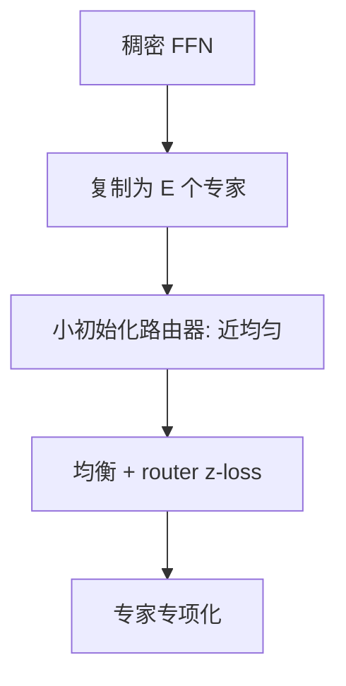

# 稠密升级到 MoE

把已训好的 FFN 复制成若干专家、再长出路由器，稠密计算最优的检查点可以变成稀疏容量更大的模型，而不从随机 MoE 重买压熵段。

<footer>—— Komatsuzaki et al., Sparse Upcycling, 2022；路由稳定性见 Fedus et al., Switch Transformer；主干路由器梯度课不重推</footer>

[上一课](/llm/model-growth-depth-upscaling)把层沿深度插进去。缺口是沿**专家**轴长：Komatsuzaki 等人的 sparse upcycling 从稠密检查点复制 FFN 为 $E$ 份专家，随机或零初始化路由器，再继续训。总参数涨、每 token FLOPs 可保持近稠密（top-1 / top-2）。本课写升级时的恒等条件与负载均衡，不重写 [路由器梯度](/llm/moe-router-gradient) 或 Switch 的容量因子。

## 问题

随机 MoE 要从零学路由与专家专项，压熵段贵且易塌缩到少数专家。升级希望：起步时无论路由到哪，FFN 近似旧稠密 FFN，函数连续。复制权重做到这一点；路由器若输出均匀，每个专家都像旧 FFN，模型先是「带噪声的稠密」，再拉开专项。路由器若一开始就尖锐，部分专家吃全部 token，其余冻死——冷专家踩 Adam $\varepsilon$ 巨步，热专家过拟合。

每 token FLOPs 与 $N_{\mathrm{total}}$ 脱钩。Chinchilla / 推理最优的账要用 **激活参数** 或 **每 token FLOPs**，不能把专家参数加总当 $N$ 去套 20 token / 参数。这是形状课留下的 MoE 缺口。

复制后的专家完全相关。后续训练必须有足够数据与均衡项把它们推开。数据不够时，升级只是把存盘变大，推理若 top-2 还会更贵。

## 方法

步骤：

1. 选定哪些层升级（常是每隔一层 FFN，注意力保持稠密）。
2. 专家权重复制自稠密 FFN；路由器小初始化，使 logits 近 0、门控近均匀。
3. 打开负载均衡与 router z-loss（主干已有），系数先保守。
4. 短 warmup，监控专家负载熵、容量 drop、以及总线 RMS 相对升级前连续。
5. 代理上用加大 $\eta$ 看是否出现路由锁死（Wortsman 式应力）。

推理账：部署若 top-2，激活 FLOPs 高于原稠密，推理最优可能并不偏向这个升级后的模型。训练期省的是相对「从零训同容量 MoE」，不是相对「停在稠密」。

## 机制

均匀路由 + 复制专家 = 旧 FFN 的期望，方差来自 Bernoulli 选择。均衡项迫使 token 分散，专家梯度开始正交化。锁死是 [注意力熵塌缩](/llm/attention-logit-growth) 在路由 softmax 上的兄弟：熵塌后多数专家 $v$ 极小，偶发大梯度造成尖峰。router z-loss 与 cap 的分工同前：钉绝对尺度 vs 有界。不要只抄稠密上的词表 z-loss 系数到路由器上。

与深度扩展同时做（又插层又升级）归因极难，应串行：先稳一种生长。

## 边界

Expert-choice 与 dropless 改容量语义，升级时的「均匀起步」假设要重验。下一课离开生长，进入**多模型合成**：SLERP / TIES / DARE，对象是已有的多个权重，而不是一个稠密爸爸。

## 小结

- Sparse upcycling 复制 FFN、均匀起步路由，避免从零 MoE 重买压熵。
- 账本用每 token FLOPs / 激活参数，禁止把专家总数套进稠密 Chinchilla。
- 路由熵塌缩与冷专家 $\varepsilon$ 巨步是主要炸因；先代理应力。
- 与插层生长串行，不要一次变两种形状。
- 出处：Komatsuzaki et al., 2022；Switch / ST-MoE 的路由稳定项。
