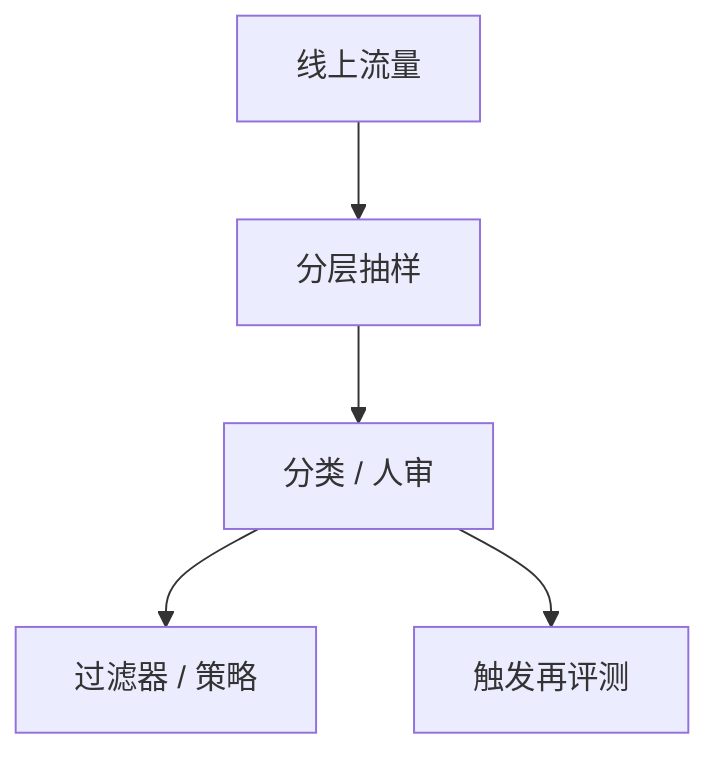

# 部署后监控

上线之后分布会变：用户、工具、对手、模型自己的级联。评测集停在发版日；监控必须在流量上继续抽样。

<footer>—— 对照产品安全运营与模型漂移监测；政策框见 [RSP](/llm/safety-levels-rsp)</footer>

[上一课](/llm/safety-levels-rsp)把门槛写在发版前。本课是补层「对齐理论与失效」的收束：部署后监控——在真实流量上抽检滥用、越狱、幻觉、提取迹象与能力漂移。缺口不是再做一次 Arena，而是承认发版评测的支持与线上支持不同。下一课程检索与嵌入不再默认「对齐已经结束」。

## 问题

发版用固定提示集。线上会出现新工具、新越狱文风、新的级联代理、新的版权投诉。若只靠内容过滤器的精确率，会漏掉 [间接注入](/llm/indirect-injection) 与缓慢的奖励黑客（用户用产品指标当 RM）。缺口是闭环：抽样、标注或分类器、升级、是否触发 RSP 再评测。

监控可以是隐私敏感的。设计应默认最小化内容留存、聚合优先、人工抽检有权限边界。本课不写如何大规模存储用户对话。

## 方法

最小闭环：风险分层抽样（工具调用、长上下文、新用户、高权限连接加权）；自动分类器只做分流，人类看边界；仪表：越狱命中、拒答漂移、提取性重复查询、水印检测、[幻觉](/llm/hallucination-taxonomy) 分列投诉。发现能力带可疑上升：回到危险能力评测，而不是只加一条过滤规则。发现提取：结合指纹与风控，而不是公开对质细节。

## 机制

分布漂移使发版 RM 与安全分类器过时，与训练期 [过优化](/llm/reward-hacking-llm) 同构，只是优化器换成了用户与对手。监控的统计对象是**速率与分位**，不是单条奇闻。没有持有标注流，分类器会自己漂移——需要定期校准集。

## 边界

本课不提供监控用户的隐蔽手段，不提供绕过产品安全的流量特征。对齐补层在此结束；检索课从嵌入训练另起，默认你已知道：上线后 $R^*$ 仍要被测量。

## 小结

- 部署后监控补发版评测的分布缺口。
- 闭环：抽样 → 分流 → 修复或再评测。
- 能力带可疑上升走 RSP，不只加过滤器。
- 出处：RSP 课；线上安全运营常识；奖励黑客与注入课。
