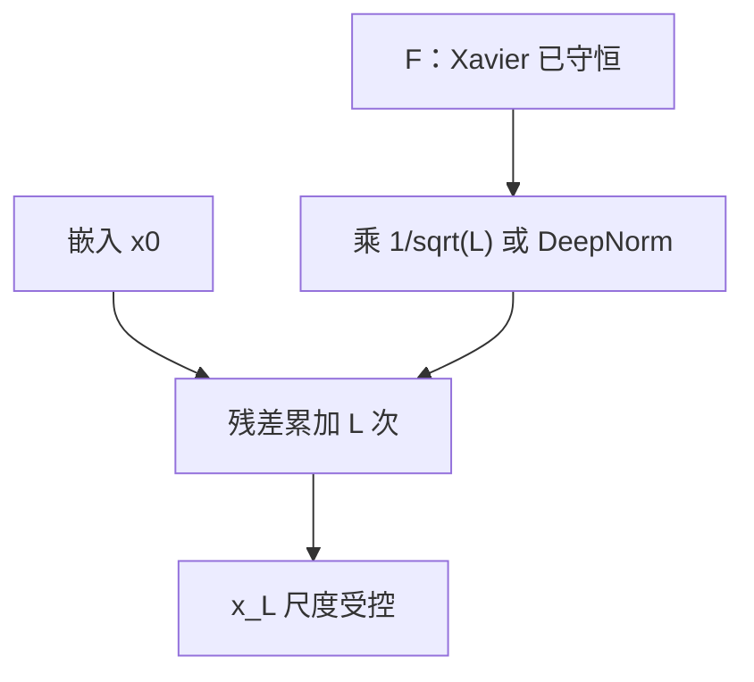

# 深度缩放初始化

残差把每层增量加进同一条流；层数变多时，若不把残差分支的起步幅度按深度缩小，输出尺度与梯度会先被加法而不是被非线性毁掉。

<footer>—— Radford et al., GPT-2, 2019；Huang et al., T-Fixup, ICML 2020；Wang et al., DeepNet, 2022</footer>

[上一课](/llm/xavier-kaiming-init)让单个 GEMM 的前向 / 反向方差守恒。缺口是 [残差流](/llm/residual-stream)：$x\leftarrow x+F(x)$ 在 $F$ 已守恒时仍把 $\mathrm{Var}(F)$ **加** $L$ 次。GPT-2 把残差投影乘 $1/\sqrt{N}$；T-Fixup 与 DeepNet 把这件事写成可训到极深的初始化。本课只补「深度」这一轴，不重写 Xavier 的扇入公式，也不进入 [Pre-LN](/llm/pre-ln-post-ln) 的位置之争——位置改变的是哪条路需要缩放，不是要不要缩放。

## 问题

设每层 $F_\ell$ 在初始化时与输入近似无关、方差为 $v$。则 $L$ 层之后

$$
\mathrm{Var}(x_L)\approx\mathrm{Var}(x_0)+L v.
$$

$v$ 若按 Xavier 钉在 $O(1)$，$L=96$ 的流比嵌入大约一个数量级。注意力 logits 随 $\|q\|\|k\|$ 涨，FFN 的中间激活跟着涨，第一步的梯度裁剪就会常年贴顶。这不是优化器坏了，是**加法深度没有进入初始化**。

Post-LN 把 LN 放在加法之后，看似每层把尺度拉回，Xiong 等人指出初始化附近 LN 的雅可比会压残差通路，深层更依赖 warmup——那是稳定性单元的课。Pre-LN 让主干不经 LN，尺度漂移更直白，必须在 $F$ 上动手。本课默认你已经选了某一种 LN 位置，只问：$F$ 的起步该不该随 $L$ 变。

「0.02 标准差」在 12 层 GPT-2 上暗含了某种深度折中。把同一常数贴到 80 层上，等于拒绝本课。深度变了，要么显式 $1/\sqrt{L}$，要么走 μP / DeepNorm 的表，不能靠同一魔法数。

## 方法

三条常用处方，不要叠乘。

**残差输出缩放（GPT-2）。** 每个子层最后的投影（注意力的 $W_O$、FFN 的输出矩阵）初始化方差再除 $N$，或等价地把该矩阵乘 $1/\sqrt{N}$，其中 $N$ 是残差层数。直觉：使 $\sum_\ell F_\ell$ 的起步方差对 $L$ 不变。Radford 等人把它写进 GPT-2，作为「更深仍可训」的工程条款。

**T-Fixup（Huang 等, ICML 2020）。** 对 Transformer 给出一组与层数相关的矩阵缩放，并在一定条件下去掉 LN 与 warmup。核心仍是：让残差分支在深度方向的 Lipschitz 与更新幅度受控。它假设特定的注意力与 FFN 结构；改 SwiGLU、改 RoPE 后系数要重验，不能当即插即用定理。

**DeepNorm（DeepNet, Wang 等）。** 把 LN 的增益与残差系数写成 $\alpha,\beta$ 随深度增长的函数，使极深（论文演示到上千层）仍有恒等路径。这是「初始化 + 结构系数」一起改，比只乘 $1/\sqrt{L}$ 更重。小模型上未必值得；要把层数加一个数量级时，才轮到它。

ReZero 把 $x\leftarrow x+\alpha F(x)$ 的 $\alpha$ 起步设为 0，让网络从纯恒等长出来。与 $1/\sqrt{L}$ 同类，只是把深度因子交给一个可学习标量。LayerScale（Touvron 等）是对角版 $\alpha$。本课把它们视为同一家族：残差增量必须先小。

## 机制

缩放作用在 $F$ 的输出，不作用在 LN 之前的主干（Pre-LN 下主干是累加）。反向时 $dF$ 也乘同一因子：深层起步不仅前向小，参数更新也小，避免第一步就离开可工作区。学习率 warmup 是另一条时间轴上的「先小」；深度缩放是结构轴上的「先小」。两条可以同时要，但不要用更长 warmup 去掩盖 $L$ 倍方差错误——warmup 结束之后尺度问题还在。

与 [μP](/llm/mup) 的关系：μP 管**宽度**极限下每层更新 $O(1)$；本课管**深度**上残差求和。Tensor Programs 对深度的保证弱于宽度，附录里的经验迁移不能当成与 fan-in 同级的定理。配方应分开写：宽度列一张表，深度列一个 $1/\sqrt{L}$ 或 DeepNorm 系数。

## 边界

本课不把 LN 从配方里删掉。T-Fixup 的「去 LN」有结构前提，现代解码器几乎都保留 RMSNorm。也不处理嵌入表与 lm_head：它们不乘 $L$ 次，下一课单独定标。MoE 的专家内部仍是残差块，专家数不是 $L$；不要把专家数填进 $1/\sqrt{N}$ 的 $N$。

深度缩放不能替代梯度裁剪，也不能替代后课的注意力 logit 控制。它只把「第一步的尺度」放回 $O(1)$。训练中途残差流再次涨起来，是激活漂移课的对象。

## 小结

- Xavier 守恒的是一层 $F$；残差把 $F$ 加 $L$ 次，必须再按深度缩小起步幅度。
- GPT-2 的 $1/\sqrt{N}$、T-Fixup、DeepNorm、ReZero / LayerScale 同属这一杠杆，不要叠乘。
- 深度因子与 μP 的宽度表、与 warmup 的时间表分工，不能互相冒充。
- 嵌入与输出头不是残差层，下一课另标。
- 出处：Radford et al., GPT-2, 2019；Huang et al., T-Fixup, ICML 2020；Wang et al., DeepNet, 2022。
