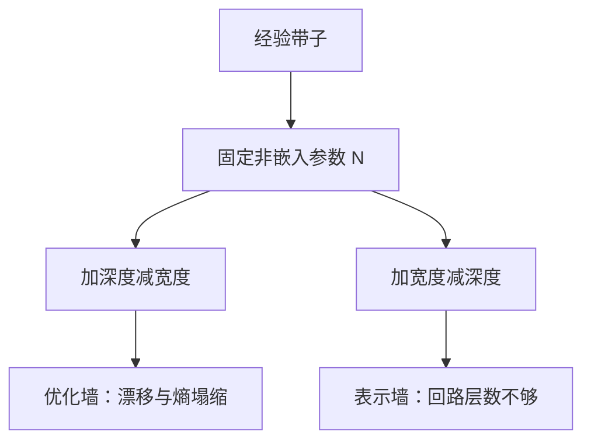

# 深度对宽度

同样参数量可以堆成更深更窄或更浅更宽；损失对这两轴并不对称，过深会先碰到优化墙，过浅会先碰到表示墙。

<footer>—— Kaplan et al., Scaling Laws for Neural Language Models, 2020；深度效率见 Tay et al., Scale Efficiently, ICLR 2022</footer>

[上一课](/llm/silent-data-corruption-training)收束稳定性。本课打开缩放实践单元：形状怎么选。主干 [Kaplan](/llm/kaplan-scaling) 把损失写成 $N,D,C$ 的幂律，其中 $N$ 是参数量，并不自动告诉你 $N$ 该拆成层数 $L$ 还是宽度 $d$。GPT-3 一类用「深且宽」的经验比例；Tay 等人指出许多「更大」其实是把计算浪费在不增深度效率的轴上。本课只补 $L$ vs $d$，词表大小下一课才进 $N$ 的账。

## 问题

参数量粗算 $N\approx 12 L d^2$（解码器，忽略词表）。固定 $N$，加 $L$ 必须减 $d$。深度加的是串行残差步数、可组合的回路；宽度加的是每步的通道与注意力头的容量。Kaplan 观察到，在合理范围内深度与宽度可以交换且损失相近，但离开带子——极深极窄或极浅极宽——损失变差。优化墙：极深即使 Pre-LN，仍有 [激活漂移](/llm/activation-scale-drift) 与注意力熵塌缩。表示墙：极浅即使很宽，层数不够形成多步算法（induction 一类回路需要深度方向的组合）。

FLOPs 近似 $C\approx 6ND$ 对固定 $N$ 几乎不区分形状，但**墙钟**区分：深度阻碍流水线气泡与并行度，宽度利好 GEMM。计算最优（Chinchilla）给的是 $N$，不是形状。部署侧宽度还决定 KV 与 GEMM 形状。选形状是稳定性、并行与表示三约束，不是只最小化 $N$。

把 $N$ 相同的两个模型叫「同样大小」会掩盖词表参数。$|V|d$ 在窄模型里占比更大。比较 $L$ vs $d$ 时应声明 $N$ 是否含嵌入，否则窄模型被词表支配。

## 方法

经验带子（须在你的配方上复测，不是物理常数）：$d/L$ 过大则浅宽，$d/L$ 过小则深窄。GPT-3 70B 量级用 80 层与数千宽度，落在带子里。改形状的消融应：

1. 固定 token 数与 $\eta$ 日程类型（μP 若只迁宽度，深度改变要重扫或用深度缩放）。
2. 固定 $N_{\mathrm{non\text{-}embed}}$ 再扫 $L$。
3. 看幂律段斜率与最终 CE，同时看注意力熵与顶层 RMS——深窄模型更容易先触发稳定性单元里的传感器。

Tay 等人的 Scale Efficiently 提醒：加宽、加头、加窗口，有的增加 FLOPs 却几乎不降损失。深度相对这些「假宽度」往往更值钱，直到优化墙。不要把能跑满 GPU 的最宽模型自动当成最优形状。

## 机制

回路形成需要层间组合：Olsson 等人的 induction 是跨层的。宽度增加的是并行特征数，不能替代那几步串行。反之，每层容量太小（$d$ 太小、头太少），注意力没有足够的子空间同时做多种路由。带子就是这两种瓶颈尚未主导的区间。稳定性把带子的深端切掉：没有 QK-Norm / cap / 深度缩放时，可用 $L$ 比理论表示需要的 $L$ 更小。

## 边界

MoE 把「有效 $N$」与「每 token FLOPs」拆开，形状课的 $12Ld^2$ 不再够用，升级 MoE 课再谈。本课不管词表；$|V|$ 下一课单独进缩放律。也不把「更深总是更好」写成定律——过深的墙是优化与通信，不是表示理论不喜欢深度。

μP 只迁宽度时，改 $L$ 必须回到深度缩放与代理应力，不能把宽模型上扫到的 $\eta$ 原样贴到加了 20 层的同宽网上。深度改变之后，注意力熵与顶层 RMS 的报警阈值也要按新的 $L$ 重标定，而不是沿用浅网的分位数。

## 小结

- $N$ 固定时 $L$ 与 $d$ 可交换，但只在一条带子内；两端分别是优化墙与表示墙。
- FLOPs 公式看不见形状；墙钟、KV、稳定性看得见。
- 比较形状时用非嵌入 $N$，并固定 token 与稳定件。
- 假宽度（加 FLOPs 不降损失）不如把预算留给深度，直到传感器报警。
- 改深度后 μP 的 $\eta$ 不能原样贴；带宽子与稳定件要一起重测。
- 出处：Kaplan et al., 2020；Tay et al., ICLR 2022。
