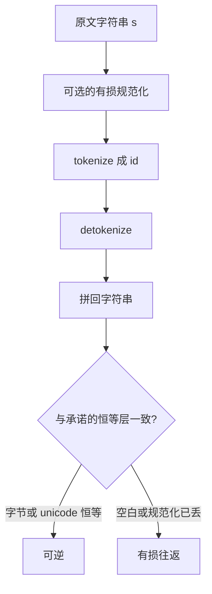

# Detokenize 与往返

若把输入当作原始 unicode 字节流、用元符号标记空白，则切分可以做成可逆的：id 序列应能映回同一段字符串，而不是一段「看起来差不多」的文本。

<footer>—— 据 Kudo & Richardson, SentencePiece: A simple and language independent subword tokenizer and detokenizer, EMNLP 2018 整理</footer>

[上一课](/llm/vocab-size-unk)把 $|V|$、压缩率和 UNK 率放到同一张权衡里。本课不重讲词表该多大。缺口是：即使 UNK 率为零，tokenize 再 detokenize 也常常不是恒等。前导空格、unicode 规范化、字节兜底、训练时额外插入的特殊符号，都会让往返变损。生成出来的 id 序列能不能拼回用户认得的原文，是分词课序的最后一块，也是嵌入课开始之前必须钉死的接口。

## 问题

[词表大小与 UNK](/llm/vocab-size-unk)保证的是「每个编号在 $V$ 里有定义」，不保证「编号序列对应唯一且可逆的字符串」。许多分词器先做 NFKC、统一空白、剥控制符，再切分。这些前置步骤不是 $V$ 上的映射，无法从 id 里解出来。于是出现一类静默损失：输入里的两个空格变成一个，全角数字变成半角，零宽字符消失。评测若只看 UNK 率，会以为覆盖完美，往返已经坏了。

另一类损失发生在词界的编码上。空格若在切分前被丢掉，detokenize 只能靠启发式往回插空格，中文、代码、Markdown 会插错。空格若被焊进相邻符号（字节级 BPE 的前导空格、SentencePiece 的 `▁`），词界就成了符号本身的一部分，往返才有机会精确。本课要分清：哪些方案把空白当成可逆的元信息，哪些方案把空白当成可丢的噪声。

### 恒等失败的三个常见位置

第一，规范化。NFKC 把兼容字符折叠，大小写折叠更激进。训练与推理必须同一套；即使同一套，也无法从 id 恢复折叠掉的原字形。第二，特殊符号。BOS、EOS、PAD、会话角色标记在 detokenize 时要剥掉还是留着，属于协议，不是分词器内部能猜的。第三，非法或截断的字节序列。字节兜底能表示任意字节，但 utf-8 解码在截断处会失败，往返在「字节层可逆、字符层不可打印」上裂开。

「看起来一样」不是往返成功。代码里差一个前导空格，缩进就错；URL 里差一个全角点，链接就断。应用层必须用字节级或 unicode 级的恒等测试，而不是人工扫一眼。

## 方法

可逆切分的标准做法是：不在进入 $V$ 之前丢掉空白，而把空白编码进符号。SentencePiece 把空格替换成 `▁`，再对整段做 BPE 或 Unigram，detokenize 时把 `▁` 换回空格。GPT-2 的字节级 BPE 用一个单独的前导空格标记焊在词首符号上。两种做法都让「词从空格后开始」成为 id 序列里的显式信息。

字节兜底补的是另一头：当某个 unicode 字符不在叶子表里，就改写为若干字节符号。只要字节符号在 $V$ 里闭合，任意字节串都有切分，UNK 率为零。往返在字节层是可逆的，前提是 detokenize 按同一套规则把字节符号拼回，并且不要先做一次有损规范化。实现上必须固定：是否 NFC/NFKC、是否剥离控制符、是否把连续空白压成一个。这些开关与合并表同等重要，要写进词表文件的头信息里。

### 前导空格为什么总被单独拿出来说

许多英文词表里，`hello` 与 ` hello`（前导空格）是两个不同的 id。语言模型对「句首」和「空格后」学到的是两套嵌入。生成时若错误地在句首也带上前导空格符号，或在中缀漏掉它，detokenize 会多出或少掉空格。这不是模型「不会写英语」，而是往返协议与训练分布不一致。中文无空格语言里，同类问题表现为 `▁` 出现的位置与造表时是否把空格当作分隔符有关；错一套，词界全乱。

聊天模板插入的角色标记、换行和空格，全部要走同一套 tokenize。模板若在字符串层手搓空格，再交给分词器，很容易制造训练时从未见过的「空格+角色」组合。

## 机制

往返可以看成两个函数 $T$ 与 $T^{-1}$。理想情况 $T^{-1}(T(s))=s$ 对训练域里的 $s$ 恒等。有损规范化使 $T$ 先经过一个不可逆的 $N$，最多只能 $T^{-1}(T(N(s)))=N(s)$。应用必须声明自己保证的是哪一层恒等：原始字节、规范化后的 unicode，还是「用于显示的可读文本」。三者混用是静默 bug 的来源。

字节兜底把 $T$ 的定义域扩到全部字节串，却把一部分字符串的切分长度拉得很长。往返成功与压缩良好不是一回事：上一课的长度尾部在这里表现为「能还原，但很碎」。截断上下文时，若从 token 边界截而不是从字符边界截，通常仍可逆；若在多字节字符中间按字节硬切，utf-8 解码失败，需要替换符，恒等破坏。

### 生成端的 detokenize 时机

自回归生成是逐 id 放出的。有的符号是不完整的字节序列前缀，必须等后续 id 到齐才能变成合法字符。流式输出若每个 id 都急着 decode，会在多字节汉字或 emoji 上闪现替换符。正确做法是按分词器的流式 decode API 缓冲未完成的字节，而不是对每个 id 单独 `convert_ids_to_tokens` 再拼接。这是往返在时间维上的版本：部分序列还不是一个合法字符串。

不要用空格 `join(tokens)` 当 detokenize。那是演示代码，不是协议。`▁` 或前导空格符号必须按词表规则展开，否则每个子词之间都会多出空格。

## 边界

没有一种分词器对所有应用都无损。搜索与检索有时故意规范化；代码生成必须字节级可逆；自然语言显示可以容忍空白折叠。协议要写进系统边界，而不是假设「用了 SentencePiece 就自动可逆」——默认开关里的 NFKC 经常把可逆变有损。多语言混合、双向文本标记、组合字符，都是恒等测试应单独列的用例。

本课结束分词课序。后面进入嵌入：离散 id 如何变成 $d$ 维向量。嵌入课默认你会 $T$ 与 $T^{-1}$ 的协议，不再讨论空格元符号或 UNK 桶。若往返在应用里是坏的，应回到本课修协议，而不是去调嵌入维。

## 小结

- UNK 率为零也不蕴含 tokenize∘detokenize 是恒等；规范化、空白、特殊符号都会造成有损往返。
- 把空白编码进符号（`▁` 或前导空格）是可逆词界的常规做法。
- 字节兜底给字节层可逆，不自动给 utf-8 字符层可打印；截断要落在 token 边界。
- 流式 detokenize 必须缓冲不完整的多字节序列。
- 恒等要声明层级：原始字节、规范化后文本，还是显示文本。
- 出处：Kudo & Richardson, EMNLP 2018；字节级 BPE 与前导空格见 GPT-2 分词实践。
