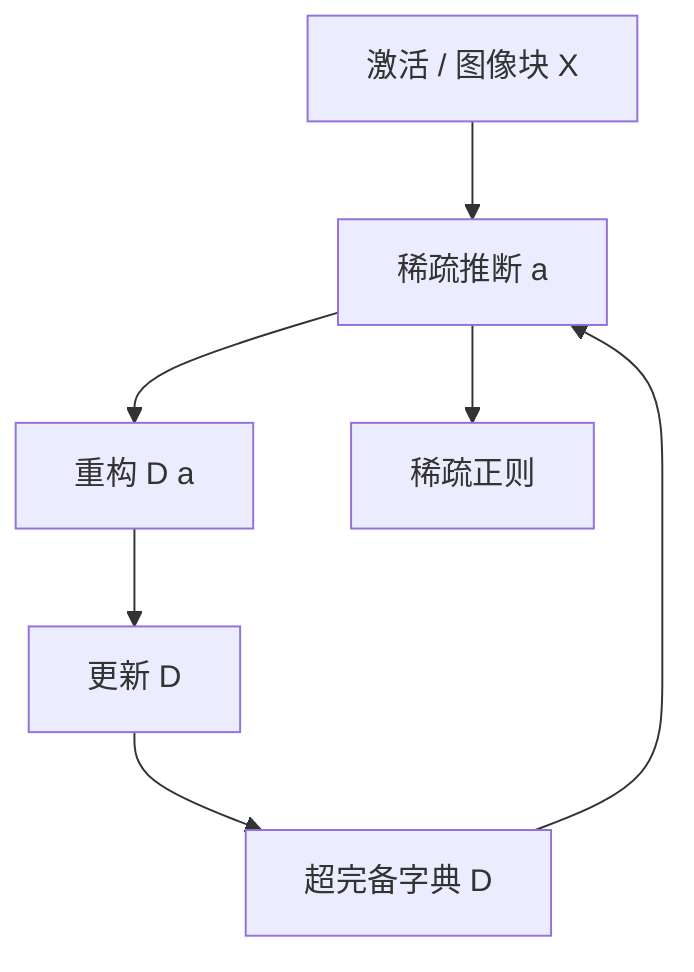

# Dictionary Learning 超完备字典

    
自然图像的稀疏编码会自发产生局部、定向、带通的感受野，与初级视皮层简单细胞相似；过完备字典加上稀疏系数，是这条路的数学骨架。

    <footer>—— Olshausen & Field, Emergence of simple-cell receptive field properties by learning a sparse code for natural images, Nature 1996</footer>

字典学习（dictionary learning）要找一组向量——字典 $D$——让数据近似写成少数几列的线性组合。当列数超过数据维度时，字典是超完备（overcomplete）的：表示不唯一，稀疏性成为选择哪一种表示的正则。Olshausen 与 Field 用它解释 V1；Aharon、Elad 与 Bruckstein 的 K-SVD 把它写成可算的交替优化。机制可解释性把同一骨架搬到冻结网络的激活上：Yun 等人 2021 年在 Transformer 隐状态上做稀疏分解，Cunningham 与 Bricken 把字典特化成 [SAE](/llm/sae-sparse-autoencoder)。本篇写超完备这一约束本身意味着什么，以及为什么「可解释特征」在数学上几乎必然是过完备的，若你相信 [叠加](/llm/superposition-hypothesis)。

## 问题

完备正交基（PCA、正交小波）有唯一系数，却不能同时做到「原子比维度多」和「每次只用几个原子」。自然语言与自然图像都表现出：可能的模式种类远多于观测维度，但单次观测只激活其中很少。若强行用 $d$ 个正交方向去装，就会出现多义基向量——一根轴负担几个不共现的模式。超完备字典接受 $F>d$，用稀疏性换唯一性：在「所有稀疏解」里挑最稀的一个。

对解释性，这不是审美偏好。若模型真的把多于 $d$ 个特征塞进 $d$ 维激活，任何完备基都必然把若干特征混在同一坐标上。你要么放弃「一个单元一个意思」，要么离开正交完备，走进过完备。字典学习是后者的标准工具。

### 稀疏推断与字典更新是两个循环

给定 $D$，求稀疏系数 $a$ 是稀疏编码（基追踪、ISTA、OMP）。给定一批 $a$，更新 $D$ 是字典学习。两步交替，目标常写成

$$
\min_{D,A}\ \|X-DA\|_F^2+\lambda\|A\|_1
\quad\text{s.t.}\ \ \|d_i\|_2=1.
$$

列归一是为了堵住「放大原子、缩小系数」的平凡逃逸。K-SVD 在更新某一列时，只动该原子被用到的样本，并做一次秩一逼近。SAE 把稀疏推断改成可微的单次编码器，从而能在十亿级 token 激活上用 SGD 走完。代价是编码器可能达不到真正的 $\ell_0$ 最优。超完备使得 $D$ 的零空间非平凡：$Da=Da'$ 可以有 $a\neq a'$。稀疏正则在等价类里选点。若正则与模型真实的特征先验不一致，学到的字典可以重构得很好，却对齐到相关簇而不是因果特征。重构误差低从来不是语义正确的证明。

## 方法

在机制可解释性里，数据矩阵 $X$ 的每一列（或每一行）是某个位点上某个 token 的激活。Yun 等人 2021 年的 *Transformer visualization via dictionary learning* 把上下文化嵌入写成 Transformer factors 的线性叠加，已经是「残差 = 字典 × 稀疏码」这个等式。后来的 SAE 只是把推断网络化，并加上可解释性与因果验收。

选择 $F$ 是在分辨率与可训练性之间切。$F/d=1$ 退回完备，叠拆不开；$F/d$ 过大则特征分裂、死原子增多、存储按 $F\cdot d$ 涨。没有与模型参数量绑定的闭式最优 $F$；经验上从 $4\times$ 扫到 $100\times$ 以上，看帕累托与人工抽查。位点也要选：MLP 激活带特权基，残差流没有；注意力输出又是另一套混合。不同位点的字典不能直接当同一组特征用。

$$
x \approx D a,\qquad \|a\|_0 \ll F,\qquad F>d
$$

这是所有后续「单义特征」工作共享的线性代数，而不是某一篇论文的独家公式。

### 与神经科学和压缩感知的对照

Olshausen–Field 的数据是图像斑块，先验是空间局部与定向；语言模型激活的先验是未知的语义稀疏。压缩感知保证：若真实信号在某字典下足够稀，且字典满足 RIP 一类条件，则 $\ell_1$ 可以恢复。激活空间未必满足 RIP，特征也未必严格稀疏。因此可解释性不能引用压缩感知定理当完备性证明，只能把定理当「为什么值得试 $\ell_1$」的动机。K-SVD 在中等规模图像上好用，对 LLM 激活的规模与流式需求不友好，这才轮到 SAE。

## 机制

### 单义性是对系数的经验检验

过完备的几何后果是特征可以近正交地挤在一起，夹角由共现结构决定。共现高的模式会被学成相关的原子，甚至被合并；共现低的模式可以靠得很近而不常打架——这就是叠加在字典侧的镜像。单义性（monosemanticity）在此有操作定义：一个原子的最大激活样本应能被同一句话解释。这不是数学定理，是对 $a_i$ 的经验检验。

线性叠加还承诺干预：把 $a_i$ 夹到大值，等于沿 $d_i$ 走，下游若真用这个方向，行为应朝释义所指的概念偏。若行为乱偏，原子可能只是相关、不是因果。字典学习本身不保证因果，只提供候选方向；因果是另一次实验，见 [Scaling Monosemanticity](/llm/scaling-monosemanticity) 的特征转向。

「超完备」描述的是原子个数相对维度，不是语义覆盖相对世界。$F=10^7$ 的字典仍可能漏掉模型实际在用的方向，同时充满只对训练激活分布负责的碎片特征。完备性是关于线性张成与稀疏码的，不是关于概念本体论的。

## 边界与工程取舍

字典学习假设近似线性可加。若关键计算发生在无法用稀疏线性组合逼近的弯曲流形上，再过完备也只是局部切空间的一张网。多层、多位点的字典之间没有免费的对应；要对齐电路，需要转码器或激活修补把一层的原子接到下一层。计算上，$D$ 的存储与每次编码的矩阵乘随 $F$ 线性涨，全面套件的训练费是开放生态出现的原因。

与 PCA 的取舍：PCA 便宜、唯一、可解释性通常差，因为方差方向不是稀疏特征。与 ICA 的取舍：ICA 假设独立源、通常不超过维度。超完备稀疏编码放松独立性到「可以相关但不同时亮」，更贴近叠加。没有一种分解对所有层都最优；报告时应写字典类、宽度、稀疏度，而不是只写「我们做了特征提取」。

不要把一篇 SAE 论文的「特征」和另一篇 K-SVD 论文的「原子」在未对齐的情况下数个数比较。它们可能分解的是不同位点、不同中心化、不同范数约束。公共语言是 $x\approx Da$ 与稀疏度，不是特征编号。

## 小结

- 超完备字典用多于维度的原子加稀疏系数表示数据，牺牲唯一性、换单义候选。
- 若叠加为真，完备正交分解必然多义；过完备是线性代数上的对应物。
- 推断与字典更新交替；SAE 用一次可微编码代替迭代稀疏编码以换规模。
- 重构好只说明张成合理；语义与因果要靠释义和干预另验。
- Olshausen–Field 提供神经科学先例，Yun 2021 提供 Transformer 先例，现代 mech interp 是同一骨架的规模化。
- 出处：Olshausen & Field, *Nature* 381, 607–609 (1996)；Aharon, Elad & Bruckstein, K-SVD, IEEE TSP 2006；Yun et al., 2021；对照 Elhage et al., 2022。
