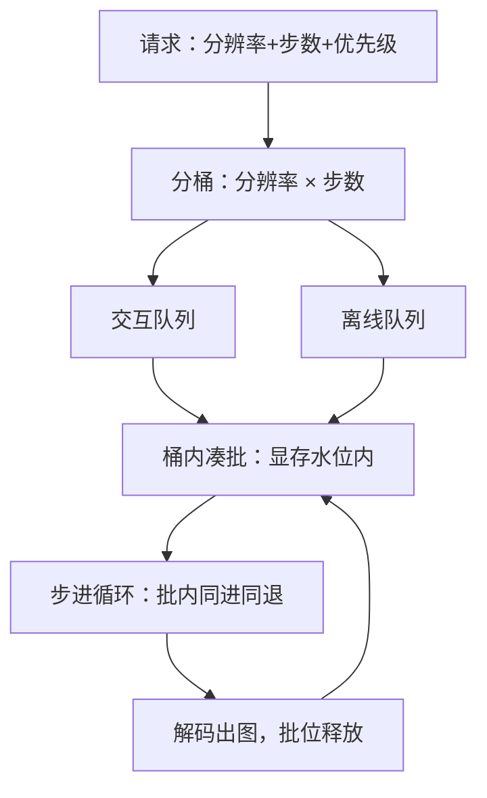
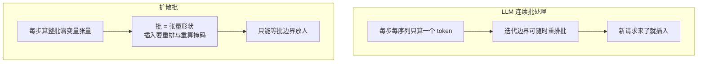

# 批处理与调度

LLM 的连续批处理逐 token 插人，扩散的批只在步与步之间同进同退；把自回归的调度直觉搬过来，凑出来的批会互相拖死。

<footer>—— 据 Yu 等 Orca 的迭代级调度与扩散服务实现对照整理</footer>

[上一课](/llm/diff-quantization)把单次前向跑便宜，本课把并行度补上：批与调度。请求调度的基础与指标、连续批处理的机制在[调度课](/llm/sch-basics-metrics)与[连续批处理深入](/llm/sch-continuous-batching-deep)已立；本课只写扩散侧的差异：没有逐 token 的增量结构，却有逐请求固定的形状与步数，调度器因此长成另一种形状。

## 问题

扩散请求在进队时就带着完整规格：分辨率、步数、引导、条件。这给了调度器 LLM 没有的先见——每个请求的总前向次数已知，队列长度可以精确折算成 GPU 时间；也拿走了 LLM 有的自由——批内所有请求必须同形状、同步数地走完每一步，中途无法像 Orca 那样在迭代边界插入新请求再按需重算。缺口是把这两个约束写成调度协议：怎么分桶、怎么凑批、怎么不让一张 $1024\times1024$ 的请求把一整批 $512$ 的拖进 OOM 或重编译。

「分桶」翻译一下：把分辨率和步数相同的请求装进同一个筐再一起算。桶像公交线路——按「路线」（形状）发车，不按乘客身份（优先级）发车；同一线路凑满一车最省油，硬把不同路线的乘客塞一车，人人都得绕路。

### 形状是第一维度

批的第一个维度不是优先级而是形状。注意力与卷积核按形状编译或图捕获，形状一变就触发重编译或退化到通用核；激活显存随批大小 × 潜变量面积线性涨。所以生产做法是按（分辨率，步数）分桶：桶内凑批，桶间排队；分辨率翻倍，token 数变四倍，注意力 FLOPs 变十六倍，高分辨率桶天然要小批。把不同分辨率硬凑进一个批，结果是 padding 浪费加显存尖峰，两头都亏。

512→1024 使潜变量 token 数 ×4、注意力 FLOPs ×16。容量规划时高分辨率请求不能按像素面积折算成本，要按注意力平方项折算——这是扩散调度最常被低估的一项。

## 方法

调度器四层：

- **分桶层**：按（分辨率，步数）分桶；桶是编译与显存的单位，不是策略的单位。
- **凑批层**：桶内积批，批大小由显存水位与延迟目标共同给出；交互流量留一个小的常驻批位，离线流量填满剩余。
- **优先级层**：交互请求与离线请求分队列；离线批可以跑到步中再让出吗——不可以，让出点只能是批边界，因此离线批的批大小要设上限，避免长批把交互队列饿死。
- **溢出层**：显存水位超限时先降批再降分辨率，最后才是拒绝；每一步降级都要在指标里留痕。

降级顺序有讲究：先降批大小，用户完全无感，只是排队的人多等一会儿；再降分辨率，输出尺寸变了，用户看得见。所以「先降批再降分辨率」本质是先花看不见的成本，再花看得见的成本——顺序反了，投诉先来。

## 机制

为什么中途不能插入新请求：Orca 的迭代级调度依赖「每步只算一个 token、序列可随时重排」；扩散每步对整批潜变量张量做全量计算，批是张量的形状而不是集合的容量，插入意味着重排张量与重算掩码，成本超过等待。可让渡的粒度因此是「批边界」：一个请求出图、批位释放，新请求才能进。这决定了交互延迟的下限是当前批的剩余步数 × 单步时延——调度器能做的是把交互请求放进小批快桶，而不是许诺随时插队。

数字感受一下延迟下限：30 步日程、单步 40 毫秒，一张图的批要跑 1.2 秒。交互请求若恰好排在刚开跑的大批后面，最坏要等满 1.2 秒才有批位空出。这就是给交互流量留「小批快桶」的原因——不是让它插队，而是让它上一辆开得快的车。

为什么先见反而简化调度：步数与形状在进队时已知，每请求的前向次数可静态折算，队列时延预估可以做到相当准；LLM 调度「输出长度未知」的估计噪声在扩散侧消失。代价是用户改配置就改负载：产品把步数与分辨率开放给用户时，等于把桶的基数开放出去，桶数爆炸会让凑批率掉光——产品层要收敛到几个预设档位，这是调度协议伸进产品设计的部分。

## 边界

本课假设同模型同版本的单实例；多模型并存的换入换出是成本课的题材。批内请求共享同一日程，个体提前终止（如步中安全拦截）要么等批结束再裁，要么引入掩码开销，两种都算进账。与传统 LLM 调度的对照到此为止：KV 驱动的抢占与换入换出在扩散侧没有对应物，不要为了对称而引入。批大小与时延的曲线要在自己的硬件上实测，纸面 FLOPs 折算不可用——评测口径见本课程后面的评测课。

## 小结

- 扩散请求进队时规格完备：总前向次数已知，但批必须同形状同步数同进同退。
- 调度第一维是形状：按（分辨率，步数）分桶，桶绑定编译与显存预算。
- Orca 式迭代级插人不适用，让渡粒度是批边界；交互延迟下限由当前批剩余步数决定。
- 高分辨率按注意力平方项折算成本，不按像素面积。
- 产品档位收敛桶数：开放全部分辨率与步数等于开放调度器的坟墓。
- 出处：Yu 等 Orca（OSDI 2022）的迭代级调度对照；桶协议据扩散服务实践整理。
