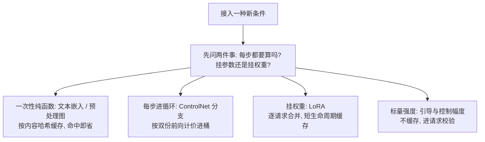
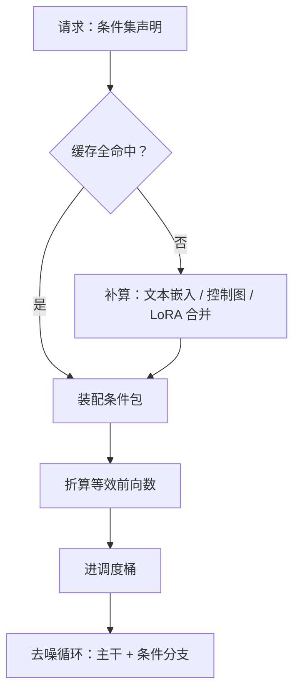

# 条件控制的服务

文本提示只是条件的一种；把构图、风格、身份都变成可挂载的条件，服务对象就从「一个模型」变成「一个模型加一柜子适配器」。

<footer>—— 据 Zhang 等 ControlNet（2023）与 IP-Adapter 等适配器实践整理</footer>

[上一课](/llm/diff-batching-scheduling)把请求凑成桶内同步的批，但那些请求共享同一个条件集。本课把「条件」本身变成服务对象：文本之外，ControlNet 的构图控制、IP-Adapter 的参考图、LoRA 的风格注入都挂在去噪网络上。第一课的条件嵌入缓存在这里推广成条件服务层：凡是纯函数的条件变换，都缓存；凡是可挂载的权重，都按请求装配。

## 问题

多一种条件，管线就多一段会算错账的地方。ControlNet 给去噪网络旁挂一份可训练的编码器副本，每步前向近似翻倍；预处理（边缘图、深度图、姿态）是 CPU 密集的一次性段，不缓存就每请求重算。LoRA 的账更细：底座一份、适配器几十个，逐请求合并有开销，预合并则组合数爆炸；叠加还有权重尺度冲突。缺口是装配协议：请求声明条件集，服务端负责装配、缓存与计价——不立协议，每个功能都以为自己独占管线。

LoRA 直译「低秩适配」：在冻结的大权重旁挂一对很小的矩阵，只训小矩阵。所谓「合并」就是把这对小矩阵的乘积加进大权重。逐请求合并像每次点餐现拼套餐，预合并像把每种组合提前做好放进冰箱——组合一多，冰箱（显存）先爆。

### 条件的分类与装配

按「算一次还是每步算、挂参数还是挂权重」分四类：

- **提示词嵌入**：纯函数，按提示词哈希缓存，命中即省一次文本编码。
- **控制图**：预处理是纯函数，按（原图，预处理器，参数）缓存；ControlNet 本体每步都算，进循环段成本。
- **适配器权重**：LoRA 按请求装配，合并后的权重短生命周期缓存（键为底座版本 + 适配器集合 + 比例）。
- **逐请求标量**：$\gamma$、ControlNet 强度、去噪强度，不缓存，进请求校验。

ControlNet 的编码器副本用零卷积初始化接入主干，启用时每步前向的 FLOPs 量级接近翻倍——按请求计价时控制条件不是「附加功能」而是「第二份前向」，定价与配额都要按这个口径。

## 方法

装配协议三步。第一步，请求规格里显式列出条件集：每项控制图带预处理器版本，每个 LoRA 带仓库版本与强度；缺省值由产品档位给，不由服务端猜。第二步，装配器按缓存键取嵌入、控制图与合并权重，未命中项并行补算，预处理在 CPU 池跑，不占 GPU 批位。第三步，把装配结果折算进调度账：启用 ControlNet 的请求换算成更大的等效前向数，进[批处理与调度](/llm/diff-batching-scheduling)的桶账，不按普通请求排队。

## 机制

为什么条件缓存有效而结果缓存廉价：条件到嵌入或控制图是确定性映射，缓存键稳定；而「提示词到成图」的映射还含种子与随机性，结果缓存只在严格复现场景有意义。为什么 LoRA 逐请求合而不是常驻多份：底座权重只读共享，合并产出的临时权重生命周期与请求同长，显存按并发峰值预留；高频组合可以升级为常驻合并变体——这是一个按命中率驱动的缓存晋升问题，不是静态配置。

「命中率驱动的晋升」翻译成零售语言：某组合每秒被点 5 次、每次合并耗时 100 毫秒，现做就要每秒烧掉半个 GPU 用来「备菜」；点得够多就提前备货（常驻合并变体），用一点显存换回整段计算。晋升与否看账本，不看喜好。

为什么引导与控制强度是运营旋钮而不是模型旋钮：它们改变条件分支的注入幅度，不改权重；把「控制不生效」的工单先用强度参数消解，能省掉大量无效的模型回滚。反过来，控制图预处理版本升级会改变所有下游请求的输入分布——预处理器版本必须进请求谱系，与模型版本一起参与归因。

常见误区：收到「ControlNet 不生效」的工单就怀疑模型坏了、急着回滚版本。实际上强度这类标量旋钮先拧一遍——它只改条件注入幅度、不动任何权重，一分钟就能验证；用它消解掉的工单，比一次模型回滚便宜几个数量级。

## 边界

多 ControlNet 的权重调和在模型侧已定，服务端只透传，不发明第二套逻辑；多个 LoRA 的叠加顺序与比例冲突是模型问题，装配层暴露参数但不解决参数。条件服务层不碰安全：参考图与控制图本身要过输入过滤，和提示词同一道门（本课程后面的安全课）。反演类条件（图生图、重绘）引入去噪强度与潜变量复用，这里只声明「条件集可包含初始潜变量」而不展开。最后，装配协议的可观测性是归因的前提：每个请求落盘条件集与缓存命中情况，否则「同一提示词不同结果」永远查不清是种子、装配还是版本的问题。

## 小结

- 条件按「算一次还是每步算、挂参数还是挂权重」分四类，各配各的缓存键。
- ControlNet 启用接近双份前向，按等效前向数计价与调度，不当附加功能。
- LoRA 逐请求装配、短生命周期缓存，高频组合按命中率晋升为常驻变体。
- 预处理器版本进请求谱系：它改变所有下游输入分布，必须参与归因。
- 强度类参数是运营旋钮，先用它消解工单再考虑动模型。
- 出处：Zhang 等 ControlNet、IP-Adapter 等适配器文献；装配协议据本课整理。
