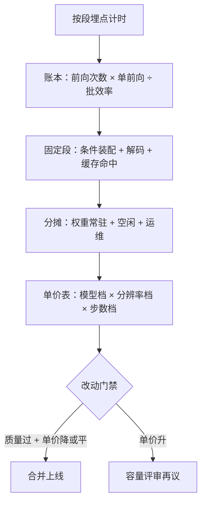

# 成本工程

单价的公式早就定了：前向次数乘单次成本除以批效率，再加固定段；成本工程不是砍价，是把公式里每一项变成有人认领的旋钮。

<footer>—— 据本课程各课的量级与图像生成服务实践整理</footer>

[上一课](/llm/diff-video-serving)把视频装进作业系统，管好了最贵的负载。本课把前六课的旋钮换成账：图像与视频共用一张单价表，每一项都要能落到人、落到监控、落到预算。蒸馏、量化、调度各自宣布了收益，成本工程的活是让它们在同一个口径下相加。

## 问题

图像服务的成本争议几乎都源于口径不一：算法报的是去噪循环的 GPU 时间，财务报的是含空闲与超时的整机账单，产品报的是按请求配额折的虚拟数。三者对不上，优化就成了各说各话。缺口是一张公认的账：**单图成本 =（前向次数 × 单前向成本）÷ 有效批效率 + 固定段成本 + 分摊成本**。前向次数是步数 × 引导倍数（[管线解剖](/llm/diff-serving-pipeline)）；单前向成本由精度与实现决定（[量化](/llm/diff-quantization)）；有效批效率是凑批率与重编译损耗（[批处理与调度](/llm/diff-batching-scheduling)）；固定段是条件装配与解码；分摊是模型常驻显存、空闲与运维。

### 认领旋钮

- **前向次数**：产品档位决定默认步数与学生/教师分层（[步数蒸馏](/llm/diff-step-distill-tradeoff)）；这是最大的单项，也最容易被「默认 50 步」这种惰性配置吃掉。
- **单前向成本**：精度分配与算子实现，归推理团队；监控指标是每步时延分布而不是平均值。
- **批效率**：桶设计与档位收敛，归调度团队；监控凑批率与重编译次数。
- **缓存命中**：条件嵌入、控制图、LoRA 合并缓存，命中率直接从固定段里扣钱。
- **常驻与换入换出**：多模型并存时，底座权重是显存常数项；换一次模型是一次冷启动，要么常驻要么排队。

SD 1.5 的 UNet 约 860M 参数，fp16 权重约 1.7 GB：多模型并存时显存的大头是权重常数项而非激活。容量规划先扣权重，再谈批大小——顺序反过来会系统性高估可承载并发。

## 方法

三步立账。第一步，埋点按段计时：条件段、循环段、收尾段、排队与换模型分别落指标，段账与第一课的解剖一一对应。第二步，单价表按（模型档，分辨率档，步数档）三维发布，每个单元格有实测数；工单与容量评审用同一张表，禁止另起口径。第三步，把「每图成本」变成有门禁的 SLO：任何改动合并前要报单价与质量两条增量，口径用本课程评测课的管线，成本与质量同 gate。

## 机制

为什么批效率项最难管：它不是单一参数，是桶设计、流量分布与档位数的乘积。流量漂移（用户突然涌向高分辨率档）会让原本健康的桶空转，有效算力先掉一半再谈别的都白搭；所以批效率要按天监控分布，漂移触发档位重审。为什么缓存命中算成本而不是算性能：固定段在批外串行执行，命中的请求不占 GPU 与 CPU 预处理池，等于直接从单价里减常数——命中率是少数「无质量代价的省钱项」，应最先挖。为什么分摊项不可省：底座常驻显存换来了零冷启动，这笔租金属固定成本；按请求均摊后，低峰期单价里有一半可能是空闲——这解释了离线批要填低谷而不是扩容高峰。

## 边界

账本不替代实验：单价表的格子要在自己的硬件与实现上实测，纸面 FLOPs 与厂商峰值折算一律不进表。降本有下限：步数与精度砍到质量门禁以下，省下的是钱、赔掉的是产品；门禁优先级恒高于单价。视频作业的成本沿用同一张表，只是格子乘上帧数项。本课不涉及对外定价：单价表是内部口径，定价还要加毛利与配额策略。最后，成本的归因依赖谱系完整——模型、LoRA、预处理器、精度、桶配置都要在请求落盘，否则单价漂移查不到是哪个旋钮动的。

## 小结

- 单价 = 前向次数 × 单前向成本 ÷ 批效率 + 固定段 + 分摊，五项各有认领人。
- 最大单项是前向次数：产品档位与师生分层的默认值决定成本基线。
- 缓存命中率是无质量代价的省钱项，最先挖；批效率最难管，按天监控漂移。
- 权重常驻是显存常数项，容量先扣权重再算并发。
- 每图成本与质量同 gate：改动必须报两条增量，成本门禁不得越过质量门禁。
- 出处：单价公式与口径据本课程各课整理；参数规格据 Stable Diffusion 公开资料。
