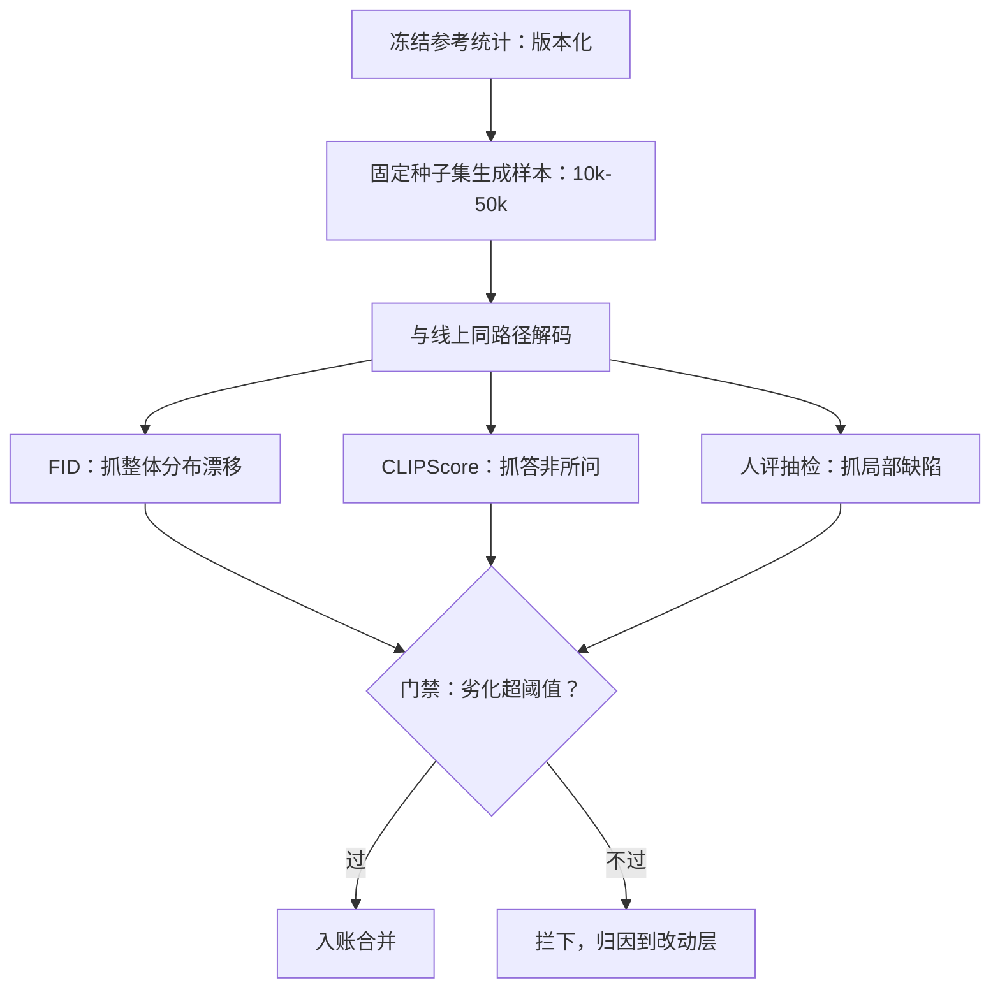

# 评测：FID 管线

FID 是两个高斯之间的距离，不是两张图之间的距离；它对「整体分布漂了没有」敏感，对「这张图的手指对不对」失明。

<footer>—— Heusel 等, GANs Trained by a Two Time-Scale Update Rule Converge to a Local Nash Equilibrium, 2017</footer>

[上一课](/llm/diff-cost-engineering)把每图成本立成账，并要求改动报「单价增量与质量增量」两条。质量增量的口径从哪来，是本课的题目：把 FID 与配对指标做成一条可复现的评测管线，让蒸馏、量化、调度的每一次改动都有同一把尺。

## 问题

FID 的定义简单：把真实图像与生成图像分别过 Inception 网络取特征，各自拟合成高斯，算两个高斯之间的 Fréchet 距离。麻烦全在管线工程上：样本量小时 FID 系统性偏高，10k 与 50k 样本算出的不是同一个数；参考统计换了数据集、分辨率或特征模型就不可比；VAE 解码路径与线上不一致时，测的是解码器不是去噪网络。更根本的失明：FID 衡量分布层面的整体相似，对提示词贴合度、局部结构缺陷几乎不敏感——只看 FID 的团队会放行「分布很像但答非所问」的回归。缺口是一组互相补位的指标加一条钉死变量的管线。

### 指标的分工

- **FID**：整体分布是否漂移，适合抓量化与蒸馏的系统性退化。
- **CLIPScore**：图像与提示词的对齐度，抓「答非所问」。
- **人评抽检**：固定提示词集上的偏好对比，抓高频纹理与结构缺陷，做最后裁决。
- **线上延迟分位数**：与质量同表报告；省出的钱要能对上省出的毫秒。

同一模型 10k 样本的 FID 系统性高于 50k 样本的值；文献口径用 50k（Heusel 等 2017）。横比的前提是样本量、参考统计、特征模型三项全同——差任何一项，比较作废。

## 方法

管线六步，全部进 CI：

1. **冻结参考**：参考统计（特征均值与协方差）按数据集与分辨率一次性算好存档，版本化。
2. **固定采样**：固定种子集生成评测样本；样本量最少 10k，能负担则 50k。
3. **同路径解码**：评测图像走与线上相同的 VAE 解码与后处理路径，测的才是服务输出。
4. **成对基线**：每次改动与改动前的版本同种子、同提示词集成对比较，报 FID 增量、CLIPScore 增量与人评胜负率。
5. **门禁**：FID 劣化超阈值或人评显著落败即拦下；阈值按改动类型分级——量化改动与调度改动的容忍度不同。
6. **报告入账**：结果连同样本量、参考统计版本、种子集版本一起存档，进[成本工程](/llm/diff-cost-engineering)的改动门禁。

## 机制

为什么成对比较是核心：FID 的绝对值没有意义，有意义的只是同协议下的差值。固定种子与提示词集后，两次评测之间唯一的变量就是被测改动，差值才能归因——这正是前几课「一次只动一个旋钮」的评测面。为什么人评不可替代：蒸馏丢的细节与量化出的怪纹常集中在少数提示词与局部区域，分布指标被大量正常图像稀释后看不见；小规模成对人评（几十到几百票）对这类退化的检出率远高于 FID。

为什么参考统计要当作数据资产管理：它定义了「分布正确」的锚点。换参考等于换考纲；分辨率升级、数据集换代时参考统计必须重算并升版本，历史结果与新版不可比，报告里要断代。特征模型同理：换 Inception 的变体或权重，整条历史基线作废。

## 边界

FID 管线测分布质量与对齐，测不了安全与水印——那是下一课的门。它也测不了交互体验：延迟分位数由服务埋点供数，评测管线只汇总。人评有自己的协议问题（评委疲劳、提示词泄漏、排序偏置），抽检规模上去之前先钉协议，否则省下的 FID 预算会赔在人评方差里。最后，评测不是发布后的仪式：管线在改动合并前跑，线上再以抽样式人评校准「指标过了但用户不满意」的残余误差——两个环节都不可省。

## 小结

- FID 测分布层面的漂移，对贴合度与局部缺陷失明，必须配 CLIPScore 与人评。
- 可比性的前提三项全同：样本量、参考统计、特征模型；参考统计版本化断代。
- 评测样本走线上同路径解码，测的才是服务输出而非实验脚本输出。
- 成对比较钉死变量：同种子、同提示词集，差值才可归因。
- 质量增量与单价增量同表报告，进改动的统一门禁。
- 出处：Heusel 等 2017（FID）；Hessel 等 2021（CLIPScore）；管线口径据本课整理。
