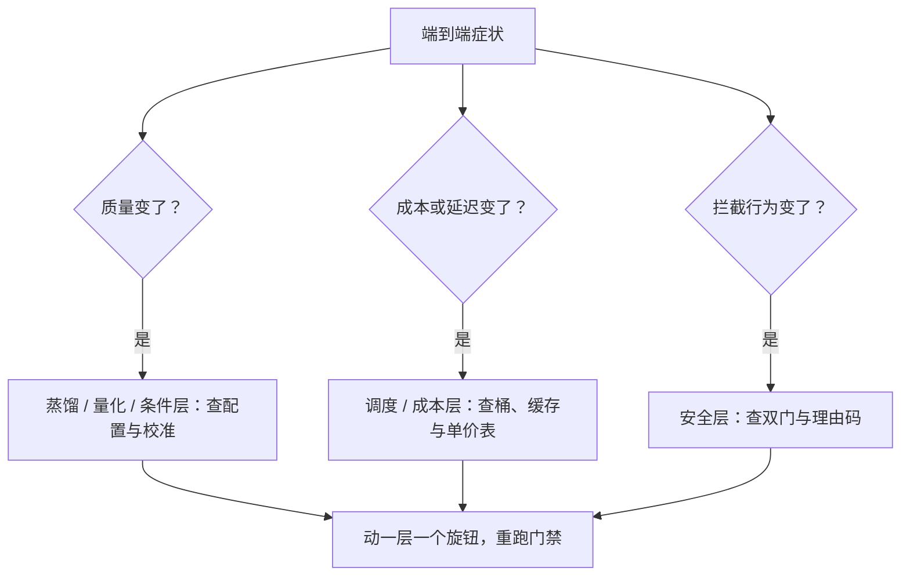

# 失败模式与收束

生成服务的故障长在端到端：图糊了、单贵了、门误杀了；排查法是从症状退到层、从层退到旋钮，而不是从爱好出发调参。

<footer>—— 据本课程整理</footer>

[上一课](/llm/diff-safety-watermark)把安全与水印装进收尾段，九个技术课全部落地。本课程最后一课做两件事：把十课编成跨层排查法，把课程收进几条线——本课程到此收束。

## 问题

扩散服务的工单从来不说层，只说症状：「图变糊了」「单价涨了」「提示词不理我了」「高分辨率爆显存了」。同一个症状下面可能是完全不同的病：图糊可能是蒸馏学生用错了采样器配置，可能是量化校准被异常时间步带偏，也可能是输出门的过滤器误杀了正常图之后重试到了错误档位。没有从症状到层的协议，团队会在错误的层反复动刀——循环段明明没问题，却把步数加了一倍。收束的问题因此不是复述各课，是提炼：哪条症状归哪层，哪层握着哪个旋钮，动之前要先取什么证。

## 方法

按层的失败清单，每层三件套：症状、验证、旋钮。

- **条件层**：贴合度集体下降——先查条件嵌入缓存是否命中旧版本、预处理器是否升版（[条件控制的服务](/llm/diff-control-serving)）。
- **蒸馏层**：纹理变平、局部怪纹——查采样器配置是否匹配学生契约、是否误开 CFG（[步数蒸馏](/llm/diff-step-distill-tradeoff)）。
- **量化层**：固定纹理伪影、黑图——查校准集时间轴覆盖与解码器精度分配（[扩散模型的量化](/llm/diff-quantization)）。
- **批与调度层**：尾延迟抖、OOM、凑批率掉——查桶设计、档位数与流量漂移（[批处理与调度](/llm/diff-batching-scheduling)）。
- **视频层**：进度抖动、重复提交、阶段重跑——查作业幂等键与进度限频（[视频生成的服务](/llm/diff-video-serving)）。
- **成本层**：单价漂——按单价表五项逐一归因，先查批效率与缓存命中率（[成本工程](/llm/diff-cost-engineering)）。
- **评测层**：门禁失灵、指标与体感脱节——查样本量、参考统计版本与解码路径（[评测：FID 管线](/llm/diff-fid-pipeline)）。
- **安全层**：误杀或漏杀——查双门判定分布、理由码与申诉回流（[安全与水印](/llm/diff-safety-watermark)）。

排查纪律沿用一条：一次只动一层的一个旋钮，动前动后跑评测管线，结果与谱系一起入账。

## 机制

收束回大图。本课程十课是两句话的展开。第一句：**单请求的成本约化成一张公式**——前向次数 × 单前向成本 ÷ 批效率，加固定段；推理管线单元（解剖、蒸馏、量化、批处理）把公式的每一项变成可测可调的对象。第二句：**多请求的生成要变成可治理的对象**——控制与生产单元（条件、视频、成本、评测、安全）把条件装配、作业、单价、质量门与内容门做成协议。与主干的分工：[DDPM](/llm/ddpm)、[潜空间与 VAE](/llm/latent-vae)、[流匹配](/llm/flow-matching)、[扩散蒸馏与少步](/llm/diffusion-distillation)、[CFG 在图像生成](/llm/cfg-image)、[视频生成的时空建模](/llm/video-gen-spatiotemporal)立第一性与默认；本课程把默认变成你自己负载上的实测决策——协议（段计时、单价表、成对门禁、双门审计、谱系落盘）跨模型与硬件复用，常数（步数、$\gamma$、精度分配、桶配置、水印强度）每次换代重测。

一句自检：任何「扩散服务优化」若说不清动的是单价公式哪一项、门禁哪条线、谱系哪一维，它就还是技巧——技巧在模型或流量换代时静默失效，协议不会。

## 边界

清单不能替代段计时数据：先看指标在哪层变，再动旋钮。深钻层收束一门课，不收束一个领域：底座、蒸馏配方与流量档位都会换代，本课程的常数会过期，公式与协议不过期。主干之后的空白——新的采样范式、端侧扩散、交互式编辑——另课交接，不在此处展开。维护一张活的失败台账：每个新故障按三件套入册，台账比清单多一层时间，是团队真正的记忆。

## 小结

- 排查协议：症状到层，层到旋钮；一次动一个，动前动后跑门禁。
- 推理管线单元给公式：前向次数 × 单前向成本 ÷ 批效率，加固定段。
- 控制与生产单元给协议：条件装配、异步作业、单价表、评测门禁、双门审计。
- 主干立第一性，深钻把你自己的负载变成决策；协议复用，常数重测。
- 段计时与谱系落盘是归因的前提，失败台账随时间生长。
- 出处：本课程各课口径汇总；Ho 等、Rombach 等、Salimans & Ho、Heusel 等见各课小节。
