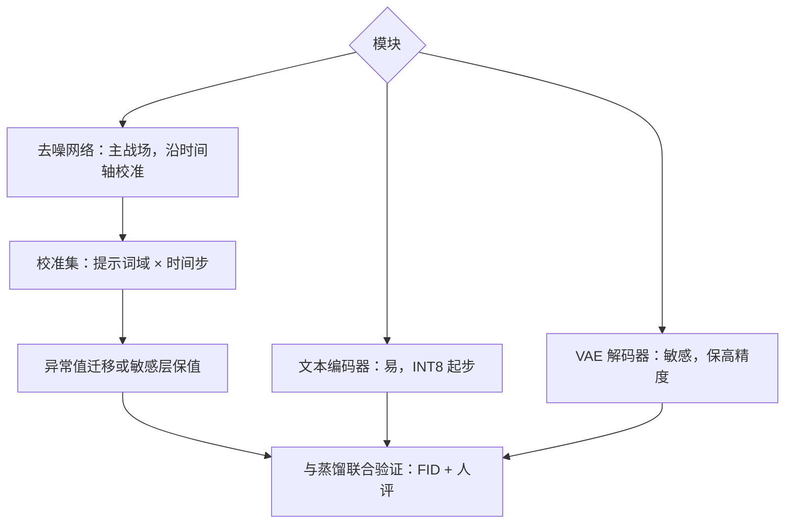
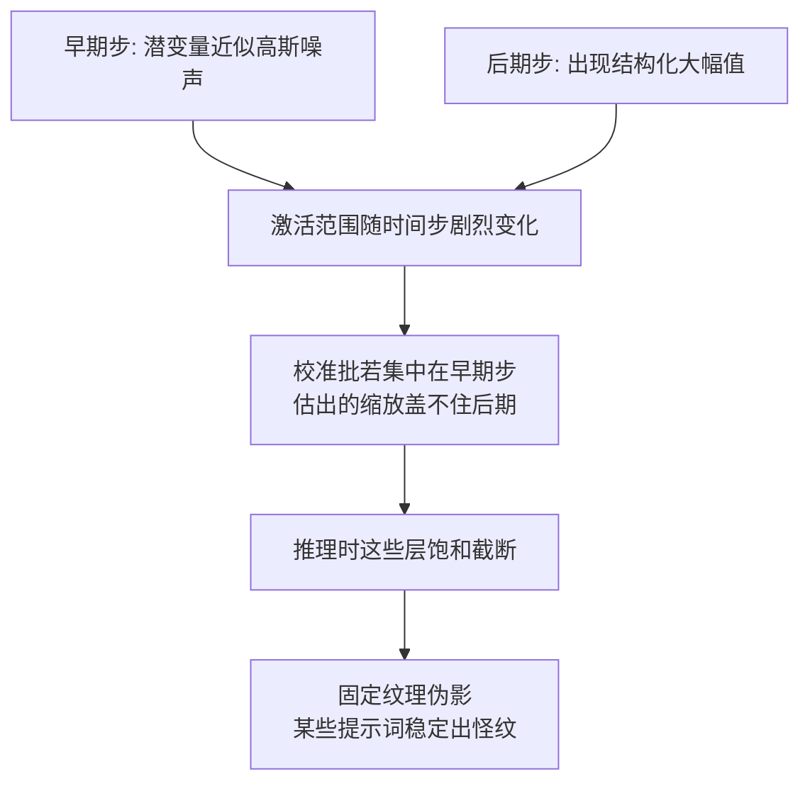

# 扩散模型的量化

扩散的误差预算要摊在几百次前向与一次解码上：去噪循环里每步省一点，解码器里错一次就全盘皆输。

<footer>—— 据 Shang 等 PTQ4DM、Li 等 Q-Diffusion 与 SmoothQuant 一线实践整理</footer>

[上一课](/llm/diff-step-distill-tradeoff)把「少跑前向」的账算清：步数与引导进了契约，收益落在交互层。本课动第二条：把每次前向跑便宜。权重与激活的量化方法学——粒度、校准、异常值迁移——在 [GPTQ](/llm/gptq)、[AWQ](/llm/awq)、[SmoothQuant](/llm/smoothquant) 与[低精度推理的误差预算](/llm/num-inference-error-budget)已立；本课只写扩散特有的部分：误差要穿过 $T$ 步迭代与 VAE 解码两个放大器，校准集多了一条时间轴，三个模块的敏感度完全不同。

## 问题

把 LLM 的量化流程原样搬来，会在两个地方翻车。第一，扩散激活的取值范围随时间步剧烈变化：早期步潜变量接近高斯噪声，后期步出现结构化的大幅值区域，用固定校准集一次性统计会被某几个时间步的异常值带偏，压低位宽后伪影集中爆发。第二，VAE 解码器在 fp16 下就有溢出产生黑图的先例，再压位宽时它不是「跟着主模型一起压」的对象，而是独立预算。缺口因此不是「能不能量化」，而是按模块分配精度、按时间轴做校准的协议。

「异常值迁移」翻译一下：少数激活通道数值特别大，就把大数从激活那边搬到权重那边——激活除一个数、权重乘同一个数，乘起来结果不变，但两边各自的数值范围都变平了。像把大件家具挪个房间，房子总量没变，每间房都好收拾，量化器就好办了。

### 三个模块，三本账

- **文本编码器**：单次前向、输出是嵌入，量化收益小、风险小，是最容易的一块。
- **去噪网络**：反复执行，是省算力的主战场；权重 INT8/FP8 起步，激活看异常值分布决定是否做平滑迁移。
- **VAE 解码器**：单次执行但直通像素，误差直接变成色带与黑块，常保 fp16 甚至部分层 fp32，或用分块解码降显存。

SD 的 VAE 解码在 fp16 下会因数值溢出输出黑图，社区的标准修法是解码器用 fp32 或对特定层做精度提升——量化方案里要为「解码器不动」留出显存与延迟的预算。

## 方法

协议分四步。第一步定预算：与蒸馏课同理，先决定可接受的质量下限（FID 增量、人评抽检），再选位宽，而不是先选位宽再看掉多少。第二步造校准集：提示词分布要覆盖真实流量的域，并且**沿时间轴采样**——每个请求的 $T$ 步激活都要有机会进入统计，或按时间段分组做逐组缩放。第三步处理异常值：把大幅值从激活迁移到权重（SmoothQuant 路线），或对敏感层保留高精度。第四步联合验证：与[步数蒸馏](/llm/diff-step-distill-tradeoff)的结论呼应，少步学生的每步误差少有后续步兜底，量化学生要一起测，不能各自达标再拼接。

## 机制

为什么时间轴会让校准失真：缩放因子是从激活统计里估的，若校准批恰好集中在早期步，估出的范围覆盖不了后期步的结构化大幅值，推理时这些层饱和截断，伪影呈固定纹理出现——这就是「量化后在某些提示词上稳定出怪纹」的来源。为什么少步放大每步误差：50 步管线里单步的量化扰动被后续 49 步部分平均掉，4 步管线里同样扰动直接进图；所以步数越少，位宽预算越紧，两者是同一张误差预算表的两行。

数字感受「少步放大误差」：同样是每步千分之一量级的扰动，50 步管线里步与步方向各异、互相抵消一部分；4 步管线里几乎原样进图，而且每一步承担的信息份额还大了十几倍。这就是「步数越少、位宽预算越紧」的算术来源。

为什么解码器单独记账：VAE 解码把潜空间的小数值差异映射成像素的大面积色块，误差不经迭代平均、也不受日程约束，是纯的单次敏感变换。实践中「去噪压到 INT8、解码保 fp16」的组合往往比「全线 INT8」便宜得多而质量几乎无损——精度分配是钱的问题，不是荣誉问题。

## 边界

本课不重讲量化方法本身：GPTQ 的逐层误差补偿、AWQ 的激活感知缩放、FP8 的缩放格式见主干与数值课；这里只定扩散侧的分配与校准协议。量化后调度器日程不要顺手改：改了日程就引入第二个变量，归因即断。硬件相关：INT8/FP8 的收益依赖张量核支持，不支持的平台省的是显存不是时间。人评抽检不可省——FID 对高频纹理的局部退化不敏感，见本课程后面的评测课。最后，量化权重改变了底座版本谱系，与蒸馏、LoRA 的组合都要进版本号，复现性契约才守得住。

常见误区：量化完顺手把采样日程也「优化」一遍，质量掉了却说不清怪谁。量化与日程是两个变量，一次只动一个；日程改动要另走一轮门禁。这条纪律在各课反复出现，因为多人协作时它总是最先被破坏的那条。

## 小结

- 扩散量化按模块分配：文本编码器易、去噪网络是主战场、VAE 解码器单独保精度。
- 校准集多一条时间轴：激活范围随时间步剧变，固定统计会被异常步带偏。
- 步数与位宽共用一张误差预算表：步数越少，每步误差越少被平均，预算越紧。
- 解码器直通像素，fp16 都会溢出的对象不能再压；分块解码省显存不省精度。
- 量化与蒸馏必须联合验证，各自达标再拼接会静默劣化。
- 出处：Shang 等 PTQ4DM、Li 等 Q-Diffusion、Xiao 等 SmoothQuant；解码器溢出口径据 Stable Diffusion 社区实践。
