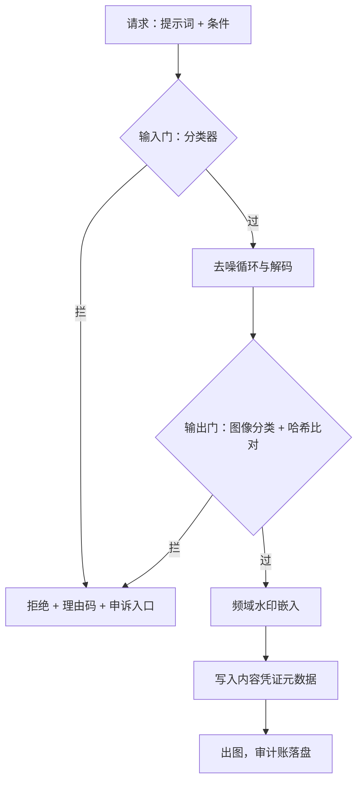
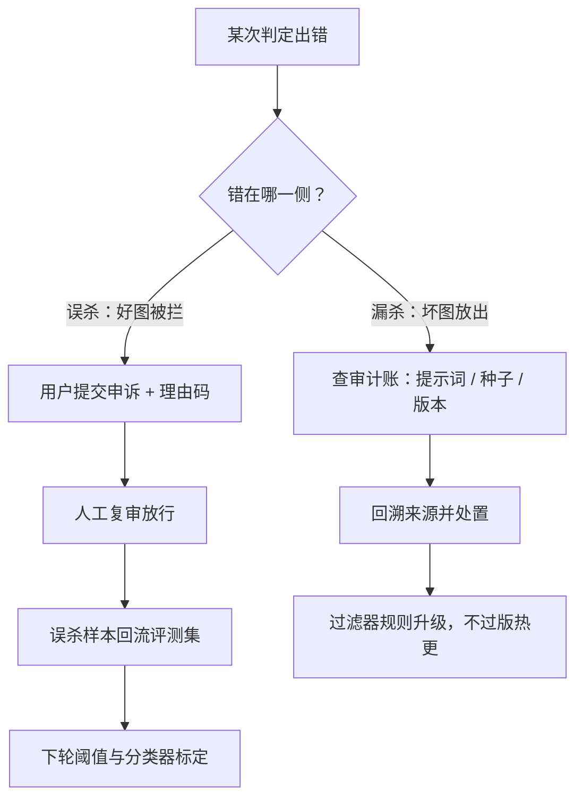

# 安全与水印

过滤器挡内容，水印管来源；两者都挡不住决心明确的敌手，上线问的不是「能不能防住」，是「失效时谁看见、怎么兜」。

<footer>—— 据 Fernandez 等 Stable Signature（2023）与 C2PA 内容凭证规范整理</footer>

[上一课](/llm/diff-fid-pipeline)给质量立了门禁。质量门之外还有两道上线前绕不开的门：输出安全与来源水印。它们都装在第一课解剖的收尾段里，也都有一条共同的纪律：机制的可失效性要被设计，而不是被假设不存在。

## 问题

风险在两侧：输入侧提示词可被绕过（同义改写、错字混排、多语言拼接都能绕开关键词表），输出侧违规图像无论提示词如何都要被拦住——所以过滤必须在解码后的像素上再设一道。水印侧的诉求不同：平台要能证明「这张图出自本服务」，用于溯源、追责与内容凭证。常见错误有两个：把提示词过滤当唯一防线；或把水印当防伪加密——它不是安全边界，是概率性溯源信号。缺口是双门过滤加水印管线的工程协议，以及两者失效时的处置路径。

### 双门与水印的落点

- **输入门**：提示词与参考图、控制图同过一道分类器；便宜、低延迟，能挡明显意图，按可绕过预期设计。
- **输出门**：解码后像素过图像分类器与哈希库比对（既有违法图像哈希库）；这是真防线，延迟与误杀率都在这里。
- **水印**：频域像素水印在收尾段嵌入；内容凭证（C2PA 类）并行写入文件。
- **审计账**：提示词、条件集、种子、模型版本、过滤判定全部落盘，支撑申诉与溯源。

哈希库比对可以理解为「指纹黑名单」：给每张图算出一个几乎唯一的指纹串（相同内容算出相同指纹），把已知违规图像的指纹存成库，新图也算指纹去库里查——不用看懂图的内容，只对指纹，所以既快又稳定，缺点是改几个像素就可能换指纹，因此只对「原样传播」的违规图有效。

元数据凭证经截图或平台转码即被剥离；频域像素水印抗轻度压缩，但缩放加裁剪加重编码的组合也能洗掉。两条腿互补：元数据给完整凭证，像素水印给元数据被剥后的最后溯源线索。

## 方法

安全门按「漏杀与误杀分别定价」配置：漏杀的代价不对称地高，输出门宁可偏严；误杀的代价是正常请求被拒，用申诉通道兜底——每条拒绝给理由码，可申诉复审，误杀样本回流评测集。权重侧的概念擦除只作纵深一层：它伤及相邻良性概念（[蒸馏课](/llm/diff-step-distill-tradeoff)讲过学生继承教师），且对新规避手法无自适应；运营上真正可迭代的是外部过滤器，升级不过版。水印固定在收尾段解码之后：对像素做频域嵌入，强度在「抗轻度压缩」与「不可见」之间标定，结果进评测管线回归。

## 机制

失效之后走哪条路，和机制本身同样值得画出来：误杀与漏杀的兜底方向相反，一个向用户侧申诉，一个向内部侧回溯。

为什么过滤必须双门：输入门看的是意图代理，输出门看的是事实结果；提示词绕过输入门后，像素分类是最后一道。为什么输出门设在解码后而不是潜空间里：违规性主要由像素级语义承载，潜变量上的分类器既不准也不稳定。为什么水印强度不能拉满：嵌入能量与视觉质量是同一张图的预算，拉满会被人眼与评测管线同时发现；标定目标是「社交媒体一次转码后仍可检出」，不是「对抗洗稿后仍可检出」——后者在威胁模型之外。

「频域嵌入」可以想象成不盖可见的章，而是把极淡的墨水按特定纹路撒进整张图的明暗纹理里：每一处都淡到人眼看不出，但用正确钥匙做统计检验时，这些纹路会累加成一个可检出的信号。信号分散在全图而非集中在某个角落，所以轻度压缩磨不掉它，裁掉一小块也还有剩余。

为什么审计账与机制同等重要：过滤器与水印都会失效，失效之后的溯源、申诉与追责全靠落盘的谱系（条件集、种子、版本、判定）。没有审计账，误杀无法申诉、漏杀无法回溯、水印无法作证——机制管当下，账本管事后。

## 边界

本课不解决对抗性攻防：水印移除与对抗提示词是持续对抗过程，工程协议保证可检测、可升级、可审计，不是绝对防线。概念擦除的质量代价要过[评测管线](/llm/diff-fid-pipeline)的门，不能只看违规率下降。哈希库比对只在有明确法律义务的辖区启用，比对命中走人工复核而非自动处置。安全过滤的延迟计入单价表：输出门的毫秒是每张图的真实成本。最后，过滤器自身的回归要独立于质量回归：拦截率与误杀率分曲线监控，两根曲线混报会让「变严」伪装成「变好」。

为什么混报危险：假设升级过滤器后拦截率从 5% 升到 8%，看似更安全；但若误杀率同时从 0.5% 涨到 3%，说明它在大量错杀正常请求。两根曲线画在同一张总分里，「更严」和「更准」就分不开了——只有分开盯，才能发现这次升级到底是挡住了坏人，还是把好人也挡在了门外。

## 小结

- 过滤双门：输入门挡意图代理，输出门在像素上挡事实结果，后者是真防线。
- 误杀走申诉与理由码，漏杀代价更高，阈值向严偏置并回流误杀样本。
- 概念擦除只是纵深一层，可迭代的是外部过滤器；升级不过版。
- 水印是概率性溯源信号：频域嵌入加内容凭证双腿，按「一次转码仍可检出」标定。
- 审计账与机制同等重要：谱系落盘支撑申诉、回溯与作证。
- 出处：Fernandez 等 Stable Signature（2023）、C2PA 规范；双门协议据内容安全实践整理。
