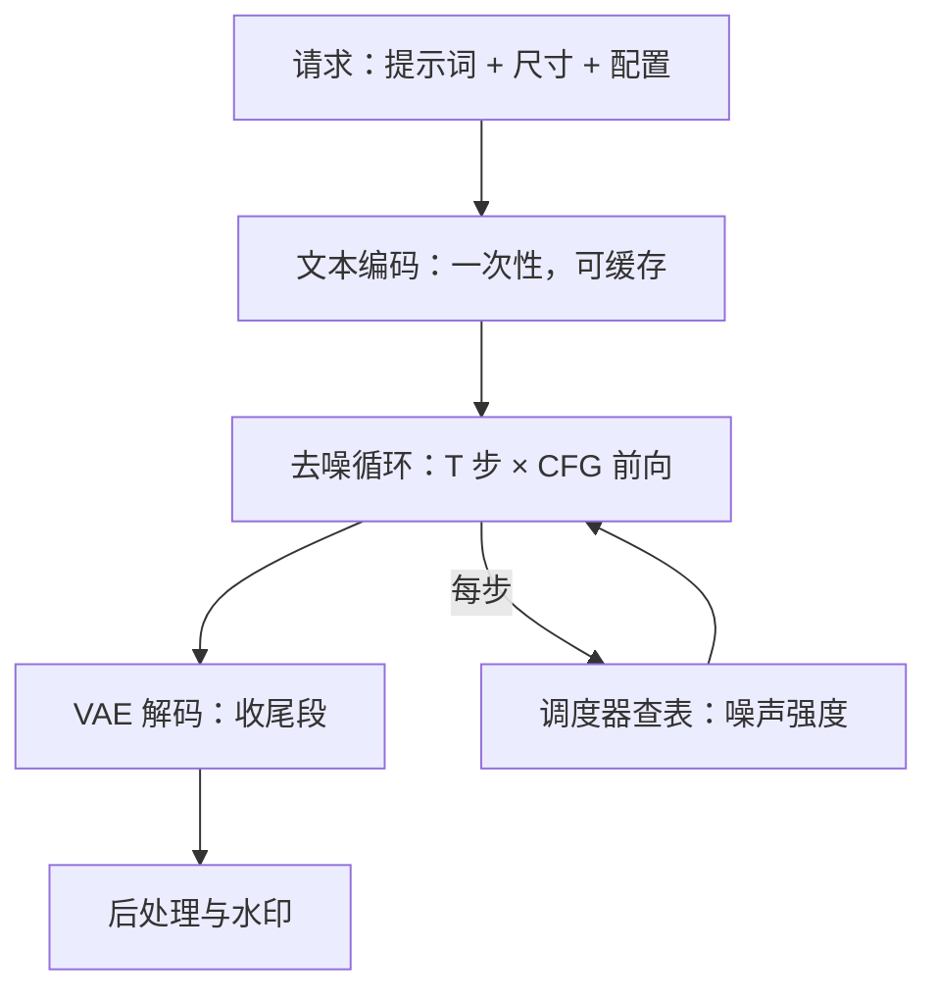
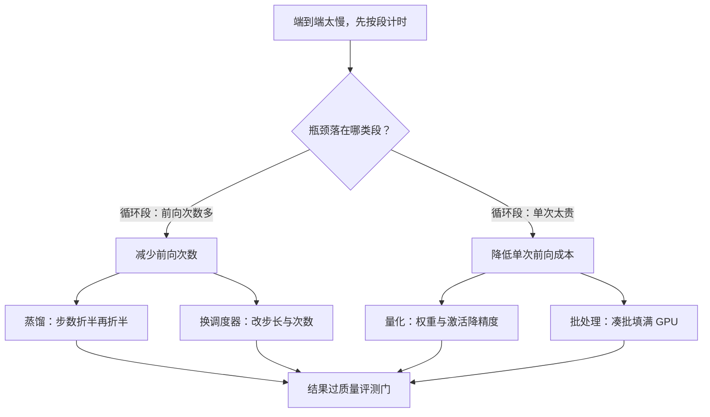

# 扩散推理管线解剖

扩散服务慢不在「模型大」，而在同一段网络被调几百次；解剖管线就是找出哪一段在重复、哪一段只跑一次、哪一段可以提前算。

<footer>—— 据 Ho 等 DDPM、Rombach 等 LDM 与 Stable Diffusion 推理实现整理</footer>

[上一课](/llm/mm-map)把多模态服务侧的失败收成六族与三跑判据：失败多半静默，靠族坐标排障，监控面板先于故障建好，多模态的深钻线告一段落。本课程转向另一类生成负载：图像与视频的扩散生成服务化。主干已有 [DDPM](/llm/ddpm)、[潜空间与 VAE](/llm/latent-vae)、[CFG 在图像生成](/llm/cfg-image)：加噪链、潜变量与引导的第一性都在那里立好。本课把「训练完的模型」切成服务视角的管线：一次请求到底执行了什么，时间与钱花在哪几段。后课的蒸馏、量化、批处理都默认你能按段报出成本。

## 问题

一次文生图请求走五段：文本编码器把提示词编成条件嵌入；调度器按日程给出每步的噪声强度；去噪网络（UNet 或 DiT）从纯噪声潜变量迭代去噪 $T$ 步；VAE 解码器把最终潜变量还原成像素；后处理做尺寸、格式与水印。缺口在五段的时间分布极不均匀：去噪网络要跑 $T$ 次、开引导时再翻倍，其余各段只跑一两次，却常被当成「一个模型」整体优化。不解剖就优化，典型错误是给只占毫秒级的文本编码器配 GPU 常驻，却让占九成以上计算的去噪循环跑在未融合的算子上。

### 一次请求的账

以 SD 1.5 在 $512\times512$、50 步、CFG $\gamma=7.5$ 为例：每步做有条件与无条件两次去噪前向，合计 $100$ 次 UNet 前向，加一次 VAE 解码；潜变量是 $64\times64\times4$，UNet fp16 权重约 $860$M 参数、$1.7$ GB。文本编码与调度器查表只占毫秒级，但前者输出可以缓存复用——同一提示词的嵌入是纯函数，这是扩散服务里最便宜的缓存。

50 步 × CFG 双前向 = 100 次去噪前向 + 1 次 VAE 解码。步数与引导是产品配置不是模型常数，前向次数按配置算，不能按模型算。

数字感受一下潜空间有多省：$512\times512\times3$ 的原图约有 79 万个数值，压成 $64\times64\times4$ 的潜变量后只剩约 1.6 万个，缩小约 48 倍。去噪循环全程在这个「小图」上进行，这就是扩散还能实时服务的前提——先在低维空间干活，最后才由 VAE 一次性放大回像素。

## 方法

服务化第一件事是把管线切成三类段：

- **一次性段**：文本编码、控制条件预处理。输入不变则输出不变，可按提示词哈希缓存。
- **循环段**：去噪网络与调度器更新。$T$ 次迭代共享同一份权重；扩散没有 KV 缓存，每步都从潜变量整张重算，这是与 LLM 推理最大的结构差异。
- **收尾段**：VAE 解码与后处理。解码是单次大变换，精度与显存敏感，常与去噪用不同精度。

切完给每段计时：去噪循环应占端到端九成上下。若不是，先查批是否太小让 GPU 在循环间空转，或解码是否落在兜底精度上。调度器是查表不是网络：换采样器改的是循环次数与步长，不改权重，这给了服务端第一根「不改模型的旋钮」，也是下一课蒸馏的对照面。

「调度器是查表不是网络」翻译一下：调度器就是一张预先算好的时间表，写明第 1 步噪声多大、第 2 步多小……直到最后一步接近零。它没有任何可学习的参数，换采样器只是换一张表，权重一个字节都不动——所以调它不触发重新训练，是服务端最便宜的旋钮。

## 机制

循环段主导成本的原因：去噪前向的 FLOPs 随潜变量面积增长，注意力项还随 token 数平方增长；$T$ 与 CFG 是乘在头上的倍数。于是服务级性能问题几乎都能约化成两条：「减少前向次数」与「降低单次前向成本」，前者通向蒸馏与调度，后者通向量化与批处理。条件嵌入缓存之所以成立，是文本编码器的纯函数性；VAE 解码不能这样缓存，因为它接在随机性最强的最终潜变量后面，输入几乎不重复。

与 LLM 服务对照：自回归的长度运行时才确定，扩散的 $T$ 在配置里就定了；自回归靠 KV 缓存把历史变增量，扩散每步对整张潜变量重算。这两条差异决定调度器形状不同，而「凑批复用」又与[连续批处理](/llm/continuous-batching)形似神不似——形似在凑批，神不似在没有逐 token 的增量结构。

常见误区：做过 LLM 推理的人常以为扩散也能挂一个 KV 缓存，把「已算过的部分」存起来逐步增量。实际上扩散每一步的潜变量都是全新的一张图，上一步的中间结果对下一步毫无复用价值——这就是为什么扩散批内所有请求必须步调一致地走完 $T$ 步，而 LLM 可以各生成各的长度。

## 边界

本课只解剖标准文生图管线：图生图多一段 VAE 编码，视频多一个时间维，都是后课的增量。段计时依赖实现，算子融合差的实现会让解码或预处理虚高，先修实现再谈分布。CFG 的机制与 $\gamma$ 的取舍在 [CFG 在图像生成](/llm/cfg-image)已立，本课只把它当前向次数的乘数；蒸馏后学生不再需要双前向，那是下一课的缺口。

## 小结

- 管线五段：文本编码、调度、去噪循环、VAE 解码、后处理；循环段占九成计算。
- 前向次数 = 步数 × 引导倍数，是服务级成本的第一公式。
- 文本编码是纯函数，条件嵌入缓存是扩散服务最便宜的复用。
- 扩散无 KV 增量结构，每步整张重算，批内步调一致是调度的前提。
- 性能问题约化成「少跑前向」与「跑便宜前向」，分别通向蒸馏与量化。
- 出处：Ho 等 DDPM、Rombach 等 LDM、Ho & Salimans CFG；量级据 Stable Diffusion 1.5 公开规格。
