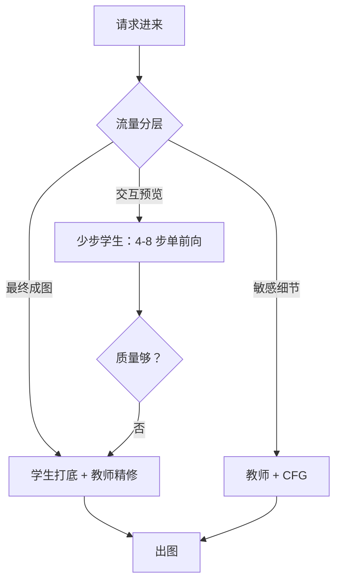

# 步数蒸馏的服务权衡

蒸馏把步数从「质量税」变成「服务契约」：步数一旦蒸进权重，就不再是用户可以在请求里随便改的参数。

<footer>—— 据 Salimans & Ho 渐进蒸馏、Luo 等 LCM 与少步扩散的服务实践整理</footer>

[上一课](/llm/diff-serving-pipeline)把管线切成一次性段、循环段与收尾段，并把成本约化成「少跑前向」与「跑便宜前向」两条。本课动第一条：步数蒸馏。蒸馏的方法谱系——渐进蒸馏、一致性模型、分布匹配——在[扩散蒸馏与少步](/llm/diffusion-distillation)已立；本课只算服务视角的账：换来什么，赔上什么，哪些旋钮随之消失。

## 问题

教师的默认配置是 25 到 50 步加 CFG 双前向，一次请求一百次量级的前向；交互式场景（边拖边看的预览）在单卡上排不进延迟预算。蒸馏学生把步数压到 4 到 8 步，且常把引导蒸进权重，单前向即可出图。账面收益清楚：$100$ 次前向变 $4$ 次，二十多倍。缺口在另一半：学生赔掉了什么，往往不在发布时的 FID 里，而在用户的具体请求里——细节变平、贴合下降，以及最容易被忽略的：$\gamma$ 旋钮没了。把学生当「更快的教师」用，会在生产里踩进这些静默的坑。

### 消失的旋钮

教师管线里 $\gamma$ 是按请求可调的旋钮：写实的调低、贴合的调高。引导蒸进学生后，CFG 分支消失，$\gamma$ 不再存在；要不同的「引导手感」，只能换一个蒸法或换一个学生。同时步数也进了契约：学生在自己规定的 4 到 8 步日程上训练，多跑或少跑、换用教师日程的采样器配置，都会静默劣化而不是报错。API 层必须把参数收走或锁死，否则用户会拿教师的用法打学生。

教师 50 步 × 双前向 = 100 次前向；引导蒸馏学生 4 步 × 单前向 = 4 次，二十余倍的差距里有一半来自 CFG 分支消失而不是步数本身——评估蒸馏收益要把两笔账分开报。

## 方法

按流量分层配模型，而不是全员换学生：

- **交互层**：预览、变体瀑布流、参数探索用少步学生；延迟是第一 SLO，质量下限即可。
- **成图层**：最终出图保留教师或「学生打底 + 教师精修几步」的混合管线；蒸馏损失集中在高频细节，精修步数远少于全程。
- **LoRA 形态**：LCM-LoRA 一类把蒸馏挂在适配器上，同一底座按请求挂载或摘除，学生与教师共存一张卡，按流量切——省多份全模型的显存，代价是每请求多一次切换合并。

上线前必须单独报步数–质量：学生在 4 步的 FID 不能抄教师 50 步的数，也不能混用参考统计。调度器配置与蒸馏契约绑定存档：采样器、时间步间距、CFG 开关一起进版本号。

## 机制

为什么蒸馏能砍步数而直接减步不行：教师日程的末端信噪比设计假定每步做小幅修正，跳步会让误差来不及被剩余步校正；蒸馏把多步修正的复合映射压进单步，学生学的是「跳到的终点」而不是「下一步」。为什么学生会继承教师的毛病：分布匹配只对齐分布、一致性只自洽于轨迹，教师带引导放大的伪影与模式会原样进学生——所以换教师版本等于换学生，回归测试要成对跑。

为什么交互层先受益：预览的价值在「反馈回路短」，用户看到大概构图就能改提示词；质量瑕疵在探索阶段成本低。成图层则相反，用户对最后一张的高频结构最敏感，恰好是蒸馏最先丢的部分。把两层分开，蒸馏的收益就落在不伤害付费质量的地方。

## 边界

蒸馏不是免费吞吐：学生改变误差的频谱分布，只看整体 FID 会漏掉局部细节退化，需配对人评抽检——本课程后面的评测课给管线。蒸馏与量化会互相放大（[下一课](/llm/diff-quantization)），上线前要联合验证而不是各自达标。引导被蒸死后，「按请求调 $\gamma$」的产品能力随之消失，文档与 API 参数要同步收口；保留 $\gamma$ 需求的场景应选未蒸引导的学生并接受双前向。最后，蒸馏契约与底座版本强耦合：换底座重蒸，历史用户的同参数复现即被打破，版本谱系要提前设计。

## 小结

- 蒸馏把步数压一个量级，收益一半来自砍 CFG 分支，账要分开报。
- 学生把步数与日程变成模型契约：采样器配置必须绑定存档，不能沿用教师。
- 引导蒸进权重则 $\gamma$ 旋钮消失，API 要收参数而不是留一个失效的旋钮。
- 按流量分层：交互用学生、成图用混合或教师，LoRA 形态让两者共存一卡。
- 学生继承教师的伪影与模式，换教师版本须成对回归。
- 出处：Salimans & Ho 渐进蒸馏、Song 等一致性模型、Luo 等 LCM；服务口径据本课整理。
