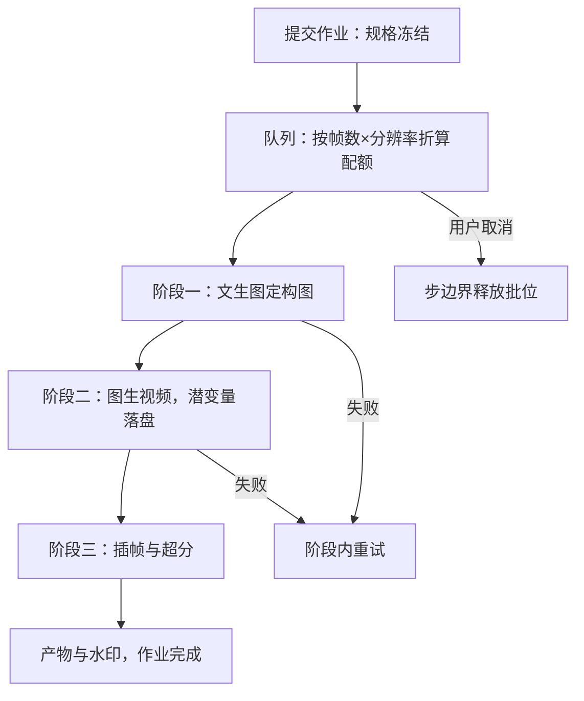

# 视频生成的服务

把分钟的生成时间塞进秒级的请求-响应里，两边都输；视频服务的正确形状是作业：提交、排队、可取消、可查进度。

<footer>—— 据 Blattmann 等 SVD（2023）与视频扩散服务实践整理</footer>

[上一课](/llm/diff-control-serving)把条件变成可装配的对象，但单请求延迟仍是秒级。时间维把账放大一到两个数量级：算力是帧数 × 空间 × 步数，时空联合去噪的原理与长 clip 的漂移在[视频生成的时空建模](/llm/video-gen-spatiotemporal)已立；本课只写服务形状的改变——从请求-响应改成作业系统，从秒级 SLO 改成分级进度。

## 问题

视频请求的三条新约束压垮同步接口。其一，单 clip 生成从几十秒到几分钟，HTTP 同步等待必然超时，重试会造成重复扣算——一次几分钟的作业被网关超时杀掉重跑，是最贵的失败模式。其二，显存不再够整段激活：几十帧的时空注意力连同视频潜变量，单卡常放不下，需要分块解码与换出。其三，产品语义变了：用户要的不是「尽快拿到」，而是「知道还要多久、能取消、失败有交代」。缺口是把管线包装成有进度、有配额、可取消的异步作业，而不是把图像接口的超时调大。

### 作业系统的形状

- **提交**：返回作业号；请求规格（帧数、分辨率、步数、条件集）进队即冻结，防中途改参造成账目混乱。
- **进度**：去噪循环天然有 $T$ 个刻度，按步上报进度；用户看到的「还有约 N 分钟」由队列位置与历史步时延折算。
- **取消**：取消点在批边界或步边界，与[批处理与调度](/llm/diff-batching-scheduling)的让渡粒度一致；取消后立即释放批位，已计算的部分不留档。
- **多级产物**：先出低分辨率或首帧预览，再排队精修；时间到首预览与完成时间是两个独立 SLO。

SVD 类模型一次生成 14 到 25 帧、分辨率到 576×1024；相对单张同分辨率图，token 数放大一个数量级以上，而步数并不减少——「帧数 × 空间 × 步数」三项是乘法，预算时一项都不能忘。

## 方法

把生成拆成阶段图（DAG）而不是单作业：文生图定构图，图生视频做运动，插帧与超分做收尾。每个阶段独立排队、独立重试、独立计价；失败在阶段内重试，不重跑全链。视频潜变量与条件嵌入作为阶段间的产物落盘——阶段二的输入不必重算阶段一。显存按阶段预算：时空去噪激活最大，采取潜变量分块与激活换出；VAE 的时间维解码分块做，decoded 段即写存储，不在显存里攒整片。

## 机制

为什么作业化不只是接口风格：计费、配额、容错都以「作业」为原子。图像时代「请求失败重试一次」的成本是一次前向；视频时代同口径的失误是一整段 GPU 时间，所以幂等键、去重与配额扣减都必须挂在作业号上。为什么阶段拆分省大钱：构图在低成本的图像模型上探索，运动合成只对选中的构图执行；不拆阶段的产品让用户为「不满意的构图」反复付费跑满整条视频管线。

为什么预览要单独一条 SLO：用户对「等」的容忍度取决于有没有反馈；首帧或低分辨率预览把主观等待切成两段，取消大多发生在预览之后——预览同时是用户体验和成本控制的共同支点。

## 边界

本课不重讲时空建模：时间注意力、潜变量视频与漂移对策见 [视频生成的时空建模](/llm/video-gen-spatiotemporal)；服务侧只把「长 clip 会漂」翻译成产品约束——一次生成的 clip 长度有上限，长视频靠条件锚定分段拼接，不承诺单次生成任意长度。多卡切分（按帧或按时间维分片）解决放不下的极端作业，代价是通信与负载均衡复杂度，只在配额明确的大作业启用，不进通用队列。作业系统的可观测性沿用图像侧，但进度上报本身要限频，步时延波动大时进度条抖动会催生重复提交。

## 小结

- 视频服务形状是异步作业：规格冻结、进度按步、取消在步边界、幂等键防重跑。
- 生成拆成 DAG：阶段独立排队重试计价，潜变量与条件落盘做阶段间交接。
- 成本按「帧数 × 空间 × 步数」三项乘法预算，token 数放大一个量级而步数不减。
- 时间到首预览与完成时间是两个 SLO，预览同时管体验与取消率。
- 显存靠分块解码与换出，多卡切分只给明确的大作业配额。
- 出处：Ho 等 Video Diffusion Models、Blattmann 等 SVD；作业系统口径据视频生成服务实践。
